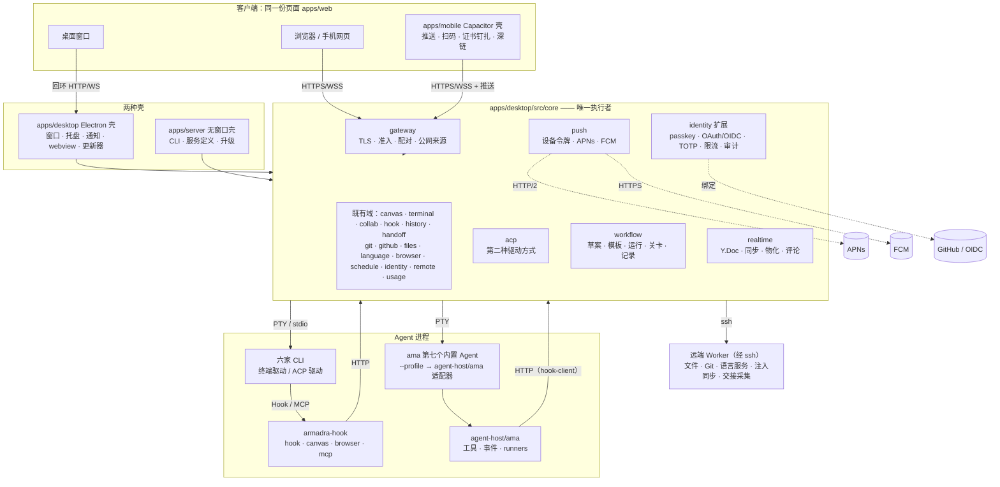

# 补全架构：后续规划二至四部分与平台线的整体框架

> 状态：部分实施（2026-10-04）。G0–G3 的包除 G3-2（Windows 真机验收）、G3-7（真 CLI 端到端）、G3-8（安全收尾）外都已合入，迁移 0030–0035、契约 §14–§23 落地；逐包的「做了什么 / 没做」见[补全进度](../status/completion-progress.md)，需要用户提供的条件汇总在该文 G4-1 一节。本文是「该实现的内容全量实现」的总框架：补全之后的整体架构、新模块与边界、数据模型与迁移编号、契约节号、安全模型、ACP 与工作流模型、移动端策略、测试策略，以及每一处取舍的被否方案。执行计划（波次、工作包、文件归属、验证命令）在 [补全执行计划](completion-plan.md)。
> 现状以[功能预期总表](../status/feature-roadmap.md)与源码为准；本文只写缺口的目标形态，已交付的部分只在边界处提及。
> 前置：[后续规划](product-roadmap.md)、[CLI 协作](cli-collaboration.md)、[ACP 会话视图](acp-session-view.md)、[协调 Agent](coordinator-agent.md)、[服务器账号与共享](server-accounts-and-sharing.md)、[画布启动器](canvas-launcher.md)、[Agent 推式投递](agent-delivery.md)、[架构](../guides/architecture.md)。界面规范由 [设计系统](design-system.md) 定；需要用户账号或证书的第三方服务由 [外部服务](external-services.md) 按提供方逐条展开，本文只按章节名引用它。

## §0 结论

| #   | 决定                                                                                                                                                                                                                                                                                                                                               | 理由                                                                                                                                                                                                                                                   |
| --- | -------------------------------------------------------------------------------------------------------------------------------------------------------------------------------------------------------------------------------------------------------------------------------------------------------------------------------------------------- | ------------------------------------------------------------------------------------------------------------------------------------------------------------------------------------------------------------------------------------------------------ |
| D1  | **架构不变，只加域**：仍是一个 Electron-free 的 core、两种壳、一份页面。新增 core 域 `acp` / `workflow` / `realtime` / `gateway` / `push`，新增 `agent-host/ama/` 与 `hook-client/`，新增 Capacitor 壳 `apps/mobile`                                                                                                                               | 现有边界（§2）已经把「业务只在 core」守住；每个缺口都能落成一个新域或现有域的一节，不需要第二套后端                                                                                                                                                    |
| D2  | **ACP 是同一终端节点的另一种驱动方式**，不是第二套 Agent 通道；协议栈直接依赖 `@armadra/agent/acp`（精确版本），core 不再手写分帧与客户端                                                                                                                                                                                                          | v3 移除 ACP 的理由是两套语义；ACP 设计 D1–D5 已把它收回同一张 `terminal_sessions`、同一个 reducer；`@armadra/agent` 零依赖、已带假 Agent 与黄金记录，少一份要锁版本的协议实现                                                                          |
| D3  | **协调者 = `ama` 作为第七个内置 Agent**，宿主适配器放本仓库 `apps/desktop/src/agent-host/ama/`；`HostApi.runners` 由适配器用画布动词实现，ama 在画布内**不自己 spawn** 任何 CLI                                                                                                                                                                    | 绕过画布 spawn 会让节点、连线授权与审批失效（ama 第五波 D17）；runner = `open-agent --task` + 投递 + `wait`，全部走已有的门链                                                                                                                          |
| D4  | **工作流引擎在 core（`core/workflow/`）**，协调者只出草案；运行、人工关卡、执行记录、定时复用都是 core 的持久化职责                                                                                                                                                                                                                                | Agent 进程随时会被关掉；人在回路要落库才能等人                                                                                                                                                                                                         |
| D5  | **多人实时协同用 Yjs**：开了实时的板以 `Y.Doc`（快照 + 更新流落库）为真相，`nodes` / `edges` / `whiteboard_json` 是它的物化；同步协议走 `ws`；core 自己的写者写前必经 `Y.Doc`；页面侧 `canvas-store` 仍是 React 的真相，绑定层按 origin 双向镜像，撤销用 `Y.UndoManager`；同一块板不混跑 CAS 与实时客户端                                          | CRDT 让离线与并发编辑不需要中心变换；Yjs 成熟、二进制更新小、MIT；现有「整文档 CAS + 客户端变基」保住了多设备但做不了光标、选区与同时编辑；两种写法混在一块板上会互相覆盖（§6）                                                                        |
| D6  | **Agent 权限角色**：保留 viewer ⊂ editor ⊂ operator ⊂ driver 的阶梯，补一条「自己创建的终端自己能驱动与审批」；不做节点级 ACL                                                                                                                                                                                                                      | S4 / S5 不变；缺的只是 operator 对自己起的 Agent 不能答审批这一处不对称（§8）                                                                                                                                                                          |
| D7  | **登录与安全**：passkey 用 `@simplewebauthn/server`（精确版本），TOTP 用 `otplib`（精确版本），都不手写；OAuth 只做绑定（GitHub + 通用 OIDC，code + PKCE），SSO = 开了「首次登录即建账号」的 OIDC；MFA = TOTP + 恢复码；限流与锁定、会话设备管理、审计页                                                                                           | WebAuthn 的 CBOR / COSE / 扩展边角与 passkey 生态变化快，库比手写更稳；两者都无原生依赖、可精确锁版本（[外部服务](external-services.md) §7.2 / §7.3 的建议）；OAuth 作绑定避免账号被第三方决定（S7）                                                   |
| D8  | **Gateway = 服务器壳的对外层下沉进 core（`core/gateway/`）**：TLS、准入、配对、公网来源、静态页面托管，两种壳共用；桌面壳只多一个开关与二维码                                                                                                                                                                                                      | 服务器壳的 `serve` 已经是「同进程装配 core + 前面一层 TLS」，没有代理；桌面要的就是同一层，不能复制一份                                                                                                                                                |
| D9  | **移动端用 Capacitor 包现有页面**（`apps/mobile/`，页面产物**打进包里**，API 跨源调用 Gateway）：原生只做推送、扫码、证书钉扎、深链、钥匙串存令牌；推送分期：① Web Push（VAPID，网页与 PWA，零第三方）② 自建 App 用自己的 APNs / FCM 密钥直连（core `core/push/`，Node 内置实现）③ 商店版需要发布方的推送密钥，只能经发布方运行的中继（待定，§10） | 「`apps/web` 是唯一前端」是硬边界；终端与编辑器已在 WebView 里跑通；原生重写等于第二份前端。页面打进包里是商店审核对「不是一个网站壳」的要求（[外部服务](external-services.md) §5.1）。APNs 密钥绑定发布方的 Team ID，不能随包分发给用户的 core（§10） |
| D10 | **迁移预分配 0030–0034**，契约预分配 §14–§23；按合入顺序落号，顺序变了以当时最大号 +1 重排并回改本文                                                                                                                                                                                                                                               | 编号必须连续、已发布的不得改；预分配让并行实施不互相等待                                                                                                                                                                                               |
| D11 | **测试分三档进 CI**：A 档无账号（假 ACP Agent、脚本化模型服务、假 ssh、双客户端实时）随 push 跑；B 档打包冒烟与更新端到端夜间跑；C 档需真实账号 / 真机，手动跑并出清单                                                                                                                                                                             | 现在十几条探针一条都不在 CI；按「要不要用户的东西」分档，能自动的全自动                                                                                                                                                                                |
| D12 | **零写入与零密钥原则延续**：凭据只进 SecretStore 与终端环境，不进启动行、日志、画布持久化、API 响应；推送载荷只有标题与深链；Gateway 二维码里只有一次性票与证书指纹                                                                                                                                                                                | 功能预期总表 §5 的验收原则                                                                                                                                                                                                                             |

## §1 补全后的整体架构



与现状相比只多了四件事：core 多了五个域与身份扩展；Agent 进程多了 `ama` 与它的适配器，`armadra-hook` 多了 `mcp` 子命令；客户端多了 Capacitor 壳；服务器壳把对外层交给了 core。三条边界原样：`apps/web` 是唯一页面；`src/core/` 是唯一执行服务，不 import `electron` 与壳目录；`src/main/` 只做壳。

## §2 新模块与边界

### §2.1 目录

```text
apps/desktop/src/
  core/
    acp/            ACP 驱动：adapters、host、session、normalize、bridge、mirror、mcp、routes
    workflow/       草案、模板、运行引擎（prompt / collect / gate）、运行记录、runner 任务记录
    realtime/       每块板一个 Y.Doc、同步 WS、更新流落库与物化、评论
    gateway/        TLS 监听、准入（设备会话 / CSRF / Origin）、配对票与二维码载荷、静态页面、状态
    push/           设备令牌、发送队列、direct（APNs / FCM）与 relay 两种发送器、触发规则、载荷加密
    identity/
      passkey.ts    `@simplewebauthn/server` 的注册 / 断言包装、RP ID 规则、挑战存储
      oauth/        GitHub 与通用 OIDC（发现文档、PKCE、state、绑定与 SSO 建号）
      mfa/          TOTP（`otplib`）、恢复码
      policy.ts     口令策略（长度、常见口令表、与账号名重合）与可选泄露检查
      throttle.ts   登录限流与锁定
    agent/credentials/   节点凭据（credentialRef）：条目、校验、注入
    secrets/        SecretBackend 接口与文件后端；壳注入 keychain / dpapi / libsecret，服务器壳用 master key 封装（外部服务 §12.1）
    net/outbound.ts 全部出站地址的常量表：用途、频率、开关（外部服务 §12.3）
    handoff/remote-capture.ts   经 Worker 在执行主机上采集交接材料
    remote/fleet.ts             执行主机舰队：Worker 版本、能力、是否过旧
  agent-host/ama/   HostApi 适配器：client、events、tools、instructions、runners
  hook-client/      CLI 与适配器共用：端点发现、令牌、HTTP、动词表生成
apps/server/src/    瘦壳：cli、service/{install,render,spec,logs,upgrade}；serve 调 core/gateway
apps/mobile/        Capacitor 工程（ios/、android/、plugins/）
apps/push-relay/    商店版推送的最小中继（无状态，端到端加密载荷）
tools/dev-stack/    docker-compose：mock release、pebble、step-ca、dex、keycloak、mailpit、gitea、glitchtip、push-sink、hibp-fixture、armadra-server（外部服务 §14）
apps/web/src/
  acp/              会话视图、输出到画板、新建向导、任务模板
  workflow/         草案卡、模板库、运行记录与对比、关卡答复
  realtime/         Yjs 绑定、awareness、光标与选区层、评论层
  mobile/           连接页（Gateway 地址 / 扫码配对）、推送权限、原生桥
  panels/settings/pages/security/   passkey、MFA、会话与设备、审计
  showcase/         开发期设计展示页（不进生产构建；设计展示页）
packages/shared/src/api/{acp,workflows,realtime,gateway,identity-security,push,credentials}.ts
tools/ci/e2e.mjs    e2e 分档运行器；tools/probes/ 下的新探针见 §12
```

### §2.2 边界规则（在 AGENTS.md 之上追加）

- `core/realtime` 是画布的**第二个写入口**，但不是第二个真相：它只在板上有活动 `Y.Doc` 时接管写入，物化仍经 `canvas/documents.saveBoard`；core 自己的写者（控制动词、调度、依赖编排）不改调用方式，由 realtime 在 `saveBoard` 前拦截并换成 Y 事务（§6.3）。
- `core/gateway` 不认识壳：它拿一个已经 `run()` 起来的 core 与一份选项（监听、公网来源、证书、静态根），返回可关闭的句柄。服务器壳的 `serve` 与桌面壳的「对外服务」开关都是它的调用方。
- `core/acp` 只认 ACP v1 规范字段，`_meta` 一律忽略；协议对象来自 `@armadra/agent/acp`，core 里不复制类型。
- `agent-host/ama/` 可以 import `@armadra/agent/host` 的类型与 `src/hook-client/`，**不得** import `core/`：它跑在 ama 进程里，与 core 之间只有 HTTP。
- `core/push` 的发送器只在配置齐全时装配；缺配置时 `transport = "log"`，行为是写一条 debug 日志，接口照常返回 `queued`。
- `apps/mobile` 不含业务代码：页面来自 `apps/web` 的构建产物；原生代码只有推送、扫码、证书钉扎、深链四个插件与一个连接前的本地页。
- 新增界面文案全部进 `apps/web/src/i18n/`（中英同步），组件只用 `apps/web/src/ui/` 已有的 shadcn 条目；样式与布局细则见 [设计系统](design-system.md)。

## §3 数据模型与迁移编号

现有迁移到 0029。预分配如下，**合入顺序即编号顺序**；任一包提前合入，以当时 `migrations/` 最大号 +1 为准并回改本表与 `migrations.lock`。所有迁移只增表与列，不改已有列。

| 编号 | 文件                          | 内容                                                                                                                                                                                                                                                                                                                                                                                                                        | 所属工作包 |
| ---- | ----------------------------- | --------------------------------------------------------------------------------------------------------------------------------------------------------------------------------------------------------------------------------------------------------------------------------------------------------------------------------------------------------------------------------------------------------------------------- | ---------- |
| 0030 | `0034_workflow.sql`           | `workflow_drafts`、`workflow_templates`、`workflow_runs`、`workflow_run_steps`（[协调 Agent](coordinator-agent.md) §5.3），加 `workflow_task_runs(task_id PK, coordinator_node_id, runner_id, node_id, status, started_at, ended_at, result_json)` 记 runner 任务（§5.4）                                                                                                                                                   | G1-8       |
| 0031 | `0031_agent_credentials.sql`  | `agent_credentials(ref PK, provider_id, kind, label, created_at, last_used_at)`；值在 SecretStore，表只记名字与种类（§9.1）                                                                                                                                                                                                                                                                                                 | G1-1       |
| 0032 | `0032_identity_hardening.sql` | `identity_credentials` 加 `sign_count`、`aaguid`、`transports_json`、`label`；新表 `identity_mfa(principal_id PK, totp_secret_ref, enrolled_at, verified_at)`、`identity_recovery_codes(principal_id, code_hash, used_at)`、`identity_lockouts(key PK, failures, locked_until_ms, updated_at_ms)`；`identity_sessions` 加 `last_seen_at_ms`、`remote_ip`、`user_agent`                                                      | G1-11      |
| 0033 | `0033_realtime.sql`           | `board_updates(board_id, seq, update BLOB, principal_id, at_ms, PK(board_id, seq))`；`board_snapshots(board_id PK, seq, state BLOB, at_ms)`；`boards` 加 `realtime INTEGER NOT NULL DEFAULT 0`（这块板是否已切到实时）与 `materialized_seq INTEGER NOT NULL DEFAULT 0`；`board_comments(id PK, board_id, anchor_kind, anchor_id, x, y, body, author_principal_id, parent_id, created_at_ms, updated_at_ms, resolved_at_ms)` | G1-9       |
| 0034 | `0034_push.sql`               | `push_devices(device_id PK FK identity_devices, platform, transport, token, public_key, app_version, created_at_ms, revoked_at_ms)`；`push_outbox(id PK, device_id, payload_blob, created_at_ms, sent_at_ms, failed_at_ms, attempts, reason)`                                                                                                                                                                               | G1-13      |

不需要迁移的：ACP（驱动方式在节点数据、会话行复用 `terminal_sessions`、镜像在数据目录）、Gateway（设置文件 + 既有 `identity_*`）、跨主机交接（材料不落库）、角色补充（纯函数）。节点数据与白板 JSON 的新字段（`agent.driver`、`source`、白板 item 的 `meta.source`）走现有「未知字段保留原文」规矩。

## §4 契约节号（`docs/contracts/core-json-api.md`）

现有到 §13（画布启动器）。预分配（G0-3 先写节标题与「预留」一行，各包只填自己的节）：

| 节  | 内容                                                                                                                                                                                                              | 所属工作包         |
| --- | ----------------------------------------------------------------------------------------------------------------------------------------------------------------------------------------------------------------- | ------------------ |
| §14 | ACP：`/api/agents` 行的 `acp`（§14.1）；`/api/acp/sessions*`、`/api/acp/nodes/{id}/driver`、事件 `acp.update / acp.turn / acp.driver`、审批 `optionId`（§14.2–§14.4）                                             | G1-4、G2-1         |
| §15 | 工作流与 runners：`/api/workflows/*`、`workflow-propose` 动词、草案 JSON（§15.1–§15.4）；`wait` 动词与 `workflow_task_runs` 行（§15.5）；自动化目标 `WORKFLOW_RUN`（§15.6）                                       | G1-8、G2-4、G2-3   |
| §16 | 实时协同：`WS …/boards/{boardId}/sync` 的帧（§16.1）、物化与 `board.changed` 的关系（§16.2）、评论 `/api/workspaces/{id}/boards/{boardId}/comments*` 与事件 `board.comment`（§16.3）、awareness 状态形状（§16.4） | G1-9、G2-6、G2-5   |
| §17 | Gateway：`GET/PUT /api/gateway`（状态与配置）、`POST /api/gateway/pairing`（铸票）、二维码载荷 `{ origin, ticket, fingerprint, expiresAt }`                                                                       | G1-10              |
| §18 | 身份扩展：口令策略与锁定错误码（§18.1）、passkey 四条路由（§18.2）、MFA 登录两步与恢复码（§18.3）、会话列表与撤销（§18.4）、OAuth / OIDC 的 start / callback / 绑定 / SSO（§18.5）、审计查询（§18.6）             | G1-11、G1-12、G2-8 |
| §19 | 推送：`/api/push/devices*`、载荷形状（标题、正文、深链，不含正文以外的数据）                                                                                                                                      | G1-13              |
| §20 | 节点凭据：`/api/credentials*`、`POST /api/terminals` 的 `credentialRef`、拒绝码                                                                                                                                   | G1-1               |
| §21 | 跨主机交接（§21.1：`handoff/prepare` 的新错误码与 `capturedOn`）与 Worker 舰队（§21.2：执行主机状态里的 `worker { version, capabilities, outdated }`，集成状态的 `outdatedHosts`）                                | G1-2               |
| §22 | 投递画面门补充：计划投递的 `TARGET_NOT_AT_PROMPT`、新增的对话框特征 id 列表                                                                                                                                       | G1-3               |
| §23 | 权限补充：`approval:answer` 的「自己创建的终端」规则、工作流关卡的答复权限                                                                                                                                        | G2-9               |

形状规则不变：camelCase，错误 `{ code, message }`，权限不足一律 `403 forbidden`。

## §5 Agent 侧：ACP、协调者、runners、工作流

### §5.1 ACP 集成模型

沿用 [ACP 会话视图](acp-session-view.md) 的 D1–D14，三处修订：

1. **协议栈**：`core/acp/client.ts` 改为包装 `@armadra/agent/acp` 的 `AcpClient`（`initialize / newSession / resumeSession / loadSession / prompt / setMode / cancel`，挂起的 `request_permission` 经 `onPermission` 交出）；单测用它的 `fakeAcpAgentPath()`，`--minimal` 跑降级路径。`core/acp/testing/fake-agent.mjs` 不再需要。
2. **契约节**：§13 已被启动器占用，ACP 改用 **§14**；工作流用 §15。迁移不需要，0031 不再为 ACP 预留。
3. **ama 行**：`ama --mode acp` 已存在（协议 1、`loadSession`、`session/list / resume / close`、模式 id 就是它的权限模式），适配器表里 ama 一行不再「待拍板」：`program: "ama"`、`args: ["--mode","acp","--profile",<path>]`、`sessionId: "same"`、`resume: "resume"`；画布工具经 profile 的 `host` 适配器提供，**不加 MCP**。

语义映射写死、不隐式等价：`session/cancel` ⇔ 现有 `interrupt` 动词与头部「打断这一轮」（`write(ESC)` 的 ACP 实现）；`session/request_permission` ⇔ `agent_approvals` 一行 + 路由 `"acp"`，答复经 `POST /api/approvals/{id}/answer { decision, optionId? }`；回合被取消或适配器退出时挂起的请求一律回 `cancelled` 并记 `answered_by = "core"`。其余结论照旧：ACP 会话是 `terminal_sessions` 里 `backend_kind = 'acp'` 的一行；节点数据 `agent.driver`；`stateSource = "acp"` 经 `core/acp/normalize.ts` 归一成现有 `AgentEvent`；审批走 `agent_approvals` + `optionId`；`send` 落为 `session/prompt`、`ESC` 落为 `session/cancel`；画布工具经 `session/new.mcpServers` 注入 `armadra-hook mcp`；转录对不上 CLI 会话 id 的读镜像 `<数据目录>/acp/<nodeId>/<sessionId>.acp.jsonl`。六家的支持形态与 resume 能力见该文 §3.1，Copilot 跨进程不可 resume 因此永不休眠。

### §5.2 协调者 `ama`

沿用 [协调 Agent](coordinator-agent.md) §2–§7，按 `@armadra/agent` 0.6.2 修订：

- 精确版本 devDependency `"@armadra/agent": "0.6.2"`（不用 caret：`hostApi` 兼容矩阵与 `release:check` 要求每次升级是一次显式改动，lockfile 之外再钉一道）；`dist/bundle/ama.cjs` 复制进 `out/agent/`、after-pack 放 `resources/agent/`，启动器与 `armadra-hook` 同形；`tools/release/compatibility.json` 加 `agent { package, version, hostApi: 1 }`，`release:check` 校验与 lockfile 一致。
- 适配器 `agent-host/ama/main.ts` 导出 `{ hostApi: 1, create }`；无 `ARMADRA_NODE_ID` 返回 `undefined`。`tools.ts` 从 `collab/control/index.ts::VERBS`、`context-link.ts::VERBS`、`browser/verb-spec.ts` 生成工具表（与 `armadra-hook mcp` 共用 `hook-client/verbs.ts`），`tools.disable("task")` **不再需要**——改为用 `runners.provide` 把 `task(agent=…)` 接到画布（§5.3）。
- 密钥：`SecretStore("ama-<provider>")`，启动前写 0600 的 `auth.json` 只传路径；ChatGPT 登录（ama 0.6 的 SIWC）走 ama 自己的 `auth.json`，Armadra 不碰。
- 事件走进程内扩展通道，`normalize/pi.ts` 零翻译；审批先在节点终端答，画布直答在 G2 经 `approvals.setBroker` 接到 `hook/approvals.ts` 的 pending 目录。
- 场景 11 用脚本化 OpenAI 兼容模型服务驱动，不需要真实密钥。

### §5.3 `HostApi.runners`：画布节点作为 ama 的子 Agent

ama 的 `task(agent=<id>)` 在有宿主时只认宿主注入的 runner（第五波 D17）。Armadra 适配器为每个内置 CLI id（六家 + `ama`）与 `custom:*` 注册一个 `HostRunner`：

| runner 契约                                                          | 画布实现                                                                                                                                                                                                                                                                                                                                                                                                                                             |
| -------------------------------------------------------------------- | ---------------------------------------------------------------------------------------------------------------------------------------------------------------------------------------------------------------------------------------------------------------------------------------------------------------------------------------------------------------------------------------------------------------------------------------------------- |
| `start({prompt, cwd, mode, model, resume, taskId, signal, onEvent})` | `/control/open-agent`：`--agent <id> --task <prompt> --cwd <cwd> --permission-mode <映射> [--model] [--resume <会话 id>] --name task:<taskId>`；core 建节点、连线、带任务启动。`mode` 映射：`plan→plan`、`auto-edit→auto-edit`、`auto / full-auto→full-auto`、`default / allowlist→default`。返回 `RunnerHandle{ id: nodeId }`                                                                                                                       |
| `onEvent`                                                            | 适配器调新动词 `wait --node <id> --task <taskId> --since <seq> --timeout 30s`（§15.5）长轮询：返回 `{ status, since, events[] }`，`status ∈ running \| done \| failed \| blocked \| needsInput`（`blocked` 带 `approvalId` 与原因，`needsInput` = CLI 在等人输入）；`events` 是节点状态变化与带 `task:<taskId>` 键的 `post`，映射为 `SubagentEvent{ type: "turn" / "tool" / "text" }`。`blocked` 时 ama 状态栏显示「等人审批」，适配器**不**替人回答 |
| `send(text)`                                                         | `/control/send --to <nodeId>`，走门链与队列                                                                                                                                                                                                                                                                                                                                                                                                          |
| `wait()`                                                             | 循环调 `wait` 动词直到 `done` / `failed`，或 `signal` 中止；`blocked` / `needsInput` 不结束 `wait()`，只上报事件（由 ama 决定是 `send` 还是继续等）；结果 `text` 取 `task:<taskId>:result` 的 post 正文（成员技能规定：完成后 `canvas post --key task:<taskId>:result`），缺省取 `context summary`；`isError` 取 `failed`                                                                                                                            |
| `stop()`                                                             | `/control/interrupt`；`signal` 中止同样只是 interrupt，节点保留（人要看得到），`task_ctl` 的 cleanup 才 `close`（走 execute 审批）                                                                                                                                                                                                                                                                                                                   |

`start` 按 `taskId` 幂等：`workflow_task_runs` 里已有同一 `task_id` 且节点还在，就直接返回那个节点（ama 崩溃重试不会起第二个）。每次 `start` 写一行 `workflow_task_runs`（§3 的 0030），这就是「执行记录」在 runner 这一侧的落点。ama 起的节点的 `creator_principal_id` 继承协调者终端的创建者（§8.2 的「触发者」规则），所以在服务器壳里 operator 起的协调者能审批自己团队的成员。runner 与工作流引擎的关系：引擎的 `prompt` 步骤对成员节点做的事与 runner 完全相同，两者共用 `core/workflow/dispatch.ts`。

### §5.4 工作流模型

- **草案**（`workflow_propose` 工具 → `workflow_drafts`）：`version`、`params[]`、`roles[]`（agentId、permissionMode、model、worktree）、`links[]`、`steps[]`（`prompt` / `collect` / `gate`，`after` 依赖）、`source`。形状见协调 Agent §5.2，zod 在 `packages/shared/src/api/workflows.ts`。
- **模板**：草案确认后入 `workflow_templates`；人可在页面改参数、角色、提示词；模板 JSON 的 `version` 只增。
- **运行**：`POST /api/workflows/runs {templateId, params}` → core 建一个 Frame、按 `roles` 开节点与连线（`team` 的同一段代码）、按 `after` 顺序投递 `prompt`、`collect` 步骤把来源步骤的 `post` 汇给目标节点、`gate` 步骤停下等 `POST …/gates/{id} {decision}`；每步写 `workflow_run_steps`。页面不在也跑：引擎订阅 bus 事件，与依赖编排同一处。
- **人在回路**：`gate` 是显式步骤；此外运行里任何 `execute` 类审批（`canvas close`、`interrupt`）照旧经 `agent_approvals` 等人。CLI 内部的 `git push` / `merge` 由各 CLI 自己的权限模式控制，Armadra 不拦截，模板向导里给「破坏性操作前加关卡」的建议而不是假装能拦。
- **再运行与定时**：同一模板换 `params` 再跑；自动化目标新增 `WORKFLOW_RUN { templateId, params }`（`schedule/types.ts`），到点由 dispatch 调 workflow 服务，misfire / 并发策略沿用。
- **记录与对比**：运行列表、每步的节点、产出（`post` 正文）与关卡答复；两次运行并排对比（同一步骤的产出差异）。

## §6 实时协同层

### §6.1 选型

| 方案                               | 结论 | 理由                                                                                                                                             |
| ---------------------------------- | ---- | ------------------------------------------------------------------------------------------------------------------------------------------------ |
| **Yjs**（+ `y-protocols`、`lib0`） | 采用 | CRDT，离线与并发不要中心变换；二进制更新小；`Y.Map` / `Y.Text` 正好对应节点字段与便签正文；awareness 协议自带光标与选区；MIT，三个包都无原生依赖 |
| OT（ShareDB 一类）                 | 否   | 需要中心变换与 JSON0 一类 OT 类型，白板对象与节点数据的变换规则要自己写并维护                                                                    |
| Automerge                          | 否   | JSON 文档模型贴切，但 WASM 包体大、历史全量保留、生态与工具少                                                                                    |
| 继续 CAS + 客户端变基              | 否   | 已经做到多设备同板，但同时编辑只能「后写者变基」，做不了光标、选区与同一便签的并发输入                                                           |

### §6.2 文档结构

每块板一个 `Y.Doc`：`nodes: Y.Map<nodeId, Y.Map>`（`type / title / position / size / parentId / data`；便签正文 `data.content` 用 `Y.Text`，其余字段 JSON）、`edges: Y.Map<edgeId, JSON>`、`whiteboard: Y.Map<itemId, string>`（每个白板 item 一条不透明 JSON 串，按 item 粒度 LWW，core 仍不解析内容；整块白板放一个值会让并发白板编辑互相覆盖）、`meta: Y.Map`（视口不进）。awareness 状态：`{ principalId, deviceId, name, color, cursor?: {x, y}, selection?: string[], focusNodeId? }`。

### §6.3 真相、物化与两种写者

- **真相**：`boards.realtime = 1` 的板，真相是 `board_snapshots.state` + 其后的 `board_updates`；`nodes` / `edges` / `whiteboard_json` 是物化出来的缓存（`boards.materialized_seq` 记到哪一条）。`realtime = 0` 的板一切如旧（CAS + 租约）。
- **切换**：第一个声明了 `realtime` 能力（`hello.capabilities`）的客户端打开一块板时，core 把它切到 `realtime = 1`（从表物化进文档、写首个快照）；之后不再切回。旧页面（没有这个能力）对这块板只读，`PUT …/document` 答 409 `realtime_active`——**同一块板不混跑两种写法**。
- **core 自己的写者**：控制动词、调度、依赖编排、输出到画板都经 `canvas/documents.saveBoard`；`realtime/intercept.ts` 挂在它前面：板是实时板时，**先加载文档**（快照 + 增量，没客户端也加载，空闲 60 秒后卸载），把请求与文档 diff 后以 `origin: "core"` 的事务应用，再走物化；禁止任何绕过文档直写表的路径（`documents.test` 加一条「实时板上直写被拒」）。
- **物化**：每条更新追加 `board_updates`（`seq` 递增）；去抖 1 秒或最后一个客户端离开时物化到表并广播 `board.changed`；每 500 条更新或最后一个客户端离开时写 `encodeStateAsUpdate` 快照并删掉 `seq ≤ 快照` 的更新行，表不无限增长。core 重启按快照 + 更新重放。
- **同步**：`WS /api/workspaces/{id}/boards/{boardId}/sync`，帧 = `y-protocols` 的 sync step1 / step2 / update 与 awareness；升级前 guard 要 `canvas:read`，更新帧要 `canvas:write`（只读者发的更新丢弃并 4403）；失去写权时同样 4403 关流。
- **租约**：实时板上 `presence.ts` 的租约不再拦写入，在线表只用于显示；「谁在编辑」由 awareness 给出。非实时板行为不变。
- **评论**：不进 `Y.Doc`，落 `board_comments`（权限、审计、锚点都要 core 判）；锚点可以是节点、白板 item 或画布坐标；`@` 提到的 principal 触发推送（§10）。评论对 Agent 可读：`context-link.ts::readableAs` 把评论作为节点的附加资料（只读）。

### §6.4 页面侧

- `apps/web/src/realtime/binding.ts`：`canvas-store` 的动作镜像为 Y 事务（`origin = 本地 clientId`）；`Y.Doc` 的 `observeDeep` 只处理 **origin 不是本地** 的事务，经现有 `canvas/sync/merge.ts` 的「远端灌入」路径灌进 store（视口留本地、手势中先不合）。回声环靠 origin 断开，绑定层有一条「本地事务不回灌」的测试。
- **撤销**：实时板用 `Y.UndoManager({ trackedOrigins: [本地 clientId] })`，节点、连线、白板 item 同在一个管理器里（保住「一个撤销栈」的约定）；`canvas-store` 的历史栈在实时板上停用，非实时板照旧。远端改动不进撤销。
- `CursorLayer.tsx` 在 React Flow 视口上画成员光标与选区外框（颜色取 awareness），`PresenceBar` 改为列 awareness 成员；评论层 `comments/`。
- 连接断开 → 本地继续编辑，重连后 sync step1 / step2 自动补齐；期间顶部显示「离线编辑」。
- 属性测试：两个内存客户端随机并发操作后状态收敛，且物化结果与 `Y.Doc` 的投影逐字段相等（A 档，§12）。

## §7 Gateway

- `core/gateway/`：`listener.ts`（`node:https`）、`tls.ts`（证书来自文件，或 `<数据目录>/tls/` 的**本地 CA + 叶证书**：CA 私钥 0600、叶证书 SAN 含主机名与当前所有私网地址，地址变了自动重签叶证书、CA 不变）、`admission.ts`（从 `apps/server/src/auth.ts` 下沉：设备会话 Cookie、CSRF、Origin、匿名路径）、`csp.ts`、`web-root.ts`、`pairing.ts`（铸配对票、二维码载荷）、`status.ts`、`routes.ts`、`index.ts`。服务器壳 `serve` 变成「解析参数 → `openGateway(running, options)`」。
- 桌面「设置 → 后台服务 → 对外服务」：开关、监听接口（仅本机 / 本机的私网接口 / 全部）、端口（首次启动由内核分配后写回设置，之后固定）、公网来源（可选，反向代理时填）、证书来源（本地 CA / 指定文件 / ACME）、二维码（网页 `https://<host>:<port>/#pair=<ticket>&fp=<指纹>`，原生深链 `armadra://pair?host=…&ticket=…&fp=…`，票两分钟一次）、CA 下载、已配对设备列表（复用账号页的设备表）。关掉即刻停止监听并断开流。
- **原生 App 的准入**：页面打在包里，来源是 `capacitor://localhost`（iOS）/ `https://localhost`（Android），对 Gateway 是跨源：`admission.ts` 除 Cookie 模式外加 **Bearer 模式**（配对后签发的会话凭据存设备钥匙串，`Authorization` 头；现有 `identity_sessions` 的 refresh / access 轮转照用），CORS 只放行这两个固定来源；浏览器 WS 不能带头，原生 App 先 `POST /api/identity/ws-ticket` 换一张 30 秒一次性票，经 `Sec-WebSocket-Protocol: armadra-ticket.<票>` 升级。网页端一律仍走 Cookie。
- 公网来源校验：Origin / Host 必须命中「配置的公网来源 ∪ 当前监听接口的 `https://<ip>:<port>`」。
- **手机网页与证书**：iOS 对自签证书即使页面接受了警告，`wss` 仍会静默失败，画布实时与终端都不可用；所以手机网页的路径是**安装本地 CA**：配对页提供 `GET /ca.crt`（匿名路径），页面给出 iOS「下载描述文件 → 设置里信任」与 Android「安装 CA 证书」的步骤，装好后整条链都是正常 TLS。原生 App 不装 CA，按二维码里的 `fp`（信任锚的 SHA-256：有本地 CA 时是 CA，指定文件时是叶）钉证书（§10）。这与[外部服务](external-services.md) §6.4「不内建 CA、文档化 mkcert」不同：内建 CA 是为了私网地址变化时只重签叶证书、手机不用重装；最终取舍见 §14 Q3。公网部署用 ACME（外部服务 §6.3，`--acme`，在 G3-5 实施）或反向代理 + 真证书。
- **证书轮换**：信任锚指纹变了（用户重置或换机）时，网页端重装 CA，原生 App 在 TLS 失败时提示重新扫码配对、不自动信任新证书；配对页永远显示当前指纹。
- 身份：经 Gateway 进来的请求带设备会话与 principal，`runAs` 照旧；桌面本机页面仍是 owner。成员账号、组与共享在桌面壳上随 Gateway 一起可用，「账号与共享」页在 Gateway 开启后出现。

## §8 安全模型

### §8.1 信任边界（补全后）

| 边界               | 规则                                                                                                                                                                                                             |
| ------------------ | ---------------------------------------------------------------------------------------------------------------------------------------------------------------------------------------------------------------- |
| 页面 ↔ core       | 桌面本机：回环 + preload 凭据；Gateway / 服务器：TLS + `__Host-` 会话 + CSRF + Origin；实时同步 WS 同一套 guard                                                                                                  |
| Agent 进程 ↔ core | 节点令牌 + `terminalBinding`；`armadra-hook`、`armadra-hook mcp`、ama 适配器三者 core 不作区分、不多给权限                                                                                                       |
| 成员 ↔ 工作空间   | scope 唯一判定（S3）；角色阶梯 + 「自己创建的终端」规则（§8.2）；工作流关卡答复要运行所在工作空间的 `operator`                                                                                                   |
| 凭据               | `credentialRef` 值只在 SecretStore；注入只进 CLI 进程环境（经启动器，不进节点 shell）；Windows 在 DPAPI 后端落地前不开放；设置页说明子进程可读                                                                   |
| 推送               | 载荷只有标题、短正文、深链；经中继时端到端加密，中继只见密文；只发给对该工作空间有 `canvas:read` 的 principal 的设备；令牌可撤销；发送失败不重试超过 3 次                                                        |
| 实时文档           | 更新按 `canvas:write` 过滤；物化走同一 `saveBoard` 校验（节点类型、尺寸、8 MiB）；评论按 `canvas:write` 写、作者或 owner 删                                                                                      |
| 身份               | 口令 scrypt 不变；passkey 公钥与 `sign_count`；TOTP 密钥在 SecretStore；OAuth 的 `client_secret` 在 SecretStore；state / PKCE 一次性；登录失败与锁定、MFA 变更、passkey 增删、OAuth 绑定、Gateway 开关全部进审计 |

### §8.2 角色决定（driver vs editor）

| 角色     | 画布 | 起自己的 Agent | 驱动 / 审批自己起的 | 驱动 / 审批别人起的 | 工作流关卡 |
| -------- | ---- | -------------- | ------------------- | ------------------- | ---------- |
| viewer   | 看   | 否             | —                   | 否                  | 否         |
| editor   | 改   | 否             | —                   | 否                  | 否         |
| operator | 改   | 是             | **是**（新增）      | 否                  | 是         |
| driver   | 改   | 是             | 是                  | 是                  | 是         |

实现只有一处：`route-access.ts` 对 `approval:answer` 与 `terminal:drive` 的判定加「或 `terminal_sessions.creator_principal_id` = 请求主体」（迁移 0028 已落库）。**创建者 = 触发者**：人从页面起的终端创建者是本人；控制动词（`open-agent` / `team`、ama 的 runner）起的继承调用方节点终端的创建者；自动化冷启动的继承自动化的创建者（`automations` 行记 `created_by`，没有时为 owner）；桌面壳无主体时为 owner。这条规则写进契约 §23，同时写明一处可接受的隐式提权：editor 能改节点里的启动命令，operator 执行它——与今天「editor 改便签、Agent 读便签」同一信任层级。Agent 之间的驱动仍由连线编译（投递设计 §3.2），与人无关。被否方案：按节点设「驱动者名单」——撞 S4，连线读取与终端所有权会变成不可判定的矩阵。

### §8.3 登录与加固

- **口令策略**：长度 ≥ 12（可配 10–64）、不得含账号名、不得在随包的常见口令表（1 万条）里；泄露检查用 HIBP 的 k-匿名范围接口（只发 SHA-1 前 5 位，带 `Add-Padding`；`identity.breachCheck: off | warn | block`，服务器壳与开了 Gateway 的桌面缺省 `warn`，网络失败不阻止设口令、只记审计；[外部服务](external-services.md) §7.4）。
- **限流与锁定**：按 principal 5 次失败后退避（1 分钟起翻倍到 15 分钟，`identity_lockouts`），按来源 IP 内存令牌桶 20 次 / 分钟；owner 可在安全页解锁；锁定不泄露账号是否存在。
- **passkey**：`identity/passkey.ts` 用 `@simplewebauthn/server`（精确版本）：注册 `POST /api/identity/passkey/register/options | verify`，登录 `…/login/options | verify`；RP ID = 公网来源的主机名（`identity.rpId` 可覆盖；多个公网来源取公共后缀；主机是 IP 字面量时答 `passkey_unavailable_on_ip_host`，设置页解释而不是让浏览器抛错，[外部服务](external-services.md) §7.2）；挑战内存存储 2 分钟、一次性；attestation 只收 `none`、不做证明链校验；`sign_count` 按库的判定存；凭据存 `identity_credentials(kind='passkey', public_key, sign_count, transports, aaguid)`。用户要提供：稳定域名；mock：软件认证器（`node:crypto` 生成密钥、拼 `authenticatorData` 与 `clientDataJSON`）、`https://localhost` 与 CDP 的虚拟认证器。
- **OAuth / OIDC**：一条代码路径（通用 OIDC 授权码 + PKCE + `nonce`：发现文档、JWKS 验签 RS256 / ES256；GitHub 是唯一非 OIDC 特例），提供方存设置 `identity.oauth.providers[] { id, kind: "github" | "oidc", issuer?, clientId, scopes, allowSignup?: false, allowedDomains?, enabled }`，`clientSecret` 进 SecretStore `armadra-oidc-<id>`（不入库、不加迁移）；回调固定 `<公网来源>/api/identity/oauth/{id}/callback`，所以**必须先有公网来源**；流程 start → callback → 绑定到当前 principal；未登录时若 `(issuer, subject)` 已绑定则登录；`allowSignup` 开着才建 `member` principal（无授予，owner 再共享），且要求 `email_verified = true` 并命中 `allowedDomains`——这就是 SSO。未配置时答 `oauth_not_configured`（替换今天的 501）。mock：`tools/probes/mock-oidc.mjs`（进程内假 issuer：发现文档、JWKS、authorize / token / userinfo）。用户要提供：OAuth 应用的 clientId / secret 与回调地址（[外部服务](external-services.md) §7.1）。
- **MFA**：TOTP 用 `otplib`（精确版本；RFC 6238，30 秒、6 位，记最后用过的时间步防重放）+ 10 个恢复码（scrypt 存哈希）；密钥在 SecretStore；登录两步：`login` 返回 `{ mfaRequired, challengeId }`，`POST /api/identity/mfa/verify`；passkey 登录视为已满足；`identity.mfa.requireFor: none | members | all`。
- **会话与设备**：列出我的会话（设备名、最近活动、IP、UA）、撤销单个、「其它设备全部登出」；owner 看全部。
- **审计**：既有 `audit_log` 加事件；安全页可按时间 / 主体 / 动作筛选、导出 CSV。

## §9 第一部分遗留项的归宿

| 项                          | 落点                                                                                                                                                                                                                                                                                                                                                                                                                                                         |
| --------------------------- | ------------------------------------------------------------------------------------------------------------------------------------------------------------------------------------------------------------------------------------------------------------------------------------------------------------------------------------------------------------------------------------------------------------------------------------------------------------ |
| §9.1 多账号凭据（第二阶段） | `core/agent/credentials/`：条目 `{ ref, providerId, kind, label }`（表 0031，值在 SecretStore `armadra-credential-<ref>`）；`kind` 与变量名的映射写死（CLI 协作 §7.3 的表，第一版 Claude `oauth-token`、Copilot `github-token`）；注入点 `ownedEnvironment`，经启动器只给 CLI 进程；`agentSessionRequest` 上行 `credentialRef`；SSH 节点与 Windows 拒绝；`AccountBindingBadge` 可选。T1–T9 需用户的真实账号；mock：自定义 Agent 指向一个只打印变量长度的脚本 |
| §9.2 跨执行主机交接         | `handoff/remote-capture.ts` + Worker 操作 `handoff.capture`：SSH 终端所在主机已注册为执行主机且 Worker 在线时，材料在那台主机采集（转录摘录经适配器归一化、工作树状态、路径），`capturedOn` 记主机；否则 501 `handoff_host_offline`。目标在另一台主机也可接受：材料是文本与相对路径                                                                                                                                                                          |
| §9.3 画面门                 | Codex 的提示符已登记；补 Codex 升级对话框的第二形态、Copilot 的目录信任（本机核实）、OpenCode / Pi / OMP 的提示符与首启对话框（需装机核实，先按官方文档登记、标 `unverified`）；`schedule/dispatch.ts` 在写入前调同一 `judgeScreen`，退回 `TARGET_NOT_AT_PROMPT` 按「忙」等下一拍                                                                                                                                                                            |
| §9.4 三家真 TUI 端到端      | 场景 10 / 12 的 OpenCode、OMP、Copilot 路径已写；需用户装机与登录（C 档，§12）                                                                                                                                                                                                                                                                                                                                                                               |
| §9.5 Worker 过旧提示        | `remote/fleet.ts` 汇总每台执行主机的 Worker 版本与能力；`GET /api/agents/{id}/integration` 加 `outdatedHosts[]`；集成页与执行主机页各一个徽标与「重新同步」                                                                                                                                                                                                                                                                                                  |
| §9.6 启动兼容退役           | 下一个发布版之后删 `LegacyLaunchWord`、`launchWords` / `launchArgs`（行上）、页面的旧 core 退路；在 G4 执行，条件写在计划里                                                                                                                                                                                                                                                                                                                                  |

## §10 移动端策略

| 方案                        | 结论 | 理由                                                                                                                                                                              |
| --------------------------- | ---- | --------------------------------------------------------------------------------------------------------------------------------------------------------------------------------- |
| **Capacitor 包现有页面**    | 采用 | 不违反「唯一前端」；xterm.js、CodeMirror、React Flow 已在手机网页上跑通；原生只补四件网页做不到的事：推送、扫码、证书钉扎、深链；iOS / Android 工程由我们持有，可加自定义原生代码 |
| React Native / Flutter 重写 | 否   | 第二份前端，所有功能双写                                                                                                                                                          |
| 纯 PWA                      | 否   | iOS 推送只对加到主屏且用户授权的 PWA 可用、不可靠；自签证书无法钉扎；没有深链                                                                                                     |

- 工程：`apps/mobile/`（Capacitor 7，`ios/`、`android/`、`src/` 只放插件桥）。页面产物**打进包里**（商店审核要求，[外部服务](external-services.md) §5.1），连接页就是 `apps/web/src/mobile/ConnectScreen`；API 跨源调 Gateway：配对后拿到的会话凭据存钥匙串、以 Bearer 发送，WS 用一次性票升级（§7「原生 App 的准入」）。不做 OTA，版本随桌面 / 服务器一起发。
- 证书钉扎：iOS 在 `CAPBridgeViewController` 子类处理 `didReceiveAuthenticationChallenge`，Android 在 `WebViewClient.onReceivedSslError` 与 OkHttp 的 pinner，都只在服务端链里信任锚的指纹等于二维码 `fp` 时放行；指纹存钥匙串；失败时提示重新扫码（§7 的轮换）。
- **推送的传输**（APNs 的 `.p8` 密钥与 FCM 的服务账号都绑定 App 发布方的账号，不能随包分发给用户的 core；[外部服务](external-services.md) §5.2 的分期）：

  | 传输      | 谁用                                          | 怎么走                                                                                                                                                                                                                                                                                                                                                                           |
  | --------- | --------------------------------------------- | -------------------------------------------------------------------------------------------------------------------------------------------------------------------------------------------------------------------------------------------------------------------------------------------------------------------------------------------------------------------------------- |
  | `webpush` | 网页与 PWA（第 1 期）                         | VAPID（RFC 8292）直发浏览器厂商端点；密钥对首次启动生成到 `<数据目录>/push/vapid.json`（0600）；零第三方、零用户条件                                                                                                                                                                                                                                                             |
  | `direct`  | 自己构建 App 的部署（企业 / 自托管，第 2 期） | core `core/push/` 直连：APNs HTTP/2（`node:http2`，JWT ES256）、FCM v1（JWT RS256 换 access token）；密钥只传文件路径，放 `<数据目录>/push/` 0600                                                                                                                                                                                                                                |
  | `relay`   | 商店版 App（**待定**，§14 Q6）                | core → 发布方运行的最小中继 `apps/push-relay/`（Node，无状态，只存「中继令牌 → APNs / FCM 令牌」）；载荷用设备注册时上交的公钥做 X25519 + AES-GCM **端到端加密**，中继与苹果 / Google 只看到密文，App 在 iOS Notification Service Extension / Android 数据消息处理器里解密再显示。外部服务 §6.2 反对我们运营基础设施；但商店版没有别的路，所以这一项的代码写完、是否运营由用户定 |
  | `log`     | 没配置                                        | 写 debug 日志，接口照常答 `queued`；推送页显示 `notConfigured`，桌面通知中心不受影响                                                                                                                                                                                                                                                                                             |

  触发规则：等人审批、Agent 出错或完成（用户关注的节点）、投递失败与回执、调度到点、资源阈值、评论提及、工作流关卡；只发给对该工作空间有 `canvas:read` 的 principal 的设备；正文不含终端原文与文件内容；点通知按深链 `armadra://w/<workspaceId>/n/<nodeId>` 打开节点焦点页；失败重试不超过 3 次。用户 / 发布方要提供：Apple 开发者账号与推送密钥、Firebase 项目服务账号、商店签名、运行中继的主机（[外部服务](external-services.md) §5.1、§5.2）；mock：`tools/probes/mock-push.mjs` 同时扮演 Web Push 端点、APNs / FCM 假端点与中继，断言请求形状、JWT 签名与密文能用设备私钥解开。

- 手机网页细节（平台线第 2 条）与原生壳共用页面：连接页、CA 安装引导、推送权限提示、会话视图与评论的手机布局、焦点页里的 ACP 输入框与软键盘工具条共存。
- CI：iOS 模拟器构建（macOS runner，不签名）与 Android debug APK 都能自动产出（B 档）；真机与商店需用户证书。

## §11 桌面三平台与服务端

- **Windows**：`tools/probes/windows-acceptance.mjs` 在一台 Windows 机器上跑完整清单（安装、session host 存活、命名管道、ConPTY 关闭证明、`.exe` 启动器经页面、文件监听、长时间运行后的资源），输出 `result.json`；会话宿主后端的 capture 接上 `replay-screen.ts`（状态 §60.5）。真机需用户。
- **签名、公证、自动更新**：`tools/probes/update-e2e.mjs` 用 `mock-release-server.mjs` 与测试用 minisign 密钥走通「检查 → 下载 → 验签 → 暂存」（macOS 未签名包只到暂存；签名包到安装），夜间跑；真证书与公证需用户（[外部服务](external-services.md)「代码签名与公证」）。
- **Linux**：夜间作业在 ubuntu 上 `dist` 出 AppImage / deb，`xvfb-run` 跑 `packaged-smoke`，deb 在容器里安装验证；修出来的问题随包交付。
- **服务端**：`apps/server/docker/Dockerfile`（多阶段、非 root、`/data` 卷）与 compose 示例；`docs/guides/server-deployment.md`（服务器部署指南：域名与证书、反向代理、备份与恢复、升级与回滚、Gateway 与服务器壳的选择）；`tools/probes/server-perf.mjs` 测事件扇出、终端吞吐、30 个会话下的内存，结果记 `docs/status/server-performance-baseline.md`；多执行主机管理 = §9.5 的舰队页加批量重新同步与健康。

## §12 测试策略

| 档   | 内容                                                                                                                                                                                                                                                                                                                                                                                                                                                                                      | 何时跑                                                     |
| ---- | ----------------------------------------------------------------------------------------------------------------------------------------------------------------------------------------------------------------------------------------------------------------------------------------------------------------------------------------------------------------------------------------------------------------------------------------------------------------------------------------- | ---------------------------------------------------------- |
| 单测 | `pnpm libs:build && pnpm -r --if-present test`；每个新域有自己的 `*.test.ts`；ACP 对假 Agent、工作流对假节点、实时对两个内存客户端、WebAuthn 对软件认证器、OAuth 对进程内假 issuer、推送对假接收端                                                                                                                                                                                                                                                                                        | 每次 push（现有 `ci.yml`）                                 |
| A    | `tools/ci/e2e.mjs --tier a`：`server-e2e`、`ui-features-e2e`、`core-terminal-{smoke,lifecycle}`、`remote-e2e`（假 ssh）、新增 `acp-e2e`（假 ACP Agent 当一家 CLI）、`coordinator-e2e`（脚本化模型驱动 ama，场景 11 的 A 档版）、`realtime-e2e`（两个浏览器上下文同时编辑 + 随机并发收敛与物化等价的属性测试）、`gateway-e2e`（本地 CA + 配对 + 成员访问）、`workflow-e2e`、`push-e2e`（对 dev-stack 的 `push-sink`，断言请求形状与密文可解）、`design-showcase`（截图、对比度、Tab 可达） | 每次 push，新增 `e2e` 作业（ubuntu：tmux、Chromium、xvfb） |
| B    | 打包冒烟（macOS、Linux）、`update-e2e`、Capacitor 构建（Android debug APK 在 ubuntu，iOS 模拟器在 macOS runner）                                                                                                                                                                                                                                                                                                                                                                          | `nightly.yml`                                              |
| C    | `agent-e2e` 场景 1–12（真 CLI 与额度）、T1–T9 多账号实测、Windows 真机清单、真 sshd、真机推送、签名发布                                                                                                                                                                                                                                                                                                                                                                                   | 手动；清单在[执行计划](completion-plan.md) §5              |

规矩：外部服务的替身统一来自 `tools/dev-stack/`（`ARMADRA_DEV_STACK=1` 门控，没有 Docker 时相关用例 `skipped`），每个工作包写明用到哪些服务；探针用临时数据目录与临时 HOME，不碰操作员配置；C 档每条写明需要什么、怎么判过；A 档失败阻断合并，B 档失败开 issue。

## §13 被否的方案汇总

| 领域     | 被否                                            | 原因                                                                                                                       |
| -------- | ----------------------------------------------- | -------------------------------------------------------------------------------------------------------------------------- |
| ACP      | core 手写 JSON-RPC / NDJSON 客户端              | `@armadra/agent/acp` 已有零依赖实现与黄金记录，两份一定漂                                                                  |
| ACP      | 新建 `acp_sessions` 表或 `acp` 节点类型         | 第二套语义（v3 §5.10 的教训）                                                                                              |
| 协调者   | ama 自己 spawn 各 CLI                           | 绕过节点、连线授权与审批                                                                                                   |
| 工作流   | 引擎跑在 ama 进程里                             | 进程随时关，人在回路要落库                                                                                                 |
| 实时协同 | OT、Automerge、继续 CAS                         | §6.1                                                                                                                       |
| 实时协同 | `Y.UndoManager` 取代画布历史栈                  | 白板与节点共用一个撤销栈是现状约定，`UndoManager` 不认白板 JSON 的粒度                                                     |
| 权限     | 节点级驱动者名单                                | 撞 S4                                                                                                                      |
| 登录     | 手写 WebAuthn / TOTP                            | 实施前评审改为用库：`@simplewebauthn/server` 与 `otplib`（精确版本）；零依赖原则在身份域让位于「签名与协议边角不自己维护」 |
| 登录     | OAuth 作为账号来源                              | 账号被第三方决定（S7）                                                                                                     |
| Gateway  | 桌面壳单独写一层 HTTPS 代理                     | 两份准入逻辑；服务器壳已证明同进程装配即可                                                                                 |
| 移动端   | React Native / Flutter、纯 PWA                  | §10                                                                                                                        |
| 推送     | 把发布方的 APNs / FCM 密钥随包分发给用户的 core | 等于公开密钥；商店版只能经发布方的中继，自建 App 才能直连                                                                  |
| 推送     | 中继明文转发                                    | 中继能看到审批与评论内容；载荷端到端加密后中继只是一条管道                                                                 |
| 多账号   | 每个 `credentialRef` 一个隔离配置目录           | 会话索引变多根、Codex 每目录一份信任、订阅账号要逐目录登录（CLI 协作 §7.3）                                                |

## §14 需要用户拍板的问题（2026-10-03 已定）

| #   | 问题                                                                                                                                                                   | 决定（2026-10-03）                                                 |
| --- | ---------------------------------------------------------------------------------------------------------------------------------------------------------------------- | ------------------------------------------------------------------ |
| Q1  | 角色阶梯补「自己创建的终端自己审批」是否接受（§8.2）                                                                                                                   | 用户选定：接受；不做节点级名单                                     |
| Q2  | 实时协同是否在桌面壳多窗口与服务器壳都缺省开启                                                                                                                         | 用户选定：都开；设置里可关回租约模式                               |
| Q3  | Gateway 的局域网证书：内建本地 CA（本文 §7：手机网页装一次 CA、地址变了不重装）还是按[外部服务](external-services.md) §6.4 不内建 CA、文档化 mkcert / step-ca          | 用户选定：内建本地 CA；原生 App 都是钉指纹，公网用 ACME 或反向代理 |
| Q4  | 移动端走 Capacitor                                                                                                                                                     | 是；iOS / Android 真机与商店要用户的账号与证书                     |
| Q5  | OAuth 首版提供方：GitHub + 通用 OIDC，是否要加别家                                                                                                                     | 只这两类；别家都能走 OIDC                                          |
| Q6  | 商店版 App 的推送：是否由发布方运营 `apps/push-relay`（需要一台公网主机与发布方的 APNs / FCM 密钥）；不运营则商店版只有前台通知，自建 App 直连，网页与 PWA 走 Web Push | 用户选定：代码按三种传输写完，中继暂不上线                         |
