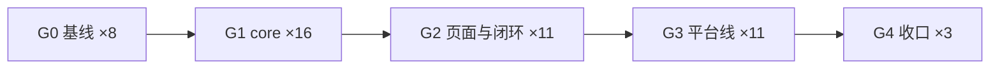
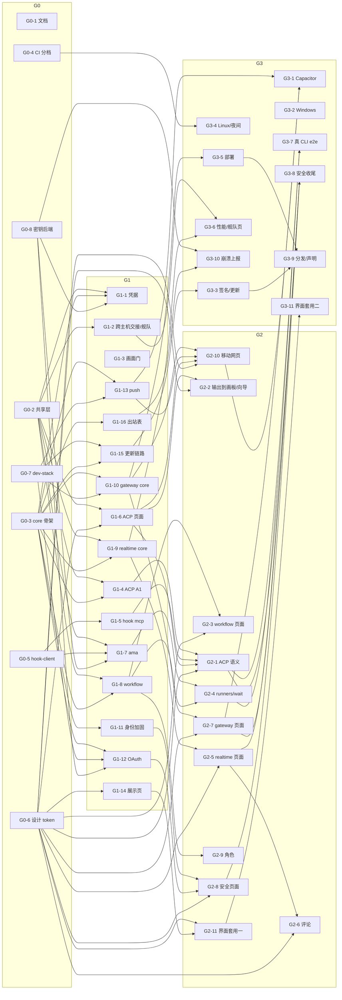

# 补全执行计划：波次、工作包与验证

> 状态：已实施（2026-10-06 回改）。G0–G3 全部合入；G4-1 文档收口已合入（#75）；G4-3 本机发布演练已完成（#78，未推标签、未建 Release）；G4-2 并进 G5，由 G5-17 实施（[G5 剩余事项计划](g5-remaining-plan.md) §0）。剩下要用户提供的条件见[用户待办清单](../status/user-action-checklist.md)。进度以[补全进度](../status/completion-progress.md)为准。框架与决定见 [补全架构](completion-architecture.md)（下称「架构」），本文只写怎么分、谁改哪些文件、怎么验。
> 规则：一个工作包一个 Opus 实施代理，规模 1–3k LOC（超过就按包内给的拆法拆）；同一波次里并行的包**不改同一个文件**（§4 的热点文件表）；每个包自己跑 §0 的验证命令，合入前 CI 绿；提交信息按仓库习惯、按模块分提交；每个包合入时在 `docs/status/completion-progress.md`（G0-1 新建）里写自己那一节（节由 G0-1 预建，不改别人的节）。
> 编号：迁移与契约节按架构 §3 / §4 预分配，**合入时以当时最大号 +1 为准**；若与预分配不同，合入的那个包回改架构 §3 / §4 与本文。

## §0 统一验证

```sh
pnpm libs:build && pnpm -r --if-present test     # CI 跑的就是这一条（shared → server → desktop → web）
pnpm --filter @armadra/web typecheck              # 改到页面的包
pnpm check                                        # 新增文件、迁移、契约节、文档登记之后
node tools/ci/e2e.mjs --tier a                    # G0-4 之后：A 档端到端（本机需要 tmux 与 Chromium）
```

规矩：单测夹具自编或脱敏；探针用临时数据目录与临时 HOME；界面文案进 `apps/web/src/i18n/`，中英同步（`i18n.test` 守）；组件只用 `apps/web/src/ui/` 已有条目（含 G0-6 经 shadcn CLI 加的 16 个），样式与状态矩阵按[设计系统](design-system.md)，每个新界面包把自己的样本加进展示页对应分区（[设计展示页](design-showcase.md) §5）；core 不 import `electron` / `../main/` / `../shell-core/`（`no-electron.test` 守）。需要用户账号、证书或真机的部分标「需用户提供」，并给 mock 路径；mock 优先对着 `tools/dev-stack/`（G0-7，[外部服务](external-services.md) §14）跑，每个包写明「dev-stack：用到哪些服务 / 无」，没装 Docker 时相关用例 `skipped` 而不是失败；mock 路径走通、清单写好，这个包就算完成。

## §1 波次总览

| 波次 | 目标                                                                                                        | 包数 | 并行度                                  |
| ---- | ----------------------------------------------------------------------------------------------------------- | ---- | --------------------------------------- |
| G0   | 基线：文档修正、共享层与 core 骨架、CI 分档、hook-client 抽取、设计系统 token 与基础件、dev-stack、密钥后端 | 8    | 全部并行，两三天                        |
| G1   | 各域 core 与第一部分遗留、展示页、更新链路、出站地址表                                                      | 16   | 全部并行；迁移按 0030 → 0034 的顺序合入 |
| G2   | 各域页面、语义闭环、角色、评论、移动网页、存量界面套用                                                      | 11   | 全部并行；每包只依赖 G1 里对应的域      |
| G3   | 平台线：移动壳、三平台、服务端、分发渠道、崩溃上报、真 CLI 端到端、安全收尾、界面套用收尾                   | 11   | 全部并行                                |
| G4   | 收口：文档、兼容退役、发布演练                                                                              | 3    | 顺序                                    |

合计 49 个包（其中 G0-6 / G1-14 / G2-11 / G3-11 来自[设计系统](design-system.md)与[设计展示页](design-showcase.md)，G0-7 / G0-8 / G1-15 / G1-16 / G3-9 / G3-10 与 G3-3 / G3-5 的扩充来自[外部服务](external-services.md) §15；该文的 W-MAIL、W-FORGE、W-MIRROR 不在后续规划四部分与平台线之内，留到 G4 之后另排）。依赖只跨波次不跨包：G1 的包只依赖 G0，G2 的包只依赖 G1 里点名的那几个，以此类推。



## §2 工作包

每个包的格式：范围 → 文件归属（新增 / 修改，其余文件不碰）→ 依赖 → 编号 → 交付 → 测试 → dev-stack（验证时用到的服务）→ 外部条件与 mock。

### G0 基线

#### G0-1 文档修正与进度载体

- 范围：审计发现的文档不一致全部改掉；建进度文档。
  - `tools/probes/README.md`：第 88 行前后与第 220 行前后仍说「Codex 信任记录写进临时 HOME」，改为启动器方案（零写入，`--dangerously-bypass-hook-trust`）；加 §12 的三档表。
  - `docs/status/typescript-core-status.md` §60.5：第一条（自定义 Agent 拿不到画布审批）已由 `9ba14061` 修掉，标「已修（9ba14061）」。
  - `docs/design/updates-and-service-install.md`、`docs/status/platform-implementation-status.md`：开头的状态说明仍描述已删除的 Go / Rust 载体，改为一段「现状入口」（指向架构、CI 与发布、本计划），正文保留作历史。
  - `README.md`：「桌面 / 浏览器 / 手机共用同一份页面」与路线图里的手机访问改为「手机经服务器壳访问；桌面 Gateway 在计划中（本计划 G1-10 / G2-7）」。
  - `docs/design/acp-session-view.md` 首部加修订注：契约节改 §14、协议栈改依赖 `@armadra/agent/acp`、ama 行按 0.6.2；`docs/design/coordinator-agent.md` 首部加修订注：0.6.2、`HostApi.runners`、B4 改 ACP 形态；`docs/design/product-roadmap.md` 第三部分第一条按协调 Agent §1 改。
  - 新建 `docs/status/completion-progress.md`：每个工作包一个 `## <包 id> <名>` 空节（49 个），各包合入时填「做了什么 / 实测 / 没做」。
- 文件：上述文件 + `docs/README.md`（登记进度文档；本计划与架构两份由协调者登记）。
- 依赖：无。交付：`pnpm check` 通过（链接与登记）。外部条件：无。
- dev-stack：无。

#### G0-2 共享层与页面骨架

- 范围：把后面所有包要动的**热点文件**一次改完，之后各包只新增自己的文件。
  - `packages/shared/src/agents.ts`：`AGENT_IDS` 加 `ama`，注册表条目按协调 Agent §2.2；`domain/node-data.ts`：`agentIdSchema` 引用 `AGENT_IDS`、`terminalAgentSchema.driver`、`contentSourceSchema` 与 sticky / editor 的可选 `source`；`hook-events.ts`：`AMA_HOOK_EVENTS`、`HOOK_CLIENT_REVISION` +1；`api/terminals.ts`：`terminalBackendKindSchema` 加 `acp`；`api/agents.ts`：`agentInfoSchema` 加可选 `acp`、`history` 旁加可选 `outdatedHosts`；`AGENT_STATE_SOURCES` 加 `acp`。
  - 新建空壳（只导出 zod 骨架与类型，各域包再填）：`api/{acp,workflows,realtime,gateway,identity-security,push,credentials}.ts`，`index.ts` 导出它们。
  - `apps/web/src/i18n/index.ts` 预登记模块 `acp.ts`、`workflow.ts`、`realtime.ts`、`gateway.ts`、`security.ts`、`push.ts`、`credentials.ts`、`mobile-connect.ts`（空对象，中英各一份）。
  - `apps/web/src/panels/settings/nav.ts` 预加 `security` 分区（`ownerOnly: false`）与 `pages/security/SecurityPage.tsx` 占位；`host` 分区标题改「后台服务与对外服务」。
  - `apps/desktop/package.json`：`@armadra/agent` 精确版本 devDependency、`yjs` / `y-protocols` / `lib0`、`@simplewebauthn/server`、`otplib`、`acme-client`（都是精确版本）依赖；`apps/web/package.json`：`yjs` / `y-protocols` / `lib0`；`pnpm-lock.yaml`。
- 文件：以上；不碰任何 `core/`。
- 依赖：无。交付：`pnpm -r --if-present test` 全绿（`registry.test` 的「六个」断言改七个也在本包）。dev-stack：无。外部条件：无。

#### G0-3 core 骨架与契约节占位

- 范围：新域的空 `install(context)` 与装配顺序；路由 scope 前缀；身份 OAuth 挂点；契约节标题。
  - 新建 `core/{acp,workflow,realtime,gateway,push}/index.ts`（只 `install` 空函数 + 注释说明域边界）；`core/main.ts` 的 `DOMAINS` 加这五个（顺序：identity → … → collab → terminal → acp → workflow → realtime → push → gateway 最后）。
  - `core/http/route-scopes.ts`：按前缀声明 `/api/acp/*`（`terminal:create` / `terminal:read`）、`/api/workflows/*`（`operator`）、`…/sync`（`canvas:read` 升级、写要 `canvas:write`）、`…/comments*`（`canvas:read` / `canvas:write`）、`/api/gateway*`（owner）、`/api/push/*`（登录即可）、`/api/credentials*`（owner）、`/api/identity/{passkey,mfa,oauth,sessions,audit}*`（按 §18 分别声明）。
  - `core/identity/oauth/index.ts` 空 `installOAuth`，`core/identity/index.ts` 调它一次。
  - `core/settings/index.ts` 与共享层 settings schema 一次加齐后面各包要读的键（都给缺省，各包不再改这两个文件）：`gateway.{enabled,listen,port,publicOrigin,tls}`、`push.{transport,apns,fcm,webpush}`、`updates.channel`、`identity.{rpId,oauth.providers[],breachCheck,mfa.requireFor}`、`agents.defaultDriver`、`collab.realtime`、`usage.{claudeUsage,copilotUsage,statusBadges}`、`models.catalog.autoRefresh`、`diagnostics.crashReportDsn`。
  - `docs/contracts/core-json-api.md`：追加 §14–§23 的标题与「预留，由 G?-? 填写」一行。
- 文件：以上 + `main.test.ts`、`route-scopes.test.ts`、`settings/routes.test.ts` 的对应断言。
- 依赖：无。dev-stack：无。外部条件：无。

#### G0-4 CI 端到端分档

- 范围：`tools/ci/e2e.mjs`（按 `--tier a|b` 跑探针清单，逐条记 `result.json`，任一失败非零退出；清单在 `tools/ci/e2e.d/`，一条一个文件 `<id>.json`）；`.github/workflows/ci.yml` 加 `e2e` 作业（ubuntu：装 tmux、Chromium、xvfb，`pnpm --filter @armadra/web build && pnpm --filter @armadra/desktop build && node tools/ci/e2e.mjs --tier a`）；新建 `.github/workflows/nightly.yml` 骨架（`schedule` + `workflow_dispatch`，B 档作业由 G3-4 填）；`tools/ci/validate-workflows.mjs` 认新作业；`e2e.mjs` 认 `ARMADRA_DEV_STACK=1`（设了就先 `pnpm dev-stack up`，没 Docker 时把标了 `devStack` 的条目记 `skipped`）；之后各包**只新增自己的条目文件** `tools/ci/e2e.d/<id>.json`（原先的单文件 `e2e.json` 已拆成目录，免得各包都改同一处末尾而冲突）；现有探针里能在 CI 上跑的（`server-e2e`、`ui-features-e2e`、`core-terminal-smoke / lifecycle`、`remote-e2e`）修到在 ubuntu 上稳定（临时目录、端口、超时）。
- 文件：`tools/ci/*`、`.github/workflows/{ci,nightly}.yml`、上述探针文件、`docs/guides/ci-release.md` §1 加一段。
- 依赖：无。交付：PR 的 `e2e` 作业绿。dev-stack：无（只做门控与全栈健康检查）。外部条件：无。

#### G0-5 hook-client 抽取与动词表生成

- 范围：按协调 Agent D4，把 `apps/desktop/src/cli/armadra-hook/{endpoint,http,session,json}.ts` 搬到 `apps/desktop/src/hook-client/`，CLI 改 import；新建 `hook-client/verbs.ts`：从 `collab/control/index.ts::VERBS`、`collab/context-link.ts::VERBS`、`browser/verb-spec.ts` 生成「工具名 / 描述 / JSON Schema 参数」表（MCP 与 ama 适配器共用），一条测试断言与 `armadra-hook canvas --help` 的动词集合一致；`electron.vite.config.ts` 的 `cliConfig` 把新目录打进同一个 bundle。
- 文件：`src/hook-client/**`、`src/cli/armadra-hook/{main,hook,control,doctor}.ts` 的 import、`electron.vite.config.ts`、对应测试搬家。
- 依赖：无。dev-stack：无。外部条件：无。

#### G0-6 设计系统 token 与基础件（WP-D1）

- 范围：[设计系统](design-system.md) §7 第 1–7 步与[设计展示页](design-showcase.md) §5 WP-D1。只加不改的 token（`--agent-ama`、七个 `--agent-*-text`、`--on-agent`、`--member-1..8`、`--warn-text / --success-text / --working-text`、`--text-display / --text-code / --text-input-touch`、`--dur-page`、`--r-pill`、三个 `--z-*`）与 `@theme` 映射；浅色四处 AA 对比度修正（`--success #177a2e`、`--caution #7f6000`、`--warn #a35a00`、`--danger-text #b8000f`）与 `--chart-*` / `--heat-*` 对齐；`styles/tokens-contrast.test.ts` 对 §2.1–§2.5 每一对断言阈值（文字 4.5、图形 3.0），`src/lib/contrast.ts` 与展示页共用；Agent 颜色两层取用（`agentColor` / `agentTextColor`）；`MobileFocusPage` 改 `--z-focus-page`、sonner 挂 `--z-toast`；`MotionConfig` 统一 `--ease-out` 160ms；shadcn CLI 加 16 个组件（`avatar`、`card`、`alert`、`empty`、`skeleton`、`spinner`、`checkbox`、`radio-group`、`label`、`field`、`input-otp`、`table`、`item`、`collapsible`、`accordion`、`button-group`，不改生成文件）与两个薄封装 `ui/agent-avatar.tsx`、`ui/member-dot.tsx`；`ui.test.tsx` 补用例与 §3.4 状态矩阵。
- 文件：`apps/web/src/styles/{tokens,app}.css`、`styles/tokens.test.ts`、`styles/tokens-contrast.test.ts`（新）、`src/lib/contrast.ts`（新）、`src/ui/*`（16 个生成文件 + 两个封装 + `ui.test.tsx`）、`src/agent/launch.ts`（只改颜色取用）、`sessions/SessionRow.tsx`、`nodes/HeaderChips.tsx`、`nodes/SubagentCard.tsx`、`shell/ProviderDetail.tsx`、`shell/MobileFocusPage.tsx`、`ui/sonner.tsx`、`main.tsx`、`splash/splash.css`、`apps/web/package.json`（shadcn 依赖，与 G0-2 不同的依赖项，rebase 可解）。
- 依赖：无（G2 的所有页面包都建立在它的 token 与组件上，所以放 G0）。编号：无。
- 测试：`tokens.test`（契约表只增不改）、`tokens-contrast.test`、`ui.test`；`pnpm --filter @armadra/web test && typecheck`。
- dev-stack：无。外部条件：无。

#### G0-7 本地 dev-stack（W-DEVSTACK）

- 范围：[外部服务](external-services.md) §14。`tools/dev-stack/docker-compose.yml`：`release`（`tools/release/mock-release-server.mjs` 改成也能跑在容器里）、`pebble`、`step-ca`、`dex`（静态用户与客户端）、`keycloak`、`mailpit`、`gitea`、`glitchtip`（+ postgres + redis）、`push-sink`（`tools/dev-stack/push-sink.mjs`：假 APNs / FCM / Web Push 端点，记录请求、校验 JWT，兼作推送中继的替身）、`hibp`（`tools/dev-stack/hibp-fixture.mjs`：range API 固定响应）、`armadra-server`（`build: ../../apps/server`，G3-5 的 Dockerfile 到位前用占位 `Dockerfile.dev`）；可选 profile `headscale`、`ntfy`；根 `package.json` 加 `dev-stack`（`up / down / logs`）脚本；`docs/guides/development.md` 加「本地 dev-stack」一段；各服务的健康检查与固定端口表；没有 Docker 时 `pnpm dev-stack up` 说明原因并退出 0。
- 文件：新建 `tools/dev-stack/**`；修改根 `package.json`、`docs/guides/development.md`、`tools/release/mock-release-server.mjs`（只加「监听地址可配」）、`.gitignore`（卷目录）。
- 依赖：无。编号：无。
- 测试：`tools/dev-stack/stack.test.mjs`（compose 可解析、端口不冲突、每个自写服务一条 `node --test`）；CI 的 `e2e` 作业在 Linux 行上 `ARMADRA_DEV_STACK=1` 起全栈一次并跑健康检查。
- dev-stack：本包就是它。外部条件：无（Docker 本机可选）。

#### G0-8 密钥后端按平台补齐（W-SECRETS）

- 范围：[外部服务](external-services.md) §12.1。`core/usage/secret-store.ts` 抽成 `core/secrets/{backend,store,file,index}.ts`：`SecretBackend { kind, get, set, delete }`，core 只认接口；桌面壳 `main/secrets.ts` 经 `platform` 注入 `safeStorage` 后端（Windows DPAPI → `dpapi`；Linux 只在 `getSelectedStorageBackend() ∈ {gnome_libsecret, kwallet*}` 时用 → `libsecret`，`basic_text` / `unknown` 退回文件并自报 `file`；macOS 维持 `security(1)` 的 `keychain`，不改条目）；服务器壳 `apps/server/src/secrets.ts`：`<数据目录>/secrets/master.key`（0600，首启生成，`ARMADRA_SECRET_MASTER_KEY_FILE` 可指到别处）AES-256-GCM 封装 → `file-encrypted`；`ARMADRA_SECRET_BACKEND=file` 强制明文 0600；`core/github/credentials.ts` 改用同一后端；所有 service 名统一 `armadra-*` 前缀（旧名一次性迁移，记录写数据目录）；设置页只显示「存在哪儿」。
- 文件：新建 `core/secrets/**`、`apps/desktop/src/main/secrets.ts`、`apps/server/src/secrets.ts`；修改 `core/usage/secret-store.ts`（变成再导出）、`core/github/credentials.ts`、`core/platform.ts`（注入点）、`apps/desktop/src/main/index.ts`（装配一行）、`apps/server/src/serve.ts`（装配一行；G1-10 之后再把 `serve.ts` 变薄）、相关测试、`AccountPage.tsx` 的后端名文案。
- 依赖：无。编号：无。
- 测试：四个后端各一组（DPAPI / libsecret 用 `runIf` 门控在对应 CI 行跑）、`basic_text` 拒绝、master key 轮换、旧条目迁移幂等；`no-electron.test` 仍过。
- dev-stack：无。外部条件：无。

### G1 各域 core 与第一部分遗留

#### G1-1 节点凭据（多账号第二阶段）

- 范围：架构 §9.1。`core/agent/credentials/{store,inject,routes,index}.ts`：条目增删改查（名字、`providerId`、`kind`、`label`；值写 SecretStore `armadra-credential-<ref>`，响应只回 `isSet`）；`kind → 变量名` 映射表（第一版 `claude: oauth-token`、`copilot: github-token`，其余 `kind` 先入表但 `enabled: false`，设置页灰掉并注明待 T4–T7）；`terminal/install.ts::ownedEnvironment` 按 `credentialRef` 现取并经启动器只给 CLI 进程；`agentSessionRequest` 上行 `credentialRef`，core 校验条目存在、`providerId` 与基础 CLI 一致，否则 `{ code: "credential_mismatch" }`；SSH 节点拒绝 `credential_unsupported_here`；密钥后端自报 `file` 时拒绝（有了 G0-8 的 `dpapi` / `libsecret`，Windows 与 Linux 都开放）。页面：`agent/account/AccountBindingBadge.tsx` 可选可切、`panels/settings/pages/AgentPage.tsx` 加凭据列表（只显示名字与 `kind`），文案进 `i18n/credentials.ts`。
- 文件：新建 `core/agent/credentials/**`、迁移 `0031_agent_credentials.sql` + `migrations.lock`；修改 `terminal/install.ts`、`agent/launch.ts`（请求形状）、`web/agent/launch.ts`、`AccountBindingBadge.tsx`、`AgentPage.tsx`、`i18n/credentials.ts`、`packages/shared/src/api/credentials.ts`、契约 §20。
- 依赖：G0-2、G0-3。编号：迁移 0031、契约 §20。
- 测试：`credentials.test`（映射表封闭、校验与拒绝码、值不进响应与日志）、`install.test` 的环境注入、`AccountBindingBadge.test`；A 档 `credentials-e2e.mjs`：自定义 Agent 指向 `tools/probes/fixtures/env-echo.mjs`（只打印变量**长度**），断言节点终端里长度正确、节点 shell 的 `env` 里没有这个变量。
- dev-stack：无。需用户提供：T1–T9 的真实账号（CLI 协作 §7.4）；清单进 §5。

#### G1-2 跨主机交接与 Worker 舰队

- 范围：架构 §9.2、§9.5。`remote/handoff-worker.ts`（Worker 侧操作 `handoff.capture`：在执行主机上按 `handoff/capture.ts` 同一逻辑采集，经适配器归一化转录摘录）、`handoff/remote-capture.ts`（控制端：SSH 终端所在主机是已注册执行主机且 Worker 在线 → 远端采集，`capturedOn` 记主机 id；否则 501 `handoff_host_offline`）、`handoff/store.ts` 第 243 行一带改调它；`remote/fleet.ts`（每台执行主机的 Worker 版本、能力集合、`outdated`，由握手结果汇总）、`hook/install/integration.ts` 的状态加 `outdatedHosts[]`（来自 `RemoteIntegration.outdatedWorkers()`）、`GET /api/execution-hosts/{id}` 加 `worker` 字段、`POST /api/execution-hosts/{id}/resync`。页面：集成页与执行主机页各一个徽标 + 「重新同步」按钮，文案进 `i18n/integration.ts` / `execution-hosts.ts`。
- 文件：新建 `remote/{handoff-worker,fleet}.ts`、`handoff/remote-capture.ts`；修改 `handoff/store.ts`、`remote/{worker,operations,integration}.ts`、`hook/install/integration.ts`、`settings/execution-hosts.ts` 的路由、`IntegrationPage.tsx`、`ExecutionHostsPage.tsx`、两份 i18n、契约 §21。
- 依赖：G0-2。编号：契约 §21。
- 测试：`remote-capture.test`（在线 / 离线 / 非执行主机三条路、`capturedOn`）、`fleet.test`（版本比较、`outdated` 判定）、`IntegrationPage.test`；A 档 `remote-e2e.mjs` 加交接一步（假 ssh）。
- dev-stack：无（假 ssh 在进程内）。需用户提供：真 sshd 主机（C 档）。

#### G1-3 画面门补齐与计划投递接门

- 范围：架构 §9.3。`agent/screen-gate.ts`：补 Codex 升级对话框第二形态与提示符变体、Copilot 目录信任（本机核实）、OpenCode / Pi / OMP 的首启对话框与提示符（按官方文档登记，`verified: false`）；每条特征带 `verified` 与来源；`collab/screen.ts` 抽出 `send.ts` 里「取画面 → 判定 → 退回理由」的那段；`schedule/dispatch.ts` 在写入前调它，退回 `TARGET_NOT_AT_PROMPT` 按「忙」等下一拍并记 `probe` 原因；`tools/probes/packaged-smoke.mjs` 的 Codex 信任断言改为「没有写回」（状态 §63.3）。
- 文件：`agent/screen-gate.ts` + 测试、新建 `collab/screen.ts`、修改 `collab/control/send.ts`（只换成调 `screen.ts`）、`schedule/dispatch.ts` + `dispatch.test.ts`、`tools/probes/packaged-smoke.mjs`、契约 §22。
- 依赖：无。编号：契约 §22。
- 测试：每条特征一条自编画面用例；`dispatch.test` 的「停在对话框上不投」；`send-screen.test` 不改断言。
- dev-stack：无。需用户提供：OpenCode / OMP / Copilot 的真实画面（装机后把 `verified` 翻真）。

#### G1-4 ACP 传输与适配器表（A1）

- 范围：ACP 设计 §5.1–§5.3 的 `types.ts`（只再导出 `@armadra/agent/acp` 的类型）、`client.ts`（包装 `AcpClient`：进程 spawn、stderr 收集、退出对账、`onPermission` 挂起表）、`adapters.ts`（七行表 + `PermissionMode → modeId / argv`，一条测试守与 `permissionFlag` 的模式集合相同）、`host.ts`（`initialize` 协商、`session/new` / `resume` / `load`、能力探测）；`agent/list.ts` 行加 `acp { support, program, installed, version?, resume }`（`resolveCommand` 探）；`tools/release/compatibility.json` 加 `acp` 键。
- 文件：新建 `core/acp/{types,client,adapters,host}.ts` + 测试；修改 `core/acp/index.ts`（骨架）、`agent/list.ts` + `list.test.ts`、`compatibility.json`、契约 §14.1。
- 依赖：G0-2、G0-3。编号：契约 §14.1。
- 测试：`client.test`（对 `fakeAcpAgentPath()`：并发请求、挂起的 `request_permission`、`--minimal` 降级）、`host.test`、`adapters.test`、`list.test`。
- dev-stack：无。外部条件：无（真适配器在 G3-7）。

#### G1-5 `armadra-hook mcp`（A3）

- 范围：ACP 设计 §5.8。`cli/armadra-hook/mcp.ts`：stdio 上手写 MCP 的 `initialize` / `tools/list` / `tools/call` 三个方法，工具表来自 `hook-client/verbs.ts`，每次 `tools/call` = 一次现有 `/control/{verb}` 或 `/context-link/{verb}` HTTP 调用（同一份节点令牌与 `terminalBinding`）；`initialize.instructions` = `collab/skill.ts` 的画布说明与信任规则；`core/acp/mcp.ts` 拼 `session/new` 的 `mcpServers` 参数（命令、`ARMADRA_NODE_ID`、端点文件）。
- 文件：新建 `cli/armadra-hook/mcp.ts` + `mcp.test.ts`、`core/acp/mcp.ts` + 测试；修改 `cli/armadra-hook/main.ts`（子命令分发一行）、`collab/skill.ts`（导出说明文本）。
- 依赖：G0-5。编号：无。
- 测试：三个方法的线路用例、工具表与 `VERBS` 一致、`tools/call` 走同一 HTTP 与令牌、错误以 MCP 错误形状返回。
- dev-stack：无。外部条件：无。

#### G1-6 ACP 会话视图页面（W1）

- 范围：ACP 设计 §6。`apps/web/src/acp/{store,SessionView,MessageList,ToolCallRow,DiffBlock,PermissionCard,PromptBox}.tsx`；`nodes/TerminalNode.tsx` 按 `data.agent.driver` 选节点体；`nodes/terminal-menu.ts` 加「会话视图 / 终端视图」；`agent/StateSourceBadge.tsx` 的 `acp`；侧栏会话行 `backend: "acp"` 徽标；`i18n/acp.ts`。用 msw 假 core 开发，契约 §14.2–§14.4 的形状先按 ACP 设计 §9.2 写进 `packages/shared/src/api/acp.ts`（本包填 zod）。
- 文件：新建 `apps/web/src/acp/**`；修改 `TerminalNode.tsx`、`terminal-menu.ts`、`StateSourceBadge.tsx`、`sessions/` 的会话行组件、`i18n/acp.ts`、`packages/shared/src/api/acp.ts`。
- 依赖：G0-2。
- 测试：`SessionView.test`（事件流 → 消息 / 工具行 / 审批卡；回合边界）、`PermissionCard.test`、`PromptBox.test`（Enter / Shift+Enter、聚焦拿租约）、`TerminalNode.test` 切换。
- dev-stack：无。外部条件：无。

#### G1-7 `ama` 第七个内置 Agent 与宿主适配器（C1）

- 范围：协调 Agent §2–§4、§7（不含 `workflow_propose`、不含 runners）。七处一致里 G0-2 没做的 core 侧：`agent/registry.ts`（条目、`stateSourceFor("ama")`）、`settings/custom-agents.ts`、`hook/normalize/index.ts` 的 `case "ama"`、`launch.ts::expectedProcesses()` 改读注册表；`hook/install/inject.ts` 的 `ama` 产物（`profile.json` 等）；`agent/canvas-launch.ts` 启动前写 `auth.json`；启动器参数化（`launcher.ts`、`windows-launcher.cs`、`scripts/hook-launcher.mjs`）；打包（`electron.vite.config.ts` 复制 `ama.cjs` 与打 `agent-host/ama/main.ts`、`after-pack.mjs`、`electron-builder.yml`、`apps/server/scripts/build.mjs`）；适配器 `agent-host/ama/{main,client,events,tools,instructions}.ts`（工具表来自 `hook-client/verbs.ts`）；密钥字段进 `AgentPage.tsx`；`compatibility.json` 加 `agent` 键与 `release:check` 校验；`host-api.test.ts` 断言 `HOST_API_VERSION`。
- 文件：以上；新建 `agent-host/ama/**`；修改列表见协调 Agent §10（减去 `workflow` 与 `hook-client` 两组）。
- 依赖：G0-2、G0-5。编号：无。
- 测试：`registry.test`、`normalize.test`（`agent_settled → idle`）、`inject.test`（profile 产物确定性、`auth.json` 不在产物清单）、`after-pack.test`、适配器三条（工具表与 `VERBS` 一致、事件全订阅、无 `ARMADRA_NODE_ID` 不激活）；A 档 `coordinator-e2e.mjs`：`lib.mjs` 加 `mockModelServer(script)`，场景 11 的 1–4 步。
- dev-stack：无（脚本化模型服务在 `lib.mjs`）。外部条件：无（脚本化模型服务）。拆法：若超 3k，把「打包与启动器」拆成 G1-7b。

#### G1-8 工作流引擎（C2）

- 范围：协调 Agent §5 + 架构 §5.4。`core/workflow/{types,store,draft,service,engine,dispatch,routes,index}.ts`：草案存取与确认、模板 CRUD、运行（建 Frame、按 `roles` 开节点与连线、`prompt` / `collect` / `gate`、`after` 复用依赖判定）、运行记录、`workflow_task_runs` 存取（给 G2-4 用）；`collab/control/workflow.ts` + `VERBS` 加 `workflow-propose`；bus 事件 `workflow.draft` / `workflow.run` / `workflow.gate`；`packages/shared/src/api/workflows.ts` 填 zod；契约 §15.1–§15.4。
- 文件：新建 `core/workflow/**`、`collab/control/workflow.ts`、迁移 `0034_workflow.sql` + `migrations.lock`；修改 `core/workflow/index.ts`（骨架）、`collab/control/index.ts`（一行）、`packages/shared/src/api/workflows.ts`、契约 §15。
- 依赖：G0-2、G0-3。编号：迁移 0030、契约 §15.1–§15.4。
- 测试：`draft.test`（zod 拒绝未知 `agentId`、`after` 环）、`engine.test`（假 `TerminalBridge` 与假节点：三种步骤、关卡等人、取消、页面不在也推进、重启后续跑）、`routes.test`；A 档 `workflow-e2e.mjs`（自定义 Agent 用 `env-echo` 一类假 CLI 走通一个两步模板）。
- dev-stack：无。外部条件：无。

#### G1-9 实时协同 core（R0）

- 范围：架构 §6.2–§6.3。`core/realtime/{doc,store,sync,intercept,materialize,comments-store,index}.ts`：`Y.Doc` 加载（快照 + 更新）、更新流与快照落库、物化、`saveBoard` 拦截、`realtime` 能力协商与板切换、`WS …/sync` 与 guard、空闲卸载；`canvas/documents.ts` 暴露「物化入口」与「实时板直写拒绝」；`canvas/presence.ts` 实时板不拦写；评论**表与存取**在本包（路由在 G2-6）；`packages/shared/src/api/realtime.ts` 填 zod；契约 §16.1–§16.2。
- 文件：新建 `core/realtime/**`、迁移 `0033_realtime.sql` + `migrations.lock`；修改 `core/realtime/index.ts`（骨架）、`canvas/documents.ts`、`canvas/presence.ts`、`events/stream.ts`（hello 能力位）、`packages/shared/src/api/realtime.ts`、契约 §16.1–§16.2。
- 依赖：G0-2、G0-3。编号：迁移 0033、契约 §16.1–§16.2。
- 测试：`doc.test`（物化进 / 出逐字段等价）、`sync.test`（两个内存客户端、只读者更新被丢弃）、`intercept.test`（控制动词在实时板上经文档写入、直写被拒）、`materialize.test`（快照截断、重启重放）、属性测试（随机并发收敛 + 物化等价）。
- dev-stack：无。外部条件：无。拆法：评论存取可拆给 G2-6。

#### G1-10 Gateway core 下沉（G0）

- 范围：架构 §7。把 `apps/server/src/{auth,tls,csp,web-root}.ts` 与 `serve.ts` 的装配部分搬进 `core/gateway/{admission,tls,csp,web-root,listener,pairing,status,routes,index}.ts`；本地 CA + 叶证书（SAN 含主机名与私网地址，地址变化重签叶）、`GET /ca.crt` 匿名路径、二维码与深链载荷（`ticket` + `fp`）、`GET/PUT /api/gateway`、`POST /api/gateway/pairing`；**Bearer 模式**与 `POST /api/identity/ws-ticket`（原生 App 用，架构 §7「原生 App 的准入」）、CORS 只放行 `capacitor://localhost` 与 `https://localhost`；设置键 `gateway.{enabled, listen, port, publicOrigin, tls}`，`install` 时按设置开启；`apps/server` 的 `serve` 改为调 `openGateway`，测试随文件搬家；`packages/shared/src/api/gateway.ts` 填 zod；契约 §17。ACME（外部服务 §6.3）不在本包，在 G3-5。**若用户在架构 §14 Q3 选了「不内建 CA」**：删掉本地 CA 生成器，`tls` 只剩「自签名叶（现状）/ 指定文件 / ACME」三种来源，`GET /ca.crt` 改为只在指定了链文件时提供其根，二维码 `fp` 固定为叶证书指纹（原生 App 在证书轮换时重配对），配对页的手机引导改为链接 mkcert / step-ca 文档（外部服务 §6.4）；其余路由与契约 §17 不变。
- 文件：新建 `core/gateway/**`（含搬来的测试）；修改 `apps/server/src/{serve,main}.ts`（变薄）、删除 `apps/server/src/{auth,tls,csp,web-root}.ts` 及其测试（搬走）、`core/gateway/index.ts`（骨架）、`settings/index.ts`（新键）、`packages/shared/src/api/gateway.ts`、契约 §17、`docs/guides/development.md`「无窗口服务器壳」一段。
- 依赖：G0-3。编号：契约 §17。
- 测试：搬来的全部通过；`tls.test`（CA 稳定、叶证书随地址重签、0600）、`pairing.test`、`routes.test`（owner 才能改配置、关掉即断流）；A 档 `gateway-e2e.mjs`：桌面模式起 core → 开 Gateway（本地 CA）→ 另一个浏览器上下文信任 CA 后配对 → 成员账号访问被共享的画布。
- dev-stack：`step-ca`（「指定文件」来源用它签的链验证 `GET /ca.crt` 与指纹）。外部条件：无（公网域名与真证书是 G3-5 的部署指南内容）。

#### G1-11 身份加固一：口令策略、限流锁定、passkey、TOTP（I1）

- 范围：架构 §8.3 除 OAuth 与泄露检查外全部。`identity/policy.ts`（口令规则 + 随包常见口令表 `identity/common-passwords.txt`；泄露检查的调用点先留空函数，G3-8 填）、`throttle.ts`（内存桶 + `identity_lockouts`）、`identity/passkey.ts`（**用 `@simplewebauthn/server` 精确版本**，不手写：`generateRegistrationOptions / verifyRegistrationResponse / generateAuthenticationOptions / verifyAuthenticationResponse`；RP ID 规则与 IP 主机答 `passkey_unavailable_on_ip_host`；挑战内存存储一次性；`sign_count` 按库的结果存）、`mfa/{totp,recovery}.ts`（TOTP 用 `otplib` 精确版本，恢复码 scrypt 哈希）；`accounts-http.ts` 把 passkey 四条路由从 501 做实、登录两步、会话列表与撤销路由；`service.ts` / `store.ts` 对应方法；审计事件；`packages/shared/src/api/identity-security.ts` 填 zod；契约 §18.1–§18.4。
- 文件：新建 `identity/{policy,throttle,passkey}.ts`、`identity/mfa/**`、迁移 `0032_identity_hardening.sql` + `migrations.lock`；修改 `identity/{accounts-http,service,store,audit,passwords}.ts`、`packages/shared/src/api/identity-security.ts`、契约 §18.1–§18.4。**不碰** `identity/{index,roles,route-access}.ts` 与 `oauth/`。
- 依赖：G0-3。编号：迁移 0032、契约 §18.1–§18.4。
- 测试：`policy.test`、`throttle.test`（退避曲线、不泄露存在性）、`passkey.test`（软件认证器：注册 → 断言；`origin` / `challenge` 不对即拒；IP 主机拒绝；多公网来源取公共后缀）、`totp.test`（RFC 向量、重放拒绝）、`accounts.integration.test` 的两步登录。
- dev-stack：无。需用户提供：稳定域名（passkey 的 RP ID）；mock 即软件认证器与 `https://localhost`。拆法：passkey 可拆成 G1-11b。

#### G1-12 OAuth / OIDC / SSO（I2）

- 范围：架构 §8.3 的 OAuth 段。`identity/oauth/{providers,flow,http,index}.ts`：通用 OIDC（发现文档、JWKS 验签 RS256 / ES256、PKCE、`state` / `nonce` 一次性、`email_verified`、`allowedDomains`）与 GitHub 特例、绑定、登录、`allowSignup` 建号；提供方在设置 `identity.oauth.providers[]`（不加迁移），`clientSecret` 进 SecretStore `armadra-oidc-<id>`；没有公网来源或没配提供方时答 `oauth_not_configured`（替换 501）；审计；契约 §18.5；单测用进程内假 issuer（`identity/oauth/fake-issuer.ts`，测试专用），集成测试对 dev-stack 的 dex 与 keycloak 跑。
- 文件：新建 `identity/oauth/{providers,flow,http,fake-issuer}.ts` + 测试；修改 `identity/oauth/index.ts`（骨架）、契约 §18.5、`packages/shared/src/api/identity-security.ts` 的 OAuth 子节（与 G1-11 分在文件的不同区块，合入时 rebase）。
- 依赖：G0-3。编号：契约 §18.5。
- 测试：对进程内假 issuer 的 start → callback → 绑定 / 登录 / 建号三条路；state 重放拒绝；`email_verified = false` 拒绝；域名不在白名单拒绝；`ARMADRA_DEV_STACK=1` 时对 dex（静态用户）与 keycloak（发现文档差异、SSO 登出）各跑一遍。
- dev-stack：`dex`、`keycloak`。需用户提供：OAuth 应用凭据与回调地址（[外部服务](external-services.md) §7.1）。

#### G1-13 推送 core（PU）

- 范围：架构 §10 的推送段。`core/push/{devices,outbox,crypto,transport-webpush,transport-direct,transport-relay,transport-log,triggers,routes,index}.ts`：设备注册（含端到端公钥）、Web Push（VAPID 密钥对生成到 `<数据目录>/push/vapid.json`，RFC 8291 加密）、载荷加密（X25519 + AES-GCM）、APNs / FCM 直连（`ARMADRA_PUSH_APNS_ENDPOINT` / `ARMADRA_PUSH_FCM_ENDPOINT` 仅测试用）、中继传输、触发规则（订阅 bus：`agent.approval`、`agent.status`、`agent.delivery`、`schedule.*`、`resources.threshold`、`board.comment`、`workflow.gate`）、按 `canvas:read` 过滤、重试上限；`apps/push-relay/`（Node，`src/{main,relay,apns,fcm}.ts`，无状态，中继令牌 ↔ 平台令牌，密文直转；是否运营待用户定，架构 §14 Q6）；设置「后台服务 → 推送」区块的配置键（只传文件路径）；`packages/shared/src/api/push.ts` 填 zod；契约 §19；假端点用 dev-stack 的 `push-sink`（`ARMADRA_PUSH_APNS_ENDPOINT` / `ARMADRA_PUSH_FCM_ENDPOINT` / `ARMADRA_PUSH_RELAY_URL` 指过去）。
- 文件：新建 `core/push/**`、`apps/push-relay/**`（含 `package.json`、`README.md`）、迁移 `0034_push.sql` + `migrations.lock`、`apps/web/src/push/service-worker.ts`（Web Push 订阅）；修改 `core/push/index.ts`（骨架）、`pnpm-workspace.yaml`（加 `apps/push-relay`）、`repo.rules.json`（如需）、`packages/shared/src/api/push.ts`、契约 §19。
- 依赖：G0-3。编号：迁移 0034、契约 §19。
- 测试：`crypto.test`（设备私钥能解）、`triggers.test`（每种事件一条、无权限的 principal 收不到）、`transport-direct.test`（对假 APNs / FCM 端点：JWT 形状、重试）、`transport-relay.test`；A 档 `push-e2e.mjs`（core → push-sink → 断言请求形状、JWT、密文可解、明文里没有终端输出）。
- dev-stack：`push-sink`。需用户 / 发布方提供：APNs 密钥、Firebase 服务账号、运行中继的主机。

#### G1-14 设计展示页与截图探针（WP-D2）

- 范围：[设计展示页](design-showcase.md) §2–§4。`apps/web/showcase.html` 与 `src/showcase/{main,ShowcaseApp,harness,force-state.css}`、`sections/<id>.tsx`（13 个分区；本包只建 token / components / canvas 等基础分区，功能分区先放占位，由各功能包填自己的 `sections/<id>.tsx`——`ShowcaseApp.tsx` 预登记全部 13 个 id，之后不再改）、`fixtures/*`、`i18n/showcase.ts`、`vite.config.ts` 只加 `input` 且生产 `dist/` 不含展示页；`tools/probes/design-showcase.mjs`：13 分区 × 2 主题 × 3 视口截图、`window.__showcaseContrast()` 实测对比度、Tab 可达计数、`reduced-motion` 与 `forced-colors` 两张额外图、`--diff` 像素比较；探针进 A 档（新增 `tools/ci/e2e.d/design-showcase.json`）。
- 文件：新建 `apps/web/showcase.html`、`apps/web/src/showcase/**`、`apps/web/src/i18n/showcase.ts`、`tools/probes/design-showcase.mjs`；修改 `apps/web/vite.config.ts`、`apps/web/src/i18n/i18n.test.ts`（排除 `fixtures/`）、`tools/probes/README.md`（自己的一节）、`tools/ci/e2e.d/<id>.json`（新增）。
- 依赖：G0-6、G0-4。编号：无。
- 测试：设计展示页 §4 的七条验收；`pnpm --filter @armadra/web build` 后断言 `dist/` 无 `showcase` chunk。
- dev-stack：无。外部条件：无。

#### G1-15 更新链路修正与通道（W-UPD）

- 范围：[外部服务](external-services.md) §3.2、§3.4、§3.1。`stage-desktop.mjs` 把 electron-builder 产出的 `latest*.yml` 一并暂存并把 `files[].url` / `path` 改写成 `artifacts.mjs` 的发布名（sha512 base64）；`assemble.mjs` 校验 yml 的 sha512 与 `SHA256SUMS` 指向同一字节；`mock-release-server.mjs` 与 `dry-run.mjs` 覆盖「yml 存在、名字正确、electron-updater 真能下载」；更新检查间隔 ≥ 6 小时并支持 `ETag` / `If-None-Match`；`settings.updates.channel`（键由 G0-3 加）接到桌面壳的 `allowPrerelease`；`latest.json` 加 `rollout { percent, seed }`，客户端按安装 id 哈希决定接受；`offer.ts::MANIFEST_NAMES` 与真实 Release 对齐。electron-builder 27 的清单签名等稳定后另开包。
- 文件：修改 `tools/release/{stage-desktop,assemble,updater-manifest,mock-release-server,dry-run}.mjs` + 测试、`apps/desktop/src/main/updates/{updater,environment}.ts`（只改检查间隔与通道，不动 Windows `signatureState`——那是 G3-3）、`apps/desktop/src/shell-core/updates/{offer,coordinate}.ts` + 测试、`docs/guides/ci-release.md` §2.7。
- 依赖：G0-3、G0-7。编号：无。
- 测试：`release:test` 全过；`dry-run` 产出含 yml；对 dev-stack `release` 服务跑一次「检查 → 下载清单 → 校验」。
- dev-stack：`release`。外部条件：无。

#### G1-16 出站地址表与用量端点政策（W-OUTBOUND）

- 范围：[外部服务](external-services.md) §12.3、§9.2、§9.3。`core/net/outbound.ts`：core 全部出站地址的常量表（用途、频率、关闭开关），一条测试 `grep` 源码里的 `https://` 字面量都在表里；Claude 额度端点（`api.anthropic.com/api/oauth/usage`）与 Copilot `copilot_internal/user` **默认关闭**，设置「账号与用量」页加开关并写明政策风险（文案进 `i18n/usage.ts`，中英同步）；Codex 端点保留默认开、标「非官方端点」，HTML 响应判 `unsupported`；`ARMADRA_COPILOT_CLIENT_ID` 允许换成自己的 OAuth 应用；Statuspage 的 `status.anthropic.com → status.claude.com` 重定向钉一条测试；`models.catalog.autoRefresh` 开关接上。
- 文件：新建 `core/net/outbound.ts` + 测试；修改 `core/usage/{providers,status,copilot-login}.ts` + 测试、`core/models/catalog.ts`、`apps/web/src/panels/settings/pages/AccountPage.tsx`（开关区块；G0-8 只改了后端名文案，不同波次）、`i18n/usage.ts`。
- 依赖：G0-3。编号：无。
- 测试：开关关着时不发请求（假端点计数为 0）、开着时请求形状；重定向跟随。
- dev-stack：无（status 与用量都用 fixture）。外部条件：无。

### G2 页面与语义闭环

#### G2-1 ACP 会话语义（A2）

- 范围：ACP 设计 §4–§5（A1、A3 之外）。`core/acp/{session,normalize,bridge,mirror,routes}.ts`；`terminal_sessions` 的 `acp` 行与按 `backend_kind` 分派的组合桥（`terminal/install.ts::setTerminalBridge`）；`hook/normalize/index.ts` 的 `case "acp"`；审批路由 `"acp"` 与 `optionId`（`agent/approvals.ts`）；驱动切换、休眠 / 唤醒（`terminal/{hibernate,hibernator}.ts` 的 ACP 分支）；`history/acp-mirror.ts`；`canvasInjection` 对 ACP 驱动的裁剪（`agent/canvas-launch.ts`）；契约 §14.2–§14.4。
- 文件：新建 `core/acp/{session,normalize,bridge,mirror,routes}.ts` + 测试、`history/acp-mirror.ts`；修改 `core/acp/index.ts`、`terminal/install.ts`、`hook/normalize/index.ts`、`agent/approvals.ts`、`terminal/{hibernate,hibernator}.ts`、`agent/canvas-launch.ts`、`history/registry.ts`、契约 §14.2–§14.4。
- 依赖：G1-4、G1-5、G1-6。编号：契约 §14.2–§14.4。
- 测试：`normalize.test`（§5.4 全表）、`session.test`（挂起审批取消一律 `cancelled`）、`bridge.test`（`writeSubmit` → prompt、ESC → cancel、`capture` 读镜像）、`driver-switch.test`、`hibernate.test` 的 ACP 用例、`routes.test`；A 档 `acp-e2e.mjs`：假 ACP Agent 注册为一家 `custom:` CLI，走「起会话 → 审批经页面答 → `send` → 切换驱动 → 休眠唤醒」。
- dev-stack：无。外部条件：无（真适配器 G3-7）。拆法：切换与休眠可拆 G2-1b。

#### G2-2 输出到画板与普通用户入口（W2 + W3）

- 范围：ACP 设计 §7–§8。`apps/web/src/acp/export-to-board.ts` + 菜单（便签 / 白板文字 / 编辑器节点 / Mermaid 四条路，经 `canvas-store` 动作与白板 `addItems`，一次撤销全回，`source` 显示与跳回）；`NewAgentWizard.tsx`、`templates.ts`、`settings.agents.defaultDriver`、`ui.simpleMode` 隐藏清单；`canvas/menus/add-menu.ts` 加「新建 Agent…」；`AgentPage.tsx` 的缺省驱动项。
- 文件：新建 `apps/web/src/acp/{export-to-board,NewAgentWizard,templates,simple-mode}.ts(x)` + 测试；修改 `canvas/menus/add-menu.ts`、`AgentPage.tsx`、`nodes/StickyNode.tsx` / `EditorNode.tsx`（`source` 头部一行）、`i18n/acp.ts`、`core/settings/index.ts`（`agents.defaultDriver` 键）。
- 依赖：G1-6。
- 测试：`export-to-board.test`（四条路各建出对象 + 一条边 / 引用）、`NewAgentWizard.test`（未装适配器灰掉并给命令、完成即建节点带首条 prompt）、`simple-mode.test`。
- dev-stack：无。外部条件：无。

#### G2-3 工作流页面、再运行与定时（C3）

- 范围：架构 §5.4 的页面与定时。`apps/web/src/workflow/{DraftCard,TemplateLibrary,RunPanel,RunCompare,GateDialog,store}.tsx`（草案卡在画布上出现、确认入库；模板库在工作面板；运行记录与两次运行对比；关卡答复）；自动化目标 `WORKFLOW_RUN`：`schedule/{types,plan,dispatch}.ts` 加目标种类并调 workflow 服务，自动化表单加「运行工作流」；契约 §15.6。
- 文件：新建 `apps/web/src/workflow/**`、`i18n/workflow.ts` 填充；修改 `schedule/{types,plan,dispatch}.ts` + 测试、`panels/automation/` 的表单、`panels/WorkPanelSheet.tsx`（加页签）、契约 §15.6、`packages/shared/src/api/workflows.ts`（自动化目标 schema）。
- 依赖：G1-8。编号：契约 §15.6。
- 测试：组件四条、`dispatch.test` 的工作流目标、`plan.test`；A 档 `workflow-e2e.mjs` 加「定时触发一次」。
- dev-stack：无。外部条件：无。

#### G2-4 `HostApi.runners` 与 `wait` 动词（C4）

- 范围：架构 §5.3。`collab/control/wait.ts`（长轮询：`--node --task --since --timeout`，返回 `{ status, since, events[] }`，`status` 五值；`VERBS` 加 `wait`）；`agent-host/ama/runners.ts`（每个内置 id 与 `custom:*` 一个 runner；`start` 幂等、`onEvent` 映射、`wait()` 循环、`stop` = interrupt）；`core/workflow/task-runs.ts` 的写入点（`open-agent` 带 `--task-id` 时记 `workflow_task_runs`）；`collab/control/nodes.ts::openAgent` 认 `--task-id` 与 `--name`；成员技能 `collab/skill.ts` 加「完成后 `canvas post --key task:<id>:result`」一句（修订号 +1）；审批画布直答：适配器 `approvals.setBroker` 写进 `hook/approvals.ts` 的 pending 目录；契约 §15.5。
- 文件：新建 `collab/control/wait.ts` + 测试、`agent-host/ama/runners.ts` + 测试、`agent-host/ama/approvals.ts`；修改 `collab/control/{index,nodes}.ts`、`collab/skill.ts`、`core/workflow/task-runs.ts`（G1-8 建的文件）、`hook/approvals.ts`、契约 §15.5。
- 依赖：G1-7、G1-8。编号：契约 §15.5。
- 测试：`wait.test`（五种状态、`since` 游标不漏不重、超时返回 `running`）、`runners.test`（幂等、`blocked` 不结束 `wait()`、`signal` 只 interrupt）；A 档 `coordinator-e2e.mjs` 加「`task(agent=claude)` 经 runner 起成员节点并收到结果」（成员用假 CLI）。
- dev-stack：无。外部条件：无。

#### G2-5 实时协同页面绑定与在线光标（R1）

- 范围：架构 §6.4。`apps/web/src/realtime/{client,binding,undo,awareness,CursorLayer,OfflineBanner}.tsx`；`store/canvas-store.ts` 开出「远端灌入」与「历史栈停用」两个入口（不改动作语义）；`app/use-board-sync.ts` 按板是否实时选同步路径；`canvas/PresenceBar.tsx` 列 awareness 成员；`FlowWorkspace.tsx` 挂光标层；`i18n/realtime.ts`。
- 文件：新建 `apps/web/src/realtime/**`；修改 `store/canvas-store.ts`、`store/canvas/{history,presence}.ts`、`app/use-board-sync.ts`、`app/App.tsx`（挂横幅）、`canvas/{PresenceBar,FlowWorkspace}.tsx`、`i18n/realtime.ts`。
- 依赖：G1-9。
- 测试：`binding.test`（本地事务不回灌、远端更新经 merge 路径、手势中延后）、`undo.test`（远端改动不进撤销、撤销被远端删掉的节点是 no-op）、`CursorLayer.test`、`two-windows.test` 的实时版本；A 档 `realtime-e2e.mjs`（两个浏览器上下文：各自拖一个节点、同一便签同时输入、断网重连）。
- dev-stack：无。外部条件：无。拆法：光标 / 选区层可拆 G2-5b。

#### G2-6 评论（R2）

- 范围：架构 §6.3 评论段。`core/realtime/comments-routes.ts`（增删改、解决、按锚点查询、`@` 解析与 `board.comment` 事件、作者或 owner 才能删）；`context-link.ts::readableAs` 把节点上的评论作为附加资料；`apps/web/src/realtime/comments/{CommentLayer,CommentThread,CommentComposer}.tsx`（锚在节点 / 白板 item / 坐标，Popover + Textarea）；契约 §16.3–§16.4。
- 文件：新建 `core/realtime/comments-routes.ts` + 测试、`apps/web/src/realtime/comments/**`；修改 `core/realtime/index.ts`（挂路由）、`collab/context-link.ts` + 测试、`i18n/realtime.ts`（评论区块）、契约 §16.3–§16.4。
- 依赖：G1-9、G2-5（光标层的锚点坐标换算）。编号：契约 §16.3–§16.4。
- 测试：路由权限三条、`@` 解析、`readableAs` 的预算计入；A 档 `realtime-e2e.mjs` 加一条评论。
- dev-stack：无。外部条件：无。

#### G2-7 桌面 Gateway 设置页与配对（G1）

- 范围：架构 §7 的页面。`panels/settings/pages/HostPage.tsx` 加「对外服务」区块（开关、接口 Select、端口、公网来源、证书来源、二维码、CA 下载、指纹、已配对设备）；配对页（`#pair=` 的现有流程）加 CA 安装引导（iOS / Android 步骤，`i18n/gateway.ts`）；桌面壳托盘菜单一项「对外服务：开 / 关」（`main/tray.ts`、`shared/ipc.ts` 一张表加一条）；`web/host/qr.ts` 载荷更新。
- 文件：修改 `HostPage.tsx` + 测试、`web/host/{qr,connection}.ts`、`session/gateway.ts`、`main/tray.ts`、`shared/ipc.ts`、`preload`、`i18n/gateway.ts`。
- 依赖：G1-10。
- 测试：`HostPage.test`（开关调 `PUT /api/gateway`、二维码载荷形状、关掉后设备列表仍可见）、`tray.test`；A 档 `gateway-e2e.mjs` 加「从页面开关」。
- dev-stack：无。外部条件：无。

#### G2-8 安全页面：会话 / 设备、MFA / passkey 管理、审计（I3）

- 范围：架构 §8.3 的页面。`panels/settings/pages/security/{SecurityPage,PasskeyList,MfaSetup,SessionList,AuditLog,OAuthBindings}.tsx`；登录页加两步（MFA）与 passkey 按钮、OAuth 按钮（提供方来自 `GET /api/identity/hello` 的新字段）；审计查询路由 `GET /api/identity/audit?…` 加筛选参数与 CSV 导出；`i18n/security.ts`；契约 §18.6。
- 文件：新建 `pages/security/**`（替换 G0-2 的占位）；修改 `identity/accounts-http.ts` **只加**审计筛选与导出两条路由（与 G1-11 不在同一波次，无冲突）、登录页组件（`apps/web/src/session/` 下）、`i18n/security.ts`、契约 §18.6。
- 依赖：G1-11、G1-12。编号：契约 §18.6。
- 测试：每个组件一条；`AuditLog.test` 的筛选与导出；A 档 `gateway-e2e.mjs` 加「成员注册 passkey 后用它登录」（软件认证器经 CDP 的 WebAuthn 虚拟认证器）。
- dev-stack：`dex`（OAuth 绑定区块的集成用例）。需用户提供：无（真实手机 passkey 在 C 档）。

#### G2-9 Agent 权限角色（RB）

- 范围：架构 §8.2。`identity/route-access.ts`：`approval:answer` / `terminal:drive` 加「创建者 = 请求主体」；创建者 = 触发者：`collab/control/nodes.ts::openAgent` / `team` 继承调用方节点终端的创建者，`schedule/cold-start.ts` 继承自动化的创建者（`automations` 表已有的创建者列，没有则 owner），ama runner 同上（经 `open-agent` 自然继承）；工作流关卡答复要 `operator`；页面：审批按钮对「自己起的」也显示（`use-access.ts`）；契约 §23。
- 文件：修改 `identity/route-access.ts` + 测试、`collab/control/nodes.ts`、`schedule/cold-start.ts`、`core/workflow/routes.ts`（关卡的 scope 声明）、`app/use-access.ts` + 测试、`docs/design/server-accounts-and-sharing.md` §6 加一行、契约 §23。
- 依赖：G1-8。编号：契约 §23。
- 测试：`route-access.test` 的「全局路由的权限表」加四行（operator 答自己起的 / 别人起的、自动化起的、ama 起的）。
- dev-stack：无。外部条件：无。

#### G2-10 移动网页：连接页与手机细节（M1）

- 范围：架构 §10 的网页部分。`apps/web/src/mobile/{ConnectScreen,CaInstallGuide,PushPermission,native-bridge}.tsx`（没有来源时显示连接页：手输地址或扫码（原生才有）→ 配对 → 跳转；`native-bridge` 只在 Capacitor 环境下存在，否则空实现：从钥匙串取会话凭据以 Bearer 发请求、WS 升级前换 `ws-ticket`、把 `fp` 交给原生钉扎、注册推送令牌与设备密钥对）；`api/runtime-url.ts` 认已保存的来源；`main.tsx` 的入口分支；手机布局细节：会话视图与评论在焦点页、软键盘工具条与 ACP 输入框共存、推送权限提示；`i18n/mobile-connect.ts`。
- 文件：新建 `apps/web/src/mobile/**`；修改 `main.tsx`（入口分支；G0-6 已在 G0 改过）、`api/runtime-url.ts`、`shell/MobileFocusPage.tsx`（只加分支；`MobileBottomNav.tsx` 归 G2-11）、`i18n/mobile-connect.ts`、`i18n/mobile.ts`。
- 依赖：G1-10、G1-13、G1-6。
- 测试：组件用例；A 档 `ui-features-e2e.mjs` 加手机视口下「连接 → 配对 → 焦点页里开会话视图」。
- dev-stack：无。外部条件：无。

#### G2-11 存量界面套用一：按钮、空态、手机对话框（WP-D3a）

- 范围：[设计系统](design-system.md) §7 第 8–10 步里**不与本波次其它包冲突**的那部分。`SettingsRow` 的标签钮 → `Button variant=ghost`；`grep -rln "<button" apps/web/src | grep -v /ui/` 列出的手写 `<button>` 逐文件换 `Button` / `IconButton` / `Toggle`（`nodes/*Badge.tsx`、`shell/MobileBottomNav.tsx`、`shell/ClusterUsage.tsx`、`panels/usage/*`、`panels/git/Reflog.tsx` 等，一文件一提交）；空态 / 加载 / 错误换 `Empty / Skeleton / Alert`（`panels/{Explorer,FileTree,ProjectSearch,Resource}*`、`sidebar/*`，文案键不变）；新建 `panels/ResponsiveDialog.tsx`（≤767 走 `Sheet side=bottom`）并把本包拥有的对话框接上；把 `components` / `patterns` 两个展示页分区的样本补齐。
- 文件：`panels/settings/SettingsRow.tsx`、`panels/ResponsiveDialog.tsx`（新）、`nodes/{ContextReads,DeliveryQueue,DependencyWait,Drive,Supervision}Badge.tsx`、`shell/MobileBottomNav.tsx`、`shell/ClusterUsage.tsx`、`panels/usage/**`、`panels/git/**`、`panels/{ExplorerDrawer,FileTree,ProjectSearchPanel,ResourceDrawer,QuickOpen,CloneRepoDialog,NewFolderDialog,FileEntryDialog}.tsx`、`sidebar/**`、`apps/web/src/showcase/sections/{components,patterns}.tsx`。**不碰**：`App.tsx`、`PresenceBar`、`FlowWorkspace`、`HostPage`、`AgentPage`、`StickyNode`、`EditorNode`、`WorkPanelSheet`、`panels/automation/**`、`MobileFocusPage`、`main.tsx`（都归本波次别的包）；这些文件的套用在 G3-11。
- 依赖：G0-6、G1-14。编号：无。
- 测试：每个改动文件的既有用例不改断言；`grep "<button"` 在本包文件集合里为 0 的守卫测试；`ResponsiveDialog.test`；展示页探针无控制台错误。
- dev-stack：无。外部条件：无。

### G3 平台线

#### G3-1 Capacitor 移动壳

- 范围：架构 §10。`apps/mobile/`：`package.json`（`@armadra/mobile`）、`capacitor.config.ts`（`webDir` 指向 `apps/web` 的移动构建产物，**打进包里**，不做 OTA）、`src/`（插件桥）、`ios/`（`CAPBridgeViewController` 子类做指纹钉扎；Notification Service Extension 解密载荷；钥匙串存会话凭据）、`android/`（`WebViewClient.onReceivedSslError` 与 OkHttp pinner 钉扎；FCM 数据消息解密；Keystore 存凭据）、插件：推送令牌 + 设备密钥对、扫码、深链 `armadra://pair?host=…&ticket=…&fp=…` 与 `armadra://w/…/n/…`；页面侧的 Bearer 与 WS 票在 G2-10 的 `native-bridge` 里（本包只填原生端）；`tools/release` 加移动端产物（debug APK、iOS 模拟器 `.app`）；`nightly.yml` 的两条构建作业；`docs/guides/client-platforms.md` 加原生段；商店定位按外部服务 §5.1（通用自托管客户端、演示服务器）。
- 文件：新建 `apps/mobile/**`；修改 `pnpm-workspace.yaml`、`repo.rules.json`（新目录与命名）、`.github/workflows/nightly.yml`（自己的两条作业）、`docs/guides/client-platforms.md`。
- 依赖：G2-7、G2-10、G1-13。
- 测试：原生层各一条单测（iOS XCTest 的钉扎判定、Android JUnit 的指纹比较、解密）；B 档：模拟器 / 模拟器构建通过并跑一遍「连接 → 配对 → 画布」的 UI 测试（Android instrumentation、iOS XCUITest）。
- dev-stack：`push-sink`（推送注册与解密的模拟器用例）。需用户提供：Apple 开发者账号、推送密钥、Android keystore、Firebase 项目；真机与商店流程清单进 §5。

#### G3-2 Windows 真机验收包

- 范围：架构 §11。`tools/probes/windows-acceptance.mjs`（在 Windows 上一键跑：安装包静默安装到临时目录、起 core、session host 存活与命名管道、ConPTY 关闭证明、`.exe` 启动器经页面起 Codex（有凭据时）、文件监听、30 分钟保活后的资源与日志、卸载；输出 `result.json`）；会话宿主后端 capture 接 `replay-screen.ts`（状态 §60.5 第三条）；修出来的问题随包交付；`docs/guides/development.md` 加「Windows 真机验收」一段。
- 文件：新建 `tools/probes/windows-acceptance.mjs`；修改 `terminal/session-host/` 的 capture、`docs/guides/development.md`、`tools/probes/README.md`（自己的一段）。
- 依赖：无。
- 测试：capture 的单测（`runIf(win32)`）；Windows CI 跑探针的「干跑」模式（不装包，只验脚本逻辑）。
- dev-stack：无。需用户提供：一台 Windows 机器跑一次并回传 `result.json`。

#### G3-3 签名、公证与自动更新端到端

- 范围：架构 §11 + [外部服务](external-services.md) §2（W-SIGN-MAC / WIN / LINUX）。**公证改用 App Store Connect API key**：secrets `APPLE_API_KEY_P8_BASE64` / `APPLE_API_KEY_ID` / `APPLE_API_ISSUER_ID`，`release.yml` 预检解到 `$RUNNER_TEMP/AuthKey.p8` 并 `notarytool store-credentials --key … --validate`，`signing-electron.mjs` 认 `APPLE_API_KEY*` 三个变量，`APPLE_ID / APPLE_APP_SPECIFIC_PASSWORD` 作回退；发布包加 `codesign --verify --deep --strict` 构建后断言；**Windows**：`environment.ts::signatureState` 真实现（`Get-AuthenticodeSignature` 子进程，`Valid` 才 `signed`），`nsis.artifactName` 改成无空格的 `Armadra-Setup-${version}-${arch}.${ext}`（`stage-desktop.mjs` / `artifacts.mjs` 同步），`win.azureSignOptions` 只在 `AZURE_*` 齐全时合并、否则走 `CSC_LINK` 或自托管 runner 两条路，`win.publisherName` 与证书主体一致的检查；**Linux**：`tools/release/sign-gpg.mjs` 给 AppImage / deb / rpm 出 `.asc`、`rpmsign --addsign`，公钥 `armadra-linux.gpg` 作 Release 资产与 `apps/web/public/` 静态文件；`tools/probes/update-e2e.mjs`：`dist` 产物 + dev-stack `release` 服务 + 测试 minisign 密钥走通「检查 → 下载 → 验签 → 暂存」，签名包再到「安装 → 重启 → 版本号变」；`shell-core/updates/` 对「暂存成功但未签名」的状态文案；本地演练模式：macOS 自签 `codesign` 身份、Windows `New-SelfSignedCertificate` + `signtool`、GPG 临时密钥；`docs/guides/ci-release.md` §2.6 / §3 更新密钥清单。
- 文件：新建 `tools/probes/update-e2e.mjs`、`tools/release/sign-gpg.mjs` + 测试；修改 `.github/workflows/release.yml`、`apps/desktop/scripts/signing-electron.mjs` + 测试、`apps/desktop/electron-builder.yml`（`nsis.artifactName`、`azureSignOptions`）、`apps/desktop/src/main/updates/environment.ts` + 测试、`tools/release/{stage-desktop,artifacts,assemble}.mjs`（G1-15 之后）、`shell-core/updates/*`（文案与状态）、`docs/guides/ci-release.md`、`tools/probes/README.md`。拆法：Linux GPG 可拆 G3-3b。
- 依赖：无。
- 测试：`updater.test` 加「暂存后未签名不安装」；`environment.test` 的 Windows 分支（`runIf(win32)`，自签证书得 `unknown`、无签名得 `unsigned`）；`signing-electron.test` 的 API key 与 `azureSignOptions` 合并逻辑；B 档 `update-e2e`。
- dev-stack：`release`。需用户提供：Apple Developer（Developer ID G2 证书 + App Store Connect API key）、Windows 签名（Azure Artifact Signing 或 OV 证书 / 自托管 runner）、GPG 签名密钥、`ARMADRA_RELEASE_SIGNING_KEY`（[外部服务](external-services.md) §2、§13）。

#### G3-4 Linux 打包验证与夜间冒烟

- 范围：架构 §11。`nightly.yml`：ubuntu 作业 `dist` 出 AppImage / deb，`xvfb-run node tools/probes/packaged-smoke.mjs --app <AppImage>`，deb 在 `ubuntu:22.04` 容器里 `apt install` 后起一次 `--version`；macOS 作业跑现有打包冒烟；`update-e2e` 作业（G3-3 的探针，`--if-present`）；`packaged-smoke.mjs` 认 Linux 路径与 `--app`；修出来的 Linux 问题（托盘、通知、PATH、tmux 发现）随包交付；`tools/release/verify-linux-glibc-baseline.sh` 接进作业。
- 文件：修改 `.github/workflows/nightly.yml`（除 G3-1 的两条作业外全部）、`tools/probes/packaged-smoke.mjs`、`tools/ci/e2e.d/`（B 档条目）、Linux 相关的壳文件（按发现）。
- 依赖：G0-4。
- 测试：夜间作业绿；`validate-workflows.test` 认新作业。
- dev-stack：`armadra-server`（deb 容器安装验证与镜像冒烟复用同一 compose）。外部条件：无。

#### G3-5 服务器部署：镜像、公网部署指南、备份升级

- 范围：架构 §11。`apps/server/docker/{Dockerfile,compose.yml,README.md}`（多阶段、非 root、`/data` 卷、健康检查、`--public-origin` 必填）；**ACME 内建**（= 外部服务 §15 的 W-ACME，落在 core/gateway 而不是 `apps/server/src/`，因为 G1-10 已把 TLS 下沉；§6.3：`--acme <email>` / `gateway.tls.acme`，`acme-client` 精确版本，`http-01` 或 `tls-alpn-01`，证书写 `<数据目录>/tls/acme/` 0600，到期前三分之一续、连续失败 3 次通知但继续用旧证书；`core/gateway/acme.ts`；本地对 Pebble 验证）；新建 `docs/guides/server-deployment.md`（服务器部署指南）：域名与证书（ACME 内建、反向代理 Caddy / Nginx 示例）、离网访问四条路（外部服务 §6.2）、Gateway 与服务器壳怎么选、备份（SQLite 一致性备份接口）与恢复、升级与回滚（`upgrade --confirm`）、安全基线（§8.3 的开关建议、HSTS、Cookie）、推送中继的部署；CI 构建镜像（`nightly.yml` 一条作业，不推送仓库）。
- 文件：新建 `apps/server/docker/**`、`core/gateway/acme.ts` + 测试、`docs/guides/server-deployment.md`；修改 `apps/server/src/cli.ts`（`--acme` 参数）、`core/gateway/{tls,index}.ts`（证书来源多一种）、`apps/server/README.md`、`docs/README.md`（登记）、`nightly.yml`（自己的一条作业）、`apps/desktop/package.json`（`acme-client`）。
- 依赖：G1-10。
- 测试：B 档：容器起来后 `server-e2e.mjs` 对着它跑一遍。
- dev-stack：`pebble`、`step-ca`（ACME 两条实现）、`armadra-server`（容器化服务器壳对着跑 `server-e2e`）。需用户提供：域名与证书（指南里是用户照做的步骤，实施只验证本机容器）。

#### G3-6 服务端性能基线与多主机管理页面

- 范围：架构 §11。`tools/probes/server-perf.mjs`（30 个终端会话、6 个事件流订阅、1 块 2000 对象的实时板：事件扇出延迟、终端吞吐、RSS / CPU；输出表格）；结果记 `docs/status/server-performance-baseline.md`（登记进 `docs/README.md`）；发现的热点修掉（按数据）；执行主机页加舰队视图（在线、Worker 版本、过旧、批量重新同步、健康探测历史），用 G1-2 的 `fleet.ts`。
- 文件：新建 `tools/probes/server-perf.mjs`、`docs/status/server-performance-baseline.md`；修改 `ExecutionHostsPage.tsx` + 子组件、`remote/fleet.ts`（健康历史）、`docs/README.md`。
- 依赖：G1-2、G1-9。
- 测试：组件用例；B 档跑一次性能探针并与基线比对（退化 20% 以上失败）。
- dev-stack：`armadra-server`（性能探针的对象之一）。外部条件：无。

#### G3-7 真 CLI 端到端：场景 11 / 12 与三家 TUI

- 范围：`tools/probes/agent-e2e/scenario-11-coordinator.mjs`（真模型版，`--real-model`）、`scenario-12-acp.mjs`（ACP 设计 §11：六家各两轮、指纹守门、审批经页面、切换、休眠）；`lib.mjs` 加 `acpAdapterInstalled()`、`promptViaApi()`、`canvasAs` 一类辅助；`agent-e2e.mjs` 的 `only` 集合；OpenCode / OMP / Copilot 的交互式 TUI 路径按装机结果修；`compatibility.json` 的 `acp` 版本按实跑填。
- 文件：新建两个场景文件；修改 `tools/probes/agent-e2e/lib.mjs`、`agent-e2e.mjs`、`tools/probes/README.md`、`compatibility.json`。
- 依赖：G2-1、G2-4。
- 测试：C 档；A 档里已有假 Agent 版本（G1-7、G2-1）保证脚本逻辑不烂。
- dev-stack：无。需用户提供：六家 CLI 的登录与额度、装机 OpenCode / OMP / Copilot、`npm i -g` 三个 ACP 适配器。

#### G3-8 安全收尾：泄露检查、公网加固、安全审查

- 范围：`identity/policy.ts` 填 HIBP k-匿名检查（`identity.breachCheck`，带 `Add-Padding`，服务器壳与开了 Gateway 的桌面缺省 `warn`，网络失败只记审计；`ARMADRA_HIBP_BASE` 指向 fixture）；Gateway 公网模式的 HSTS、`Secure` / `SameSite` 复核、CSP 对 Capacitor 来源的放行表；对 G1–G2 新增面做一次安全审查（按 AGENTS.md 的 P0 / P1 定义：凭据与正文不进日志与响应、scope 判定不漏路由、`runAs` 覆盖 WS 与 sync、Bearer 模式不泄露到网页端）、修掉发现的问题；`docs/guides/architecture.md` §7 安全边界按架构 §8.1 更新。
- 文件：修改 `identity/policy.ts` + 测试、`core/gateway/{csp,admission}.ts` + 测试、按审查结果的修复、`docs/guides/architecture.md` §7。
- 依赖：G2 全部。
- 测试：对假 HIBP 端点的三档行为；路由 scope 覆盖率测试（每条已注册路由在 `route-scopes.ts` 都有声明，缺一条即失败）。
- dev-stack：`hibp`。需用户提供：无（HIBP 是公开接口，开关缺省关）。

#### G3-9 分发渠道与许可证声明（W-DIST + W-NOTICES）

- 范围：[外部服务](external-services.md) §4、§11.3。`release.yml` 加 `publish-tap`（`AMA-Link/homebrew-tap` 的 `Casks/armadra.rb`，`HOMEBREW_TAP_TOKEN`）、`publish-scoop`（`AMA-Link/scoop-bucket`，便携 zip + `autoupdate`）、`publish-winget`（`wingetcreate update` 自动 PR，`WINGET_TOKEN`）、`image`（`docker/build-push-action` 推 `ghcr.io/ama-link/armadra-server:<version>` 与 `:latest`，用 G3-5 的 Dockerfile，`GITHUB_TOKEN` 即可）；`tools/release/templates/{armadra.rb,armadra.json,winget/*,PKGBUILD}` 模板与渲染脚本，缺 secret 时作业跳过；Flathub / Snap / apt-rpm 仓库只写结论不做；`tools/notices.mjs` 用 `pnpm licenses list --prod --json` 生成根 `THIRD_PARTY_NOTICES.md`（`repo.rules.json` 的 `root` 加一项），CI `--check` 防漂移，构建时复制进包并在关于页显示；`after-pack.mjs` 把 Electron 的 `LICENSE.electron.txt` / `LICENSES.chromium.html` 复制回 macOS 的 `Contents/Resources/`，`@armadra/agent` 的声明随 `resources/agent/` 一起带。
- 文件：新建 `tools/release/templates/**`、`tools/release/publish-channels.mjs` + 测试、`tools/notices.mjs` + 测试、`THIRD_PARTY_NOTICES.md`；修改 `.github/workflows/release.yml`（G3-3 之后 rebase，各自的作业）、`apps/desktop/scripts/after-pack.mjs` + 测试、`repo.rules.json`、`apps/web/src/panels/settings/pages/AboutPage.tsx`、`docs/guides/ci-release.md` §3（新 secret）。
- 依赖：G3-5（Dockerfile）、G3-3（Homebrew 要签名公证）。编号：无。
- 测试：`brew install --cask ./Casks/armadra.rb && brew audit --cask`、`winget validate --manifest`、`scoop install ./bucket/armadra.json`（各在对应 CI 行，B 档）；`notices.test`；`after-pack.test` 的声明文件条目。
- dev-stack：无。需用户提供：tap / bucket 仓库与细粒度 PAT（`HOMEBREW_TAP_TOKEN`、`SCOOP_BUCKET_TOKEN`、`WINGET_TOKEN`）；没有时作业跳过。

#### G3-10 可选崩溃上报（W-CRASH）

- 范围：[外部服务](external-services.md) §11.2。`apps/desktop/src/main/diagnostics.ts`（`@sentry/electron`）与 `apps/server/src/diagnostics.ts`（`@sentry/node`）只在「设置 → 通用 → 诊断」显式打开并填 DSN（`diagnostics.crashReportDsn`，服务器壳 `ARMADRA_CRASH_REPORT_DSN`）时初始化；`beforeSend` 剥掉路径里的用户名、全部环境变量、`extra`；不启用 minidump，只报 JS 错误与 breadcrumbs，`autoSessionTracking: false`；core 不 import SDK，壳经 `platform.reportError(error, context)` 注入，缺省是写本地日志；通用页的开关与说明文案（`i18n/desktop.ts`）；`core/net/outbound.ts` 加 DSN 一行。
- 文件：新建 `apps/desktop/src/main/diagnostics.ts`、`apps/server/src/diagnostics.ts` + 测试；修改 `core/platform.ts`（`reportError`；G0-8 在 G0 加过注入点，不同波次）、`apps/desktop/src/main/index.ts`、`apps/server/src/main.ts`、`GeneralPage.tsx`、`i18n/desktop.ts`、`core/net/outbound.ts`（追加一行）、两个 `package.json`。
- 依赖：G0-8、G1-16。编号：无。
- 测试：`beforeSend` 剥离的单测；关着时不初始化、不发请求；对 dev-stack 的 glitchtip 收到一条事件且事件里没有环境变量。
- dev-stack：`glitchtip`。需用户提供：一台跑 GlitchTip 的机器（可选；没有就关着）。

#### G3-11 存量界面套用二：对话框与其余页面（WP-D3b）

- 范围：[设计系统](design-system.md) §7 第 8–11 步剩下的部分：G2 新页面与 G2-11 没碰的文件（`App.tsx` 的 Overlays、`PresenceBar`、`HostPage`、`AgentPage`、`StickyNode` / `EditorNode`、`WorkPanelSheet`、`panels/automation/**`、`MobileFocusPage`、安全页、工作流页、ACP 向导）接 `ResponsiveDialog` 与 `Empty / Skeleton / Alert`；删除旧别名 `--accent-text / --accent-soft`（先 grep 确认无引用）；对照设计系统 §5.1–§5.16 逐节核对新界面的状态矩阵，差异修掉；展示页 13 个分区全部有真样本，`design-showcase.mjs --diff` 与 G2 末尾基线比较并把截图存进 `docs/status/` 的进度节。
- 文件：上述页面文件、`styles/tokens.css`（删别名）、`apps/web/src/showcase/sections/*`（补样本）。
- 依赖：G2 全部、G2-11。编号：无。
- 测试：各页面既有用例；`tokens.test`（别名删除后契约表更新，理由：设计系统 §7 第 11 步）；探针 78 张图与对比度全过。
- dev-stack：无。外部条件：无。

### G4 收口

#### G4-1 文档收口

- 范围：`docs/guides/architecture.md`（§2 图加新域与 `agent-host/`、§5 数据模型加五张表、§8 未实现重写）、`docs/guides/agent-collaboration.md`（ACP 模式、协调者、runner 技能一句）、`docs/guides/client-platforms.md`（Gateway、原生壳）、`docs/status/feature-roadmap.md`（3.1–3.13 逐行更新、§4 外部条件表重写）、`docs/design/product-roadmap.md`（勾选与剩余）、各专项设计首行状态改「已实施 / 部分实施」、`README.md` 能力一览与路线图、`docs/README.md` 校对。
- 文件：以上。依赖：G3 全部。测试：`pnpm check`。外部条件：无。 dev-stack：无。

#### G4-2 启动兼容退役

- 范围：架构 §9.6。条件：**上一个发布版（含启动器）已发出且本版是其后的第一个版本**；删 `packages/shared/src/shell.ts` 与 `core/terminal/shell.ts` 的 `LegacyLaunchWord`、`api/agents.ts` 的 `launchWordSchema` / `launchWords` / 行上 `launchArgs`、`web/agent/launch.ts` 的旧 core 退路与对应测试；契约 §13 注明「`launchWords` / `launchArgs` 自 vX 起不再出现」（追加说明，不改既有文字）。
- 文件：上述；依赖：发布节奏。测试：`launch.test`、`list.test` 改断言（理由：字段按计划删除）。外部条件：无。 dev-stack：无。

#### G4-3 发布演练 0.2.0

- 范围：`tools/release/compatibility.json` 的 `minimumInstalled`、`agent` / `acp` 键核对；`release:dry-run` 全平台；CHANGELOG；三平台产物矩阵与 `latest.json` 核对；有用户证书时走真签名，没有则按「未签名」发 draft。
- 文件：`tools/release/*`（版本与兼容）、`CHANGELOG.md`（如有）、根与各 app 的 `version`。依赖：G4-1。测试：`pnpm release:test && pnpm release:dry-run`。需用户提供：证书与发布源（否则 draft 未签名）。
- dev-stack：`release`（`release:dry-run` 对着它）。

## §3 依赖图



## §4 热点文件归属

同一波次里只有一个包能改这些文件；表外的文件按 §2 各包的「文件」一栏。

| 文件                                                                                                                                                                                                                                                    | G0                           | G1                                                           | G2                                                                      | G3                                                      |
| ------------------------------------------------------------------------------------------------------------------------------------------------------------------------------------------------------------------------------------------------------- | ---------------------------- | ------------------------------------------------------------ | ----------------------------------------------------------------------- | ------------------------------------------------------- |
| `packages/shared/src/{agents,hook-events}.ts`、`domain/node-data.ts`、`api/{agents,terminals}.ts`、`index.ts`                                                                                                                                           | G0-2                         | —                                                            | —                                                                       | —                                                       |
| `packages/shared/src/api/<域>.ts`                                                                                                                                                                                                                       | G0-2 建                      | 各域包填自己的                                               | G2-3（workflows 自动化目标）                                            | —                                                       |
| `core/main.ts`、`core/http/route-scopes.ts`                                                                                                                                                                                                             | G0-3                         | —                                                            | —                                                                       | G3-8（覆盖率测试只加测试）                              |
| `docs/contracts/core-json-api.md`                                                                                                                                                                                                                       | G0-3 建节                    | 各包只填自己的节                                             | 同左                                                                    | —                                                       |
| `migrations.lock`                                                                                                                                                                                                                                       | —                            | 0030 → 0034 按序                                             | —                                                                       | —                                                       |
| `core/terminal/install.ts`                                                                                                                                                                                                                              | —                            | G1-1                                                         | G2-1                                                                    | —                                                       |
| `core/hook/normalize/index.ts`                                                                                                                                                                                                                          | —                            | G1-7                                                         | G2-1                                                                    | —                                                       |
| `core/hook/install/inject.ts`、`agent/canvas-launch.ts`                                                                                                                                                                                                 | —                            | G1-7                                                         | G2-1                                                                    | —                                                       |
| `core/agent/{registry,launch}.ts`                                                                                                                                                                                                                       | —                            | G1-7                                                         | —                                                                       | —                                                       |
| `core/agent/list.ts`                                                                                                                                                                                                                                    | —                            | G1-4                                                         | —                                                                       | —                                                       |
| `core/agent/approvals.ts`、`hook/approvals.ts`                                                                                                                                                                                                          | —                            | —                                                            | G2-1 / G2-4                                                             | —                                                       |
| `core/collab/control/index.ts`（`VERBS`）                                                                                                                                                                                                               | —                            | G1-8                                                         | G2-4                                                                    | —                                                       |
| `core/collab/control/{send,nodes}.ts`、`collab/skill.ts`                                                                                                                                                                                                | —                            | G1-3（send）、G1-5（skill 导出）                             | G2-4（nodes、skill）、G2-9（nodes 的创建者） → G2-4 先合入，G2-9 rebase | —                                                       |
| `core/schedule/*`                                                                                                                                                                                                                                       | —                            | G1-3（dispatch）                                             | G2-3（types/plan/dispatch）、G2-9（cold-start）                         | —                                                       |
| `core/canvas/{documents,presence}.ts`                                                                                                                                                                                                                   | —                            | G1-9                                                         | —                                                                       | —                                                       |
| `core/identity/{accounts-http,service,store}.ts`                                                                                                                                                                                                        | —                            | G1-11                                                        | G2-8（只加两条路由）                                                    | —                                                       |
| `core/identity/{index,oauth/index}.ts`                                                                                                                                                                                                                  | G0-3                         | G1-12（oauth/）                                              | —                                                                       | —                                                       |
| `core/identity/{roles,route-access}.ts`                                                                                                                                                                                                                 | —                            | —                                                            | G2-9                                                                    | —                                                       |
| `core/handoff/store.ts`、`remote/*`                                                                                                                                                                                                                     | —                            | G1-2                                                         | —                                                                       | G3-6（fleet.ts）                                        |
| `apps/server/src/*`                                                                                                                                                                                                                                     | —                            | G1-10                                                        | —                                                                       | G3-5（只 docker/ 与 README）                            |
| `apps/desktop/{electron.vite.config.ts,electron-builder.yml,scripts/after-pack.mjs}`                                                                                                                                                                    | G0-5（vite）                 | G1-7                                                         | —                                                                       | G3-3（signing）                                         |
| `apps/web/src/nodes/{TerminalNode,terminal-menu}.tsx`                                                                                                                                                                                                   | —                            | G1-6                                                         | —                                                                       | —                                                       |
| `apps/web/src/nodes/{StickyNode,EditorNode}.tsx`                                                                                                                                                                                                        | —                            | —                                                            | G2-2                                                                    | —                                                       |
| `apps/web/src/store/canvas-store.ts`、`store/canvas/*`                                                                                                                                                                                                  | —                            | —                                                            | G2-5                                                                    | —                                                       |
| `apps/web/src/app/{App,use-board-sync,use-access}.tsx`                                                                                                                                                                                                  | —                            | —                                                            | G2-5（App、board-sync）、G2-9（use-access）                             | —                                                       |
| `apps/web/src/main.tsx`、`api/runtime-url.ts`                                                                                                                                                                                                           | —                            | —                                                            | G2-10                                                                   | —                                                       |
| `apps/web/src/panels/settings/nav.ts`                                                                                                                                                                                                                   | G0-2                         | —                                                            | —                                                                       | —                                                       |
| `apps/web/src/panels/settings/pages/AgentPage.tsx`                                                                                                                                                                                                      | —                            | G1-1（凭据区块）、G1-7（密钥字段）→ G1-1 先合入，G1-7 rebase | G2-2                                                                    | —                                                       |
| `apps/web/src/panels/settings/pages/{HostPage,IntegrationPage,ExecutionHostsPage}.tsx`                                                                                                                                                                  | —                            | G1-2（Integration、ExecutionHosts）                          | G2-7（Host）                                                            | G3-6（ExecutionHosts）                                  |
| `apps/web/src/i18n/index.ts`                                                                                                                                                                                                                            | G0-2                         | —                                                            | —                                                                       | —                                                       |
| `apps/web/src/i18n/<模块>.ts`                                                                                                                                                                                                                           | G0-2 建                      | 各包填自己的                                                 | 同左                                                                    | 同左                                                    |
| `tools/probes/agent-e2e/lib.mjs`                                                                                                                                                                                                                        | —                            | G1-7（`mockModelServer`）                                    | —                                                                       | G3-7                                                    |
| `tools/probes/packaged-smoke.mjs`                                                                                                                                                                                                                       | —                            | G1-3                                                         | —                                                                       | G3-4                                                    |
| `tools/probes/README.md`                                                                                                                                                                                                                                | G0-1                         | —                                                            | —                                                                       | 各包只加自己的一段                                      |
| `.github/workflows/ci.yml`                                                                                                                                                                                                                              | G0-4                         | —                                                            | —                                                                       | —                                                       |
| `.github/workflows/nightly.yml`                                                                                                                                                                                                                         | G0-4 建                      | —                                                            | —                                                                       | G3-4（主体）、G3-1 / G3-5（各自的作业，追加在文件末尾） |
| `tools/release/compatibility.json`                                                                                                                                                                                                                      | —                            | G1-4（`acp` 键）、G1-7（`agent` 键）：不同键，rebase         | —                                                                       | G3-7、G4-3                                              |
| `apps/web/src/styles/*`、`src/ui/*`、`src/lib/contrast.ts`                                                                                                                                                                                              | G0-6                         | —                                                            | —                                                                       | G3-11（只删别名）                                       |
| `apps/web/src/main.tsx`                                                                                                                                                                                                                                 | G0-6                         | —                                                            | G2-10                                                                   | —                                                       |
| `apps/web/src/agent/launch.ts`                                                                                                                                                                                                                          | G0-6                         | G1-1                                                         | —                                                                       | —                                                       |
| `apps/web/src/{sessions/SessionRow,nodes/HeaderChips,nodes/SubagentCard,shell/ProviderDetail,shell/MobileFocusPage}.tsx`                                                                                                                                | G0-6                         | —                                                            | G2-10（MobileFocusPage 只加分支）                                       | G3-11                                                   |
| `apps/web/src/shell/{MobileBottomNav,ClusterUsage}.tsx`、`nodes/*Badge.tsx`、`panels/usage/**`、`panels/git/**`、`sidebar/**`、`panels/{Explorer*,FileTree,ProjectSearchPanel,ResourceDrawer,QuickOpen,*Dialog}.tsx`、`panels/settings/SettingsRow.tsx` | —                            | —                                                            | G2-11                                                                   | —                                                       |
| `apps/web/src/showcase/ShowcaseApp.tsx`                                                                                                                                                                                                                 | —                            | G1-14（预登记 13 个分区）                                    | —                                                                       | —                                                       |
| `apps/web/src/showcase/sections/<id>.tsx`                                                                                                                                                                                                               | —                            | G1-14（基础分区）                                            | 各功能包只写自己的分区                                                  | G3-11 补齐                                              |
| `apps/web/src/panels/settings/pages/{AccountPage,GeneralPage,AboutPage}.tsx`                                                                                                                                                                            | G0-8（Account 文案）         | G1-16（Account 开关）                                        | —                                                                       | G3-10（General）、G3-9（About）                         |
| `core/settings/index.ts`、共享层 settings schema                                                                                                                                                                                                        | G0-3（一次加齐所有新键）     | —                                                            | —                                                                       | —                                                       |
| `core/platform.ts`                                                                                                                                                                                                                                      | G0-8                         | —                                                            | —                                                                       | G3-10                                                   |
| `core/usage/*`                                                                                                                                                                                                                                          | G0-8（secret-store 再导出）  | G1-16（providers / status / copilot-login）                  | —                                                                       | —                                                       |
| `core/github/credentials.ts`                                                                                                                                                                                                                            | G0-8                         | —                                                            | —                                                                       | —                                                       |
| `tools/release/{stage-desktop,assemble,updater-manifest,mock-release-server,dry-run}.mjs`                                                                                                                                                               | G0-7（mock server 监听地址） | G1-15                                                        | —                                                                       | G3-3（名字改动）、G4-3                                  |
| `.github/workflows/release.yml`                                                                                                                                                                                                                         | —                            | —                                                            | —                                                                       | G3-3（签名 / 公证作业）→ G3-9（发布渠道作业）rebase     |
| `apps/desktop/src/main/updates/*`、`shell-core/updates/*`                                                                                                                                                                                               | —                            | G1-15                                                        | —                                                                       | G3-3                                                    |
| `apps/desktop/src/main/index.ts`                                                                                                                                                                                                                        | G0-8                         | —                                                            | —                                                                       | G3-10                                                   |
| `apps/server/src/{serve,main}.ts`                                                                                                                                                                                                                       | G0-8（装配一行）             | G1-10（变薄）                                                | —                                                                       | G3-10（main 一行）、G3-5（cli `--acme`）                |
| `tools/ci/e2e.d/`（一条一个文件）                                                                                                                                                                                                                       | G0-4 建                      | 各包只新增自己的 `<id>.json`                                 | 同左                                                                    | 同左                                                    |
| `tools/dev-stack/**`                                                                                                                                                                                                                                    | G0-7                         | —                                                            | —                                                                       | G3-5（`armadra-server` 条目换成真 Dockerfile）          |
| `docs/status/completion-progress.md`                                                                                                                                                                                                                    | G0-1 建节                    | 各包只写自己的节                                             | 同左                                                                    | 同左                                                    |

## §5 需用户提供的条件与清单（C 档）

实施不等这些：每条都有 mock 路径，mock 走通即交付；下面是拿到条件后要做的事。

| #   | 条件                                                                                                      | 用在               | 拿到后怎么验                                                                                         |
| --- | --------------------------------------------------------------------------------------------------------- | ------------------ | ---------------------------------------------------------------------------------------------------- |
| U1  | 两个 Claude 订阅（一个 `/login`，一个 `setup-token`）、两个带 Copilot 的 GitHub 账号与细粒度 PAT          | G1-1               | CLI 协作 §7.4 的 T1、T3、T8；通过后把 `kind` 表里 Claude / Copilot 以外的条目按 T4–T7 的结果逐个打开 |
| U2  | 装了 OpenCode / OMP / Copilot 并登录的机器                                                                | G1-3、G3-7         | `node tools/probes/agent-e2e.mjs --only 10,12`；把画面门特征的 `verified` 翻真                       |
| U3  | `npm i -g @agentclientprotocol/claude-agent-acp @agentclientprotocol/codex-acp pi-acp`                    | G3-7               | 场景 12 六家各两轮；`compatibility.json` 记实跑版本                                                  |
| U4  | 一台真实 sshd 主机（注册为执行主机）                                                                      | G1-2               | `remote-e2e.mjs --real <host>`：传输、主机密钥、交接经远端采集                                       |
| U5  | 一台 Windows 机器                                                                                         | G3-2、G1-1（T9）   | `node tools/probes/windows-acceptance.mjs`，回传 `result.json`                                       |
| U6  | Gateway / 服务器的稳定域名与真证书（或反向代理）                                                          | G1-10、G1-11、G3-5 | 按部署指南部署；手机网页不装 CA 直接访问；passkey 用真实手机注册与登录                               |
| U7  | OAuth 应用（GitHub）与一个 OIDC 提供方的 clientId / secret                                                | G1-12              | 设置里填入 → 绑定 → 用它登录 → `allowSignup` 建号一次                                                |
| U8  | Apple 开发者账号（证书、公证、APNs `.p8`）、Windows 代码签名证书、minisign 发布密钥                       | G3-3、G3-1、G4-3   | `release.yml` 带 secret 跑一次 draft；`update-e2e` 对签名包走到「安装」；真机收到推送                |
| U9  | Android keystore、Firebase 项目服务账号                                                                   | G3-1               | 签名 APK 装真机；FCM 推送到达                                                                        |
| U10 | 一台公网主机运行 `apps/push-relay`（商店版推送）                                                          | G1-13、G3-1        | `push.transport = "relay"` 指向它；真机收到端到端加密的通知                                          |
| U12 | tap / bucket 仓库与细粒度 PAT（`HOMEBREW_TAP_TOKEN`、`SCOOP_BUCKET_TOKEN`、`WINGET_TOKEN`）、GPG 签名密钥 | G3-9、G3-3         | 发布一次 draft 后在 tap / bucket 里看到新 cask / manifest；`.asc` 能 `gpg --verify`                  |
| U13 | GlitchTip 实例（可选）与 Azure Artifact Signing 订阅或 OV 证书（Windows）                                 | G3-10、G3-3        | 打开诊断开关后 GlitchTip 收到一条事件；Windows 包 `Get-AuthenticodeSignature` 为 `Valid`             |
| U11 | 一个 Armadra 服务器壳的公网部署（可选）                                                                   | G3-5、G3-6         | `server-e2e.mjs` 对着它跑；性能探针对着它跑一次记入基线                                              |

## §6 完成定义

- 架构 §0 的每一条决定都有代码落点并被单测覆盖；契约 §14–§23 填满、与代码一致；迁移 0030–0034 合入且 `migrations.lock` 一致。
- A 档 e2e 随每次 push 跑并绿；B 档夜间绿；C 档每条都有脚本与清单，拿到条件即可跑。
- 功能预期总表里本计划覆盖的行从 ⬜ / 🔶 变为 ✅，或在 §4「需要外部条件的项」里有一行写清缺什么、脚本在哪。
- `pnpm check` 与 `pnpm libs:build && pnpm -r --if-present test` 在三平台 CI 全绿。
