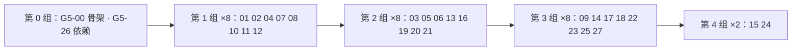

# G5 剩余事项计划：全部实现

> 状态：目标设计（2026-10-04 定）。G0–G4 之后仍没做的事逐条按源码核过，分成三档：**A** 现在就能实现（本文 §3 分成 28 个工作包）、**B** 要用户提供账号 / 证书 / 设备 / 域名（§4 清单，附已有的 mock）、**C** 按设计决定不做（§5，引用决定出处）。来源：[补全进度](../status/completion-progress.md)各包的「没做 / 已知限制 / 偏离」、[安全审查 2026-10](../status/security-review-2026-10.md) §3 的 L1–L10、[功能预期总表](../status/feature-roadmap.md)仍为 🔶 / ⬜ 的行、[后续规划](product-roadmap.md)未勾的条、[架构](../guides/architecture.md) §8、各「部分实施」设计文档首行、[补全执行计划](completion-plan.md) G4-2、Dependabot 的 PR 与警报、CI 已知的不稳定用例。
> 规则沿用[补全执行计划](completion-plan.md)：一个工作包一个实施代理，1–3k LOC；同一组里并行的包**不改同一个文件**（§3.0 热点文件表）；迁移号与契约节号在本文预分配，合入时以 main 当时最大号 +1 为准；每个包合入时在[补全进度](../status/completion-progress.md)新增自己一节（G5 的节由 G5-00 预建）。
> 现状以源码为准；本文只写缺口的目标形态与怎么分。

## §0 结论与两个决定

- 核对结果：清单共 **91 条**。**A 70 条**（含 R-65 的镜像作业部分；分进 28 个包，5 组、每组 ≤ 8 并行），**B 8 条**（§4 展开成 18 项，其中 4 项是 G4-1 清单之外新增的），**C 13 条**。已经做完却仍挂在旧文档「没做」里的 7 条直接从清单划掉并记证据（§1.6）。
- **G4-2（启动兼容退役）并进 G5。** 原条件是「上一个含启动器的发布版已发出、本版是其后第一个」，为的是给旧页面对新 core（或反过来）留一个版本的退路。现在核对：唯一存在过的发布是从未公开的 0.1.0 Draft，而且它早于画布启动器（启动器在 #14–#19 合入）；含启动器的 0.2.0 还没发出（G4-3 只做了本机演练）。也就是说**从来没有一个公开版本带过旧的启动格式**，不存在要兼容的「上一版」，退路条件无意义。G5-17 删 `LegacyLaunchWord`、`launchWordSchema` / `launchWords` / 行上 `launchArgs` 与页面的旧 core 退路，契约 §13 只追加一句「自 0.2.0 起不再出现」，不改既有文字。
- **忘记口令的设计**：邮箱是可选的（[外部服务](external-services.md) §7.5「邀请、重置、通知都设计成链接 / 一次性码由管理员亲手交给人」），所以不做「输入邮箱自助重置」。做 **owner 签发的重置链接**：owner（或组 admin 对本组成员）在账号与共享页为某人「签发重置链接」，core 发一枚一次性、24 小时内有效的令牌，链接 `…/#reset=<令牌>` 由 owner 交给人（装了 W-MAIL 时多一个「发邮件」按钮）；打开链接是整页「设置新口令」，设成功后撤销这个人其它全部会话（顺手关掉 L2）。登录页的「忘记口令」只显示「请联系管理员为你签发重置链接」。

## §1 清单

编号 R-nn；「来源」写文档与节；「证据」写核对到的源码位置。A 列的「包」指 §3 的工作包。

### §1.1 身份、安全与 Gateway

| 编号 | 事项                                                                                         | 来源                                 | 档  | 证据                                                                                                                                                                     | 包       |
| ---- | -------------------------------------------------------------------------------------------- | ------------------------------------ | --- | ------------------------------------------------------------------------------------------------------------------------------------------------------------------------ | -------- |
| R-01 | 8 位配对短码（桌面配对卡 + 手机 `InputOTP` 输入）                                            | G2-7、G2-10、架构 §8、设计系统 §5.12 | A   | `core/gateway/` 无 `shortCode`；`ui/input-otp.tsx` 已在（只有 `MfaSetup`、`SignIn` 用）；`ConnectScreen.tsx` 只贴链接 / 扫码                                             | G5-01    |
| R-02 | 设备表「平台」「最近访问」两列                                                               | G2-7、G3-11、架构 §8                 | A   | `identity/service.ts::PublicDevice` 只有 `deviceId/principalId/name/role/epoch/createdAtMs/revokedAtMs`；`identity_sessions` 已有 `last_seen_at_ms / user_agent`（0032） | G5-02/03 |
| R-03 | 通行密钥重命名                                                                               | G2-8                                 | A   | `accounts-http.ts::passkey()` 只有 GET 列表、`register/*`、`login/*`、DELETE；`identity_credentials.label` 列已在                                                        | G5-02/03 |
| R-04 | owner 替人重置 MFA 的页面                                                                    | G2-8                                 | A   | core `accounts-http.ts:1145 case "reset"`、审计 `identity.mfa.reset` 已有；`apps/web/src` 无调用                                                                         | G5-03    |
| R-05 | 忘记口令（owner 签发重置链接，见 §0）                                                        | G2-8                                 | A   | `core/identity`、`web/session` 无 `reset` / `forgot`                                                                                                                     | G5-02/03 |
| R-06 | 整页登录入口（无侧栏）                                                                       | G2-8、设计系统 §5.9                  | A   | `SignIn.tsx` 只从 `AccountsSharingPage` / `AccountPage` / `SecurityPage` 挂；`app/App.tsx` 无登录分支                                                                    | G5-03    |
| R-07 | L1 长连接按访问令牌到期定时复核                                                              | 安全审查 L1                          | A   | `http/server.ts:350` 只在 `revalidate` 回调（授权变化）时复核                                                                                                            | G5-20    |
| R-08 | L2 改口令后撤销其它会话                                                                      | 安全审查 L2                          | A   | `accounts-http.ts:260 setPassword` 不动会话                                                                                                                              | G5-02    |
| R-09 | L3 邀请 `ttlMs` 夹到 30 天                                                                   | 安全审查 L3                          | A   | `accounts-http.ts:380` 原样透传                                                                                                                                          | G5-02    |
| R-10 | L4 OAuth 挂起 `state` 按来源地址分表                                                         | 安全审查 L4                          | A   | `oauth/flow.ts:42 MAX_PENDING = 1000`，单表挤最老                                                                                                                        | G5-20    |
| R-11 | L5 中继 `/v1/register` 加 App 证明                                                           | 安全审查 L5                          | B   | App Attest / Play Integrity 都要 Apple / Google 开发者账号；中继本身也按 §14 Q6 不部署                                                                                   | —        |
| R-12 | L6 崩溃剥离认 Armadra 会话密钥形状                                                           | 安全审查 L6                          | A   | `diagnostics/crash.ts:69 TOKEN_PATTERNS` 无 `<会话>.<密钥>` 形状                                                                                                         | G5-19    |
| R-13 | L7 口令策略拒绝码文案与 `warn` 档提示                                                        | 安全审查 L7、G3-8                    | A   | 拒绝码只在 `packages/shared/src/api/identity-security.ts`；`apps/web/src` 无 `passwordBreached` / `password_*`                                                           | G5-03    |
| R-14 | L8 GitHub / 自动化两面对 Bearer 写不再要 CSRF                                                | 安全审查 L8、G3-8                    | A   | `github/http.ts:398 requireCsrf: rule.mutating`、`schedule/api.ts` 同样；`csrfRequired` 只在 `identity/{http,accounts-http,oauth/http}.ts`                               | G5-20    |
| R-15 | L9 桌面回环无凭据不再按主人                                                                  | 安全审查 L9                          | A   | 契约 §3.2 现状；桌面页面已走 Bearer（G2-10），hook 走应用令牌，剩的是探针与本机其它调用方                                                                                | G5-24    |
| R-16 | L10 ama 密钥只发节点用得到的那家                                                             | 安全审查 L10                         | A   | `agent/ama-credentials.ts` 兑换全部已设供应商                                                                                                                            | G5-20    |
| R-17 | OAuth 登录也受 `identity.mfa.requireFor`「未登记提示」                                       | G1-12                                | A   | `oauth/flow.ts` 只对已登记 TOTP 的人走第二步                                                                                                                             | G5-20    |
| R-18 | `tls-alpn-01`                                                                                | G3-5、架构 §8                        | A   | `gateway/acme.ts:53` 注明不做；`acme-client` 支持该挑战                                                                                                                  | G5-16    |
| R-19 | 打包桌面壳里 Gateway 的页面产物路径                                                          | G1-10                                | A   | `gateway/web-root.ts:201` 只认 `apps/web/dist` 与 `web/`；没在 asar 里验过                                                                                               | G5-16    |
| R-20 | `private` / `all` 两档真实绑定                                                               | G1-10                                | B   | 用例不许监听非回环；要用户局域网真机                                                                                                                                     | —        |
| R-21 | 桌面窗口的设备表要先有身份会话、不自动换票                                                   | G2-7                                 | C   | G2-7 决定：免得每次打开设置都多配出一台设备                                                                                                                              | —        |
| R-22 | 策略要求 MFA 而未登记时不拦登录                                                              | G1-11                                | C   | G1-11 决定：会话带 `mfaEnrollmentRequired`，由安全页带去登记（G2-8 已做）                                                                                                | —        |
| R-23 | 真域名、真 OAuth 应用、真手机 passkey                                                        | G1-11、G1-12、总表 §4                | B   | 见 §4                                                                                                                                                                    | —        |
| R-24 | 服务器壳 `secrets rotate`（`rotateMasterKey` 接 CLI）                                        | G0-8                                 | A   | `apps/server/src/cli.ts` 无 `rotate`；`core/secrets` 已有 `rotateMasterKey`                                                                                              | G5-13    |
| R-25 | libsecret 真钥匙环 CI、别的壳接管后读不到 `dpapi` / `libsecret`、`safeStorage` 跑不进 vitest | G0-8                                 | C   | 平台限制，G0-8 已记；无 CI 行能提供                                                                                                                                      | —        |

### §1.2 ACP、协调者与工作流

| 编号 | 事项                                                                                     | 来源                                   | 档  | 证据                                                                                                                                                                                                              | 包       |
| ---- | ---------------------------------------------------------------------------------------- | -------------------------------------- | --- | ----------------------------------------------------------------------------------------------------------------------------------------------------------------------------------------------------------------- | -------- |
| R-26 | ACP `elicitation/create`                                                                 | G2-1、架构 §8、ACP 设计首行            | A   | `acp/normalize.ts:172` 已归一化为 `waiting`，但 `@armadra/agent` 0.6.7 的 `drivers/acp/client.d.ts` 没有 elicitation 回调（只有 `requestPermission`、`mcpServers`）；要先给上游加（同 G1-5 做 `mcpServers` 的路） | G5-04/05 |
| R-27 | ACP 按模型选择（`session/set_config_option`）                                            | 同上                                   | A   | `core/acp` 无 `set_config_option`；`PromptBox.tsx` 只有模式 Select                                                                                                                                                | G5-04/05 |
| R-28 | `pi-acp` 的 `mapFile` 映射                                                               | 同上                                   | A   | `adapters.ts:133 sessionId: "mapFile"` 但 G2-1 按 `opaque` 处理                                                                                                                                                   | G5-04    |
| R-29 | ACP 驱动下的节点凭据与 ama 密钥兑换                                                      | 同上                                   | A   | ACP 直接起适配器，不经启动器；core 在进程内，可在 spawn 时按同一套校验把变量只设给适配器进程                                                                                                                      | G5-04    |
| R-30 | SSH 节点切 ACP                                                                           | 同上                                   | A   | `acp/routes.ts:240,443,458 acp_unsupported`；`ssh` 子进程的 stdio 即 ACP 传输                                                                                                                                     | G5-06    |
| R-31 | 手机上 PromptBox 的模式 Select 收进「⋯」                                                 | G2-10                                  | A   | `PromptBox.tsx` 直接渲染 `Select`                                                                                                                                                                                 | G5-05    |
| R-32 | 六家真适配器版本区间、Copilot 旗标、OMP `--model=`、Pi 键名                              | G1-4、G2-1、G3-7、总表 §4              | B   | `compatibility.json` 其余五家 `null`；C 档探针与手册已备                                                                                                                                                          | —        |
| R-33 | runners 的 `--cwd` / `--resume`                                                          | G2-4、总表 §3.2                        | A   | `collab/control/nodes.ts` 只有 `--task-id` / `--name`；`runners.ts:366` 忽略 `resume` 只记日志                                                                                                                    | G5-07    |
| R-34 | e2e 覆盖 `wait` 的 `blocked`                                                             | G2-4                                   | A   | 场景 11 无该步                                                                                                                                                                                                    | G5-07    |
| R-35 | 任务提示词受投递上限 2000 字                                                             | G2-4                                   | C   | `collab/mailbox.ts:191` 与技能文本都写明「大产物写文件发路径」，是投递设计的上限                                                                                                                                  | —        |
| R-36 | 模板编辑器增删 / 拖排步骤与角色                                                          | G2-3、总表 §3.2、后续规划三、设计 §5.5 | A   | `workflow/TemplateEditor.tsx` 无 `addStep` / `removeStep`                                                                                                                                                         | G5-08    |
| R-37 | 模板改版后已有定时计划的迁移                                                             | G2-3                                   | A   | `schedule/workflow-target.ts:72,102,176` 版本不等即冻结跳过，无升级路径                                                                                                                                           | G5-08    |
| R-38 | 协调者右侧分派抽屉                                                                       | G3-11、设计系统 §5.4                   | A   | `apps/web/src` 无 `DispatchDrawer`；展示页用画布节点表达                                                                                                                                                          | G5-09    |
| R-39 | 完成节点 1px `--success` 边框                                                            | G2-3、设计系统 §4 表                   | A   | `workflow/node-steps.tsx` 只画「第 n 步」                                                                                                                                                                         | G5-09    |
| R-40 | 成员能建自动化之前冷启动创建者恒为 owner                                                 | G2-9                                   | C   | `creators.ts::AUTOMATION_CREATOR`；成员今天不能建自动化，前提不成立                                                                                                                                               | —        |
| R-41 | 真 CLI（Codex / OpenCode / OMP / Copilot）场景 10 / 12，画面门特征                       | G1-3、G3-7、后续规划一、二             | B   | 见 §4                                                                                                                                                                                                             | —        |
| R-42 | `omp` 向导里不给安装命令                                                                 | G2-2                                   | C   | G2-2：没有可确认的安装命令                                                                                                                                                                                        | —        |
| R-43 | 代码块导出写到 Agent 的 cwd、远端工作空间导出、落成后 `unread` 光晕、向导「选择文件夹…」 | G2-2                                   | A   | `assets/exports.ts:70` 固定工作区根；远端 501；`export-to-board.ts` 无 `unread`；`platform/index.ts:34 pickDirectory` 已有而 `NewAgentWizard.tsx` 未用                                                            | G5-23    |

### §1.3 实时协同、评论与推送

| 编号 | 事项                                             | 来源                 | 档  | 证据                                                                                                                     | 包    |
| ---- | ------------------------------------------------ | -------------------- | --- | ------------------------------------------------------------------------------------------------------------------------ | ----- |
| R-44 | 实时板的视口持久化                               | G2-5                 | A   | G2-5：视口不进文档、自动保存对实时板不 PUT；`realtime/session.ts` 无视口                                                 | G5-11 |
| R-45 | 白板对象（`wb:`）的他人选区外框                  | G2-5                 | A   | `CursorLayer.tsx` 无 `wb:`                                                                                               | G5-11 |
| R-46 | 跟随对方视口（而不是光标）                       | G2-5、后续规划四     | A   | `session.ts:46 following` 只跟光标；awareness 无 `viewport`                                                              | G5-11 |
| R-47 | 评论正文 Markdown                                | G2-6                 | A   | `realtime/comments/` 无 markdown；编辑器已有 Markdown 预览可复用                                                         | G5-12 |
| R-48 | 白板对象上的评论随连线读给 Agent                 | G2-6                 | A   | `collab/context-link.ts:144,431` 白板形状不走节点读取路径                                                                | G5-12 |
| R-49 | 评论钉按屏幕距离聚成「+N」                       | G2-6                 | A   | `CommentLayer.tsx` 只按同锚点聚                                                                                          | G5-12 |
| R-50 | `schedule.*`、`resources.threshold` 事件实际发出 | G1-13                | A   | `push/triggers.ts:117,162` 监听这两族；`bus.ts` 只有 `resource.sample`，`schedule/` 只发 `workspace.event`，规则从不触发 | G5-10 |
| R-51 | 「用户关注的节点」过滤 → 按设备选推送种类        | G1-13                | A   | G1-13：无数据来源，发给全部有 `canvas:read` 的人；`push_devices` 无偏好列                                                | G5-10 |
| R-52 | UnifiedPush（ntfy）                              | G1-13、外部服务 §5.2 | A   | `core/push` 无 UnifiedPush；dev-stack `push-sink` 已有假 UnifiedPush 端点、`ntfy` profile 已有                           | G5-10 |
| R-53 | 推送中继部署、真 APNs / FCM、真机收推送          | G1-13、G3-1          | B   | 见 §4                                                                                                                    | —     |
| R-54 | Android FCM 令牌轮换主动重登记                   | G3-1                 | A   | `ArmadraMessagingService.java` 有 `onNewToken`，不回写 `PUT /api/push/devices`                                           | G5-22 |
| R-55 | App 里 `` 直连 core 的资源不带 Bearer   | G2-10                | A   | `native-bridge.ts:243` 只包 `fetch` / `WebSocket`                                                                        | G5-22 |
| R-56 | 原生 App 发起 OAuth（`oauth_browser_required`）  | G1-12                | A   | 系统浏览器 + `armadra://oauth` 深链回调；`flow.ts` 的绑定 Cookie 在原生上换成深链里的一次性票                            | G5-22 |
| R-57 | 真浏览器里的推送订阅、通用链接、真机与商店       | G2-10、G3-1          | B   | 见 §4                                                                                                                    | —     |
| R-58 | Android 系统已信任证书不参与指纹                 | G3-1                 | C   | WebView 无钩子（G3-1）                                                                                                   | —     |

### §1.4 桌面壳、发布与平台

| 编号 | 事项                                                                                                                                                                           | 来源                                 | 档  | 证据                                                                                                                                                                                                                  | 包       |
| ---- | ------------------------------------------------------------------------------------------------------------------------------------------------------------------------------ | ------------------------------------ | --- | --------------------------------------------------------------------------------------------------------------------------------------------------------------------------------------------------------------------- | -------- |
| R-59 | G4-2 启动兼容退役                                                                                                                                                              | 计划 G4-2、架构 §9.6                 | A   | `LegacyLaunchWord` / `launchWords` / `launchArgs` 仍在 `packages/shared/src/{shell,agents,api/agents}.ts`、`core/terminal/shell.ts`、`agent/list.ts`、`hook/install/integration.ts`、`web/agent/launch.ts`；决定见 §0 | G5-17    |
| R-60 | 更新页「检查」按钮接壳                                                                                                                                                         | G1-15、架构 §8、总表 §3.12           | A   | `updates/use-update-state.ts:62 reason: "noReleaseSource"`；壳有 `updates:check`                                                                                                                                      | G5-17    |
| R-61 | `signatureState` 在 macOS 只看 `_CodeSignature`                                                                                                                                | G3-3                                 | A   | `main/updates/environment.ts:70`；改用 `codesign --verify`                                                                                                                                                            | G5-17    |
| R-62 | 更新器缓存目录名 `@armadradesktop-updater`                                                                                                                                     | G3-3                                 | A   | `electron-builder.yml` 无 `updaterCacheDirName`                                                                                                                                                                       | G5-18    |
| R-63 | `release.yml` 发布说明读 `CHANGELOG.md`                                                                                                                                        | G4-3                                 | A   | `release.yml:573` 用 `generate-notes`；`assemble.mjs:263 --notes-from` 已有                                                                                                                                           | G5-18    |
| R-64 | arm64 AppImage 缺 `libz.so`                                                                                                                                                    | G3-4、总表 §3.12                     | A   | `electron-builder.yml:187` 两架构同一配置；未带运行时库                                                                                                                                                               | G5-18    |
| R-65 | 更新镜像作业（W-MIRROR）                                                                                                                                                       | 外部服务 §3.3、§15                   | A/B | 作业与多端点能写并对本地 S3 替身验（A）；真 R2 与域名（B）                                                                                                                                                            | G5-18    |
| R-66 | electron-builder 27 清单签名                                                                                                                                                   | G1-15、外部服务 §2.4                 | A   | 现 26.15.3；27 稳定即升，否则记录                                                                                                                                                                                     | G5-18    |
| R-67 | 第三方声明漏掉打进 `out/` 的桌面 devDependencies                                                                                                                               | G3-9                                 | A   | `tools/notices.mjs:40` 只 `--prod`                                                                                                                                                                                    | G5-18    |
| R-68 | Windows 会话宿主：没有会话且 core 不在时提早退出（卸载 / 升级赛跑）                                                                                                            | G3-2                                 | A   | `session-host/server.ts:56 DEFAULT_IDLE_EXIT_MS = 30 分钟`，不看 core 是否还连着                                                                                                                                      | G5-21    |
| R-69 | 渲染进程 JS 错误上报（可选、剥离）                                                                                                                                             | G3-10、总表 §3.12                    | A   | `main/diagnostics.ts:106 ipcMode: 0`；页面无 `onerror` 上报                                                                                                                                                           | G5-19    |
| R-70 | Claude 额度关掉后按本地 JSONL 估算窗口                                                                                                                                         | G1-16                                | A   | `core/usage/` 无本地窗口估算；成本扫描器已读同一份转录                                                                                                                                                                | G5-25    |
| R-71 | `AlertDialog` 手机底部形态                                                                                                                                                     | G3-11、设计系统首行                  | A   | `ResponsiveDialog.tsx` 只对应 `Dialog`                                                                                                                                                                                | G5-23    |
| R-72 | 零碎：`Spinner` 调用处 `aria-label`、`armadra-hook canvas --help`、「设置 → 连接 → 后台服务」两处旧文案、展示页 i18n 不进生产包、展示页缺的四个组件样本与集成分区 CLI 分组样本 | G0-6、G0-5、G0-2、G1-14、G2-11、G3-6 | A   | `ui/spinner.tsx:9` 英文；`i18n/{automation,github}.ts` 仍写旧标题；`i18n/index.ts:55` 直接 import showcase；`showcase/sections/components.tsx` 无 resizable / chart / sonner / context-menu                           | G5-00/23 |
| R-73 | 休眠判据 `processesUnder` 同步 `ps`                                                                                                                                            | G3-6                                 | A   | `terminal/hibernator.ts:696`                                                                                                                                                                                          | G5-16    |
| R-74 | `linux-x64` 性能基线                                                                                                                                                           | G3-6、总表 §3.11                     | A   | `server-perf-baseline.json` 只有 `darwin-arm64`；main 上 nightly 已跑过（2026-10-03）                                                                                                                                 | G5-16    |
| R-75 | Caddy 配置实跑、镜像里浏览器节点（`ARMADRA_BROWSER_PATH`）                                                                                                                     | G3-5                                 | A   | 指南 §3.3 Caddy 未跑；`apps/server/docker/Dockerfile` 无 Chrome 与说明                                                                                                                                                | G5-16    |
| R-76 | step-ca 的 ACME 签发进 CI                                                                                                                                                      | G3-5                                 | C   | CI 的 Linux 上容器到宿主回环不通（G3-5）；Pebble 两条路已验                                                                                                                                                           | —        |
| R-77 | Worker 的升级本身                                                                                                                                                              | G1-2                                 | C   | Worker 就是远端安装的同一份 core 包（架构 §2「`worker --stdio`」）；升级 = 升级远端安装，G1-2 决定不在范围                                                                                                            | —        |
| R-78 | 真 sshd、Windows 真机、签名证书、分发推送、商店                                                                                                                                | 总表 §4                              | B   | 见 §4                                                                                                                                                                                                                 | —        |
| R-79 | A 档只在 Linux 跑；生成的 shadcn 文件不改（`cn` import、`TabsContent`）                                                                                                        | G0-4、G0-6、G2-11                    | C   | G0-4 决定；生成文件不改是 G2-11 / G3-11 的做法（焦点环由调用方加）                                                                                                                                                    | —        |
| R-80 | `ama.exe` 是 `armadra-hook.exe` 的拷贝；Windows `hookClient()` 的 `.cmd` 兜底                                                                                                  | G1-7、G1-5                           | C   | 打包版带 `.exe`（G3-2 验过），兜底只在没有 `.exe` 的开发构建                                                                                                                                                          | —        |
| R-81 | core 子进程异常退出时 IPC 尽力而为；`usage.codexUsage` 沿用旧键；pebble / dex 的 issuer 怪癖                                                                                   | G3-10、G1-16、G0-7                   | C   | 各包已记为设计 / 约定                                                                                                                                                                                                 | —        |

### §1.5 外部服务、依赖与 CI

| 编号 | 事项                                                                                                              | 来源                         | 档  | 证据                                                                                                                                                | 包       |
| ---- | ----------------------------------------------------------------------------------------------------------------- | ---------------------------- | --- | --------------------------------------------------------------------------------------------------------------------------------------------------- | -------- |
| R-82 | W-MAIL：SMTP 可选通知通道（邀请 / 重置链接「发邮件」）                                                            | 外部服务 §7.5、§15、架构 §8  | A   | 无 `core/mail`；dev-stack 已有 `mailpit`                                                                                                            | G5-13    |
| R-83 | W-FORGE：`core/forge/` 抽象 + Gitea / Forgejo + GitLab                                                            | 外部服务 §10.2、总表 §3.8 ⬜ | A   | 只有 `core/github/`；dev-stack 已有 `gitea`；GitLab 用录制 fixture（§10.2）                                                                         | G5-14/15 |
| R-84 | Dependabot：`ws` 8.18.3 → 8.21.0（PR #13 与 #4 同一件事）                                                         | Dependabot                   | A   | `apps/desktop/package.json:30 "ws": "8.18.3"`；#13 是手工同样改动                                                                                   | G5-26    |
| R-85 | 警报 #51 `uuid` < 11.1.1（中，经 `xcode@3.0.1`，electron-builder 的 macOS 路）                                    | Dependabot                   | A   | `pnpm-lock.yaml:5634 uuid@7.0.3`，只有 `xcode` 依赖它；`overrides` 到 11.1.1 并跑 `dist`                                                            | G5-26    |
| R-86 | 警报 #48 `node-forge` ≤ 1.4.0（高，无修复版，经 `acme-client@5.4.0`，生产）                                       | Dependabot                   | A   | `pnpm-lock.yaml:8468`；只用于 ACME 的 CSR / 账户密钥签名，不验别人的签名；评估换 `acme-client` 新版或在 `acme.ts` 自写 CSR（本仓库已有 DER 写入器） | G5-26    |
| R-87 | 警报 #49 `braces` ≤ 3.0.3、#50 `http-cache-semantics` ≤ 4.2.0（高，无修复版，经 `micromatch` / `got@11`，构建期） | Dependabot                   | A   | `pnpm-lock.yaml:10631,9754`；不进运行时；登记评估、锁住并等上游                                                                                     | G5-26    |
| R-88 | Windows `approvals.test` sweep 偶发                                                                               | 通用规则「已知偶发」         | A   | `agent/approvals.test.ts:205`「sweeps the files a killed client left behind」；mtime 粒度 / 时钟                                                    | G5-27    |
| R-89 | `server-container-e2e` 配对偶发卡住（现场已留）                                                                   | 同上、`6b0ba9b8`             | A   | `server-e2e.mjs` 配对等不到时留截图 / 页面文字 / 接口应答 / 服务器输出；还没按现场修                                                                | G5-27    |
| R-90 | macOS 无头浏览器跨源 iframe `DOM.getDocument` 卡住（现场已留）                                                    | 同上、`8aa2b8e3`、#80        | A   | CDP 追踪记子会话；`--disable-gpu` 后仍有 OOPIF 子会话不答的现场                                                                                     | G5-27    |
| R-91 | 夜间 `report` 作业开 issue 只在 main 失败时触发                                                                   | G3-4                         | C   | 不是实现缺口；main 上首次失败即验证                                                                                                                 | —        |

### §1.6 核对后划掉的（已做完，旧文档未更新）

| 事项                                                    | 旧出处             | 证据                                                                         |
| ------------------------------------------------------- | ------------------ | ---------------------------------------------------------------------------- |
| `canvasMcp` 注入 `mcpInjected` 为真                     | G2-1               | G1-5 已升 `@armadra/agent` 0.6.5；`client.d.ts:36 features.mcpServers: true` |
| 壳侧兼容性围栏检查                                      | G1-15              | `shell-core/updates/verdict.ts:37 compatibilityRefused`                      |
| 成员节点 `creator_principal_id` 继承协调者              | G2-4               | G2-9 `identity/creators.ts` 的库触发器让任何一条路起的会话行都继承           |
| 终端节点头「第 n 步」与「等待接管」                     | G2-3、G2-9         | G3-11 已做                                                                   |
| `TabsContent` 焦点环、浅色棋盘格、`CommandInput` 焦点环 | G1-14、G0-4、G2-11 | G2-11 / G3-11 由调用方加                                                     |
| 两份设备表合并                                          | G2-7               | G3-11 已合成 `GatewayDevices`                                                |
| Windows 节点凭据与 ama 密钥兑换                         | G1-1               | G3-2 `armadra-launch.exe` 已兑换                                             |

## §2 编号预分配与热点文件

### §2.1 编号

main 当前最大迁移 `0035_node_creators.sql`，契约最大节 §23。合入时以当时最大号 +1 为准，不同就回改本文。

| 迁移 | 用途                                                                    | 包    |
| ---- | ----------------------------------------------------------------------- | ----- |
| 0036 | `identity_password_resets`（一次性重置令牌）                            | G5-02 |
| 0037 | `push_devices` 加 `kinds_json`（推送种类偏好）与 `unifiedpush_endpoint` | G5-10 |
| 0038 | `forge_config`（每仓库的托管平台）与 `github_references` 加 `forge` 列  | G5-14 |

| 契约节 | 标题                                            | 包    |
| ------ | ----------------------------------------------- | ----- |
| §24    | Gateway 配对短码                                | G5-01 |
| §25    | 口令重置链接                                    | G5-02 |
| §26    | ACP 补充：elicitation、模型、凭据、SSH          | G5-04 |
| §27    | 推送补充：设备偏好、UnifiedPush、调度与资源事件 | G5-10 |
| §28    | 邮件通道                                        | G5-13 |
| §29    | 托管平台（forge）                               | G5-14 |
| §30    | 页面错误上报                                    | G5-19 |

既有节只**追加**字段说明（设备行多两列记在 §10 / §18.4，passkey `PATCH` 记在 §18.2，`open-agent --cwd/--resume` 记在 §15.5，自动化模板升级记在 §15.6，awareness `viewport` 记在 §16.4，§13 加 G4-2 的一句），不改既有文字与节号。

### §2.2 热点文件归属

同一组里只有一个包能改这些文件。G5-00 像 G0-3 一样先把全部新面的 scope、事件名、i18n 模块、设置键与契约节标题一次加齐，其余包只填自己的文件。

| 文件                                                                                                                                                                                         | 归属                                                                                                                                                                                  |
| -------------------------------------------------------------------------------------------------------------------------------------------------------------------------------------------- | ------------------------------------------------------------------------------------------------------------------------------------------------------------------------------------- |
| `core/http/route-scopes.ts`、`core/main.ts`                                                                                                                                                  | G5-00（新前缀 `/api/mail/`、`/api/forge/`、`/api/diagnostics/client-error`、`/api/gateway/pairing-code`、`/api/identity/password-reset/` 的 scope 与 `SELF_GUARDED`）；之后只有 G5-24 |
| `core/http/routes.ts`                                                                                                                                                                        | 不动：新路由都在各域自己的 `routes.ts` 里经 `install` 挂                                                                                                                              |
| `core/bus.ts`、`packages/shared/src/api/events.ts`                                                                                                                                           | G5-00 加 `schedule.fired / schedule.failed / schedule.attention`、`resources.threshold` 的形状；G5-10 只发事件                                                                        |
| `apps/web/src/i18n/index.ts`                                                                                                                                                                 | G5-00（预登记 `coordinator`、`forge`、`mail`、`diagnostics`、`password-reset`；展示页模块改为只在 DEV 挂）                                                                            |
| `core/settings/completion-settings.ts` 与 `packages/shared/src/completion-settings.ts`（字节相同）                                                                                           | G5-00（`diagnostics.reportPageErrors` 缺省 false、`usage.claudeLocalWindow` 缺省 true）                                                                                               |
| `docs/contracts/core-json-api.md`                                                                                                                                                            | G5-00 建 §24–§30 标题「预留」；各包只填自己的节与自己的追加句                                                                                                                         |
| `migrations.lock`                                                                                                                                                                            | 0036 → 0038 按 G5-02 → G5-10 → G5-14 的顺序合入                                                                                                                                       |
| `core/identity/{accounts-http,service,store,passkey}.ts`、`core/identity/mfa/*`、共享层 `api/identity*.ts`                                                                                   | G5-02；G5-03 只改页面                                                                                                                                                                 |
| `core/identity/oauth/*`、`core/http/server.ts`、`core/github/http.ts`、`core/schedule/api.ts`、`core/agent/ama-credentials.ts`                                                               | G5-20；G5-22（oauth 深链）与 G5-14（github → forge）在它之后                                                                                                                          |
| `core/gateway/index.ts`                                                                                                                                                                      | G5-01（配对码路由）→ G5-16（ALPN、web-root）                                                                                                                                          |
| `core/acp/*`、共享层 `api/acp.ts`                                                                                                                                                            | G5-04 → G5-05（页面）/ G5-06（SSH，只加 `ssh.ts` 并改 `index.ts`、`bridge.ts`）                                                                                                       |
| `apps/web/src/acp/*`、`i18n/acp.ts`                                                                                                                                                          | G5-05                                                                                                                                                                                 |
| `apps/web/src/workflow/*`（除 `node-steps.tsx`）、`core/schedule/workflow-target.ts`、`core/workflow/service.ts`                                                                             | G5-08；`node-steps.tsx` 与终端节点头归 G5-09                                                                                                                                          |
| `collab/control/nodes.ts`、`workflow/dispatch.ts`、`agent-host/ama/runners.ts`                                                                                                               | G5-07                                                                                                                                                                                 |
| `apps/web/src/realtime/*`（评论子目录除外）、`core/realtime/awareness.ts`、共享层 `api/realtime.ts`                                                                                          | G5-11；`realtime/comments/*`、`collab/context-link.ts` 归 G5-12                                                                                                                       |
| `core/push/*`、`core/schedule/engine.ts`、`core/resources/*`、`apps/web/src/push/*`                                                                                                          | G5-10                                                                                                                                                                                 |
| `apps/server/src/cli.ts`、`apps/server/src/diagnostics.ts`                                                                                                                                   | G5-13（`--smtp-url`、`secrets rotate`）；`diagnostics.ts` 归 G5-19                                                                                                                    |
| `apps/desktop/package.json`、`pnpm-lock.yaml`、`pnpm-workspace.yaml`、`THIRD_PARTY_NOTICES.md`                                                                                               | G5-26 先合；之后改依赖的包（G5-13 `nodemailer`、G5-04 `@armadra/agent`、G5-18 electron-builder）各自 rebase 后再 `pnpm install`                                                       |
| `apps/desktop/electron-builder.yml`、`scripts/after-pack.mjs`、`.github/workflows/release.yml`、`tools/release/*`、`tools/notices.mjs`                                                       | G5-18；G5-17 只改 `main/updates/*`、`shell-core/updates/*`、`web/updates/*`                                                                                                           |
| `packages/shared/src/{shell,agents}.ts`、`api/agents.ts`、`core/terminal/shell.ts`、`agent/list.ts`、`hook/install/integration.ts`、`web/agent/launch.ts`                                    | G5-17                                                                                                                                                                                 |
| `apps/web/src/app/App.tsx`、`session/SignIn.tsx`、`panels/settings/pages/{AccountsSharingPage,AccountPage}.tsx`、`pages/security/*`、`pages/gateway/GatewayDevices.tsx`                      | G5-03                                                                                                                                                                                 |
| `panels/settings/pages/gateway/*`（`GatewayDevices.tsx` 除外）、`mobile/ConnectScreen.tsx`、`host/qr.ts`、`i18n/{gateway,mobile-connect}.ts`                                                 | G5-01；`mobile/*` 其余与 `apps/mobile/**` 归 G5-22                                                                                                                                    |
| `panels/ResponsiveDialog.tsx`、`acp/NewAgentWizard.tsx`、`acp/export-to-board.ts`、`core/assets/exports.ts`、`i18n/{automation,github}.ts`、`showcase/sections/{components,integration}.tsx` | G5-23                                                                                                                                                                                 |
| `tools/probes/*`                                                                                                                                                                             | 各包只加自己的探针步骤文件；共用的 `lib.mjs` / `server-e2e.mjs` 归 G5-27                                                                                                              |
| `docs/status/completion-progress.md`                                                                                                                                                         | G5-00 预建 28 节；各包只写自己那节                                                                                                                                                    |

## §3 A 档工作包

每包：范围 → 文件 → 接口 → 测试 → dev-stack。规模按 1–3k LOC 估。验证命令同[补全执行计划](completion-plan.md) §0。

### 第 0 组（2 个，先合）

#### G5-00 骨架与编号

- 范围：§2.2 表里归它的全部预登记；`completion-progress.md` 预建「G5-00 … G5-27」28 节；契约 §24–§30 标题「预留」；`i18n/index.ts` 把 `showcase` 模块改为 `import.meta.env.DEV` 下才挂（R-72 的「展示页 i18n 不进生产包」，`i18n.test` 的「每个模块都挂进 `MESSAGE_MODULES`」改为开发态断言，生产构建用例断言 `dist/` 里没有 `showcase` 的文案）；`bus.ts` / `api/events.ts` 加四个事件形状（只定义不发）；设置键两份字节相同。
- 文件：§2.2 表第 1–7 行；`apps/web/src/showcase/production.test.ts`。
- 测试：`route-scopes.test`、`main.test`、`completion-settings.test`、shared `api-events.test`、`i18n.test`、`production.test`；`pnpm check`。dev-stack：无。

#### G5-26 依赖审计

- 范围：`ws` → 8.21.0（与 #13 同一改动；合入后请用户关掉 #4、#13）；`pnpm-workspace.yaml` `overrides` 把 `uuid` 统一到 ≥ 11.1.1 并跑一次 `pnpm --filter @armadra/desktop dist`（`xcode` 包只在 macOS 打包时用 `uuid.v4`，API 未变）；`node-forge`：先看 `acme-client` 是否有不依赖它的版本，有就升；没有就在 `core/gateway/acme.ts` 用仓库已有的 DER 写入器自写 CSR 与账户密钥签名、把 `acme-client` 的 `forge` 用法换掉（它只签不验，漏洞是验签侧的，但生产依赖里不留高危）；`braces` / `http-cache-semantics` 只在构建期（`fast-glob` / `electron-builder` 的 `got@11`），没有修复版：在 `docs/guides/ci-release.md` 登记「构建期依赖、不进运行时」并锁版本，Dependabot 警报由用户 dismiss 或等上游。生产依赖变了跑 `node tools/notices.mjs`。
- 文件：`apps/desktop/package.json`、`pnpm-workspace.yaml`、`pnpm-lock.yaml`、`THIRD_PARTY_NOTICES.md`、`core/gateway/acme.ts`（只在走自写 CSR 时）、`docs/guides/ci-release.md`。
- 测试：全量 `pnpm -r --if-present test`；`acme.test` 与 `ARMADRA_DEV_STACK=1` 的 `acme.pebble.test`；`release:test`。dev-stack：`pebble`。

### 第 1 组（8 个并行）

#### G5-01 Gateway 配对短码与手机输入（R-01）

- 范围：core 在签发配对票时同时签一枚 8 位短码（`[A-Z2-9]`、显示成 `XXXX-XXXX`，两分钟、一次性，与票同生同灭，按来源地址限流走 M4 的桶）；`POST /api/gateway/pairing-code/exchange { code }` 答与 `#pair=` 相同的票 + `fp`（短码只在 `private` / 回环来源与已信任的 TLS 上开放：公网 `all` 档关掉，防撒网）；配对卡按设计 §5.12 画「配对码 3F7K-9Q2M 2:59」与「新配对码」；手机连接页第三个入口「输入配对码」用 `InputOTP` 8 位分两组，输入满自动兑换；展示页 `gateway` / `mobile` 分区补样本。
- 文件：`core/gateway/{pairing-code.ts（新）,index.ts,admission.ts}`、共享层 `api/gateway.ts`、`panels/settings/pages/gateway/*`（除 `GatewayDevices.tsx`）、`mobile/ConnectScreen.tsx`、`mobile/connect.ts`、`host/qr.ts`、`i18n/{gateway,mobile-connect}.ts`、`showcase/sections/{gateway,mobile}.tsx`、契约 §24。
- 测试：`pairing-code.test`（字母表、一次性、过期、限流、档位关闭）；`gateway.integration.test` 加「短码换票 → 配对 → 票失效」；`ConnectScreen.test`；`gateway-e2e` 加一步「手机页输入短码配对」；`design-showcase --only=gateway,mobile`。dev-stack：无。

#### G5-02 身份 core：重置链接、passkey 改名、设备两列（R-02 核心、R-03、R-05、R-08、R-09）

- 范围：迁移 0036 `identity_password_resets(token_hash, principal_id, issued_by, expires_at_ms, used_at_ms)`；`POST /api/identity/principals/{id}/password-reset`（owner 或该组 admin，答 `{ token, expiresAtMs }` 只此一次，审计 `identity.password.reset.issue`）、`GET /api/identity/password-reset/{token}`（匿名，答 `{ displayName, expiresAtMs }`，走 M4 的失败扣费桶）、`POST /api/identity/password-reset/{token} { password }`（过口令策略与泄露检查，成功后撤销该人全部会话并记 `identity.password.reset.use`）；`setPassword` 成功后撤销本人其它会话（L2），答复带 `revokedSessions`；邀请 `ttlMs` 夹到 30 天（L3）；`PATCH /api/identity/passkey/{id} { label }`（1–64 字，只有本人）；`PublicDevice` 加可选 `platform`（由该设备最近会话的 `user_agent` 归成 `macos / windows / linux / ios / android / web / unknown`，不回 UA 原文）与 `lastSeenAtMs`（取该设备会话里最大的 `last_seen_at_ms`）。
- 文件：`core/db/migrations/0036_password_resets.sql` + `migrations.lock`、`core/identity/{accounts-http,service,store,password-reset.ts（新）,passkey}.ts`、`identity/audit.ts`（动作表追加）、共享层 `api/identity*.ts`、契约 §25 与 §18.2 / §18.4 / §10 的追加句。
- 测试：`password-reset.test`（签发权限、一次性、过期、策略、撤销会话、审计无令牌）；`security-http.test` 加 passkey 改名与 L2 / L3；`accounts.integration.test` 加设备行两列；`route-access.test`。dev-stack：`hibp`（可选）。

#### G5-04 ACP core 补充（R-26 core、R-27 core、R-28、R-29）

- 范围：（1）上游：给 Owlbay/armadra-agent 的 `AcpClient` 加 `onElicitation` 回调与 `setConfigOption(sessionId, key, value)`，`features.elicitation` / `features.configOptions` 能力位（与 G1-5 加 `mcpServers` 同一做法，开 PR、等用户发版后再升依赖；在那之前 core 按 `features` 判断，缺时与现在一样）；（2）`elicitation/create` 进 `agent_approvals`（`request_json = { protocol: "acp", elicitation }`），`agent.approval` 载荷多 `elicitation` 字段，答复 `POST …/approvals/{id}/answer { elicitation: { action, content } }`，取消 / 退出 / 切换一律 `cancel`；（3）起会话与 `…/mode` 旁加 `PUT /api/acp/sessions/{id}/model { modelId }`，模型目录来自 `initialize` 答的 `configOptions`，`GET …/log` 的 `modes` 旁多 `models`；（4）`pi-acp` 的 `mapFile`：按适配器表读 `~/.pi/acp/sessions.json`（路径与形状在 `adapters.ts` 一行写死、读不到退回 `opaque`），接回时把 ACP 会话 id 映射回 Pi 的会话文件；（5）ACP 驱动的节点带 `credentialRef` 或是 ama 时，`startAdapter` 前经 `terminal/install.ts::ownedEnvironment` 同一套校验（H2 的 `credential:use`）取值，只放进适配器进程的 `env`，不进节点数据、镜像与日志。
- 文件：`core/acp/{client,host,session,adapters,routes,normalize,mirror}.ts`、`agent/approvals.ts`（`elicitation` 路由）、共享层 `api/acp.ts`、契约 §26 与 §14.x 追加句；上游 PR 另记。
- 测试：对假 ACP Agent（`fakeAcpAgentPath()`，需要上游给假 Agent 加 elicitation 与 configOptions）：`session.test` 的 elicitation 三态、`routes.test` 的 model、`host.test` 的 mapFile 与凭据注入（值只在子进程 env、不在镜像 / 日志）；`credentials.test` 加 ACP 一路。dev-stack：无。

#### G5-07 协调者 runners：`--cwd` / `--resume` 与 `blocked` 覆盖（R-33、R-34）

- 范围：`open-agent --cwd <路径>`（工作区内相对或绝对，按 core 平台校验，越界拒绝 `cwd_outside_workspace`）、`--resume <会话 id>`（只对该 CLI 认识的会话 id，走 `launch.ts` 已有的 resume 行；不认识答 `resume_unsupported`）；`workflow/dispatch.ts::launchRoleNode` 透传；ama runner 把 `request.cwd` / `request.resume` 映射过去，不再忽略；成员技能说明一句；场景 11 加「成员停在审批上 → `wait` 答 `blocked` 带 `approvalId` → 页面答复 → 继续到 done」。
- 文件：`collab/control/nodes.ts`、`workflow/dispatch.ts`、`agent-host/ama/runners.ts`、`collab/skill.ts`（`SKILLS_REVISION` +1）、`tools/probes/agent-e2e/scenario-11*.mjs`、契约 §15.5 追加句。
- 测试：`nodes.test` / `wait.test` / `runners.test` 各加用例；`agent-e2e --only 11`（脚本化模型）。dev-stack：无。

#### G5-08 工作流编辑器与模板升级（R-36、R-37）

- 范围：编辑器按设计 §5.5：左列步骤 `Item` 列表可增删、拖排（`@dnd-kit` 已在依赖里就用，否则上下移按钮），角色可增删，依赖 Select 随步骤变化；保存即新版本（既有语义）。模板升级：`PUT /api/workflows/templates/{id}` 答复带 `frozenSchedules: [{scheduleId, reason}]`（参数缺失 / 类型不符 / 无差异），新增 `POST /api/workflows/templates/{id}/upgrade-schedules { scheduleIds }` 把能升的计划改到新版本（参数集相容时自动、否则列出要人补的参数）；自动化表单对冻结计划显示 `Alert` +「更新到最新版本」。
- 文件：`apps/web/src/workflow/{TemplateEditor,TemplateLibrary,model,store,api}.ts(x)`、`panels/automation/*`（只加冻结提示与按钮）、`core/workflow/{service,routes}.ts`、`core/schedule/workflow-target.ts`、共享层 `api/workflows.ts`、`i18n/workflow.ts`、契约 §15.6 追加句。
- 测试：`workflow.test.tsx`（增删拖排、保存形状）；`workflow-target.test`（相容 / 不相容升级）；`workflow-e2e` 加「改模板 → 升级计划 → 到点按新版本跑」。dev-stack：无。

#### G5-10 推送补充（R-50、R-51、R-52）

- 范围：（1）`core/schedule/engine.ts` 到点 / 失败 / 需处理时发 `schedule.fired` / `schedule.failed` / `schedule.attention`（形状由 G5-00 定，不带命令与输出）；`core/resources/` 的阈值判定从页面搬进 core（设置里已有阈值），越线发 `resources.threshold`（带 `sessionId`、`metric`、`value`）；（2）迁移 0037：`push_devices.kinds_json`（缺省全部），`PATCH /api/push/devices/{deviceId} { kinds }`，`triggers.ts` 按设备过滤；手机推送提示下多一组开关；（3）UnifiedPush：设备登记可带 `unifiedpush: { endpoint }`，传输 `transport-unifiedpush.ts` 向用户自己的 ntfy / 任意 UP 端点 POST 端到端信封（出站表登记为「用户配置的地址」），`push.transport` 不新增键——按设备有 UP 端点就走它。
- 文件：`core/push/*`、`core/schedule/engine.ts`、`core/resources/{service,thresholds.ts（新）}.ts`、`core/db/migrations/0036_push_preferences.sql` + `migrations.lock`、共享层 `api/push.ts`、`apps/web/src/push/*`、`mobile/PushPermission.tsx`、`i18n/push.ts`、`core/net/outbound.ts`、契约 §27 与 §19 追加句。
- 测试：`triggers.test` 四族事件真发；`transport-unifiedpush.test` 对 `push-sink` 的 UP 端点；`push-e2e` 加 UP 一条线与设备偏好过滤。dev-stack：`push-sink`、`ntfy`（profile）。

#### G5-11 实时协同补充（R-44、R-45、R-46）

- 范围：实时板视口存本机 `localStorage`（按 `boardId`，刷新回到自己上次的位置，不进文档）；awareness 加 `viewport { x, y, zoom }`（共享层 `awarenessStateSchema` 与 `AWARENESS_LIMITS` 同步，core `realtime/awareness.ts` 校验），`follow(clientId)` 改为跟对方视口（插值 120ms），对方没报视口时退回跟光标；`CursorLayer` 对 `wb:` 项按白板 item 的包围盒画选区外框；展示页 `collab` 分区加「跟随视口」样本。
- 文件：`apps/web/src/realtime/{session,awareness,binding,CursorLayer}.ts(x)`、`canvas/*` 只读、`core/realtime/awareness.ts`、共享层 `api/realtime.ts`、`showcase/sections/collab.tsx`、契约 §16.4 追加句。
- 测试：`awareness.test`（core 与页面）、`CursorLayer.test`、`realtime-e2e` 加「B 跟随 A 的视口」与「刷新后视口不变」。dev-stack：无。

#### G5-12 评论补充（R-47、R-48、R-49）

- 范围：评论正文按 Markdown 渲染（复用编辑器的 Markdown 预览渲染器，禁 HTML、链接只开 `http(s)`、提及记号先替换）；`collab/context-link.ts` 对 `reference` 边指向的白板对象 / Frame 也附上未解决评论（锚点 `item`，8 KiB 上限计入预算）；`CommentLayer` 按屏幕距离（< 24px）聚合成「+N」钉，缩放变化重算。
- 文件：`apps/web/src/realtime/comments/*`、`core/collab/context-link.ts`、`core/realtime/comments-store.ts`（只加按 item 批量查询）、`i18n/realtime.ts`。
- 测试：`comments.test`（Markdown 安全、聚合）；`context-link.test` 加白板引用附评论；`realtime-e2e` 评论一步加白板对象。dev-stack：无。

### 第 2 组（8 个并行；依赖第 1 组点名的包）

#### G5-03 身份页面：整页登录、忘记口令、重置页、passkey 改名、MFA 重置、L7（R-02 页面、R-03 页面、R-04、R-05 页面、R-06、R-13）

- 依赖：G5-02（接口）、G5-13（邮件按钮按 `GET /api/mail/status.configured` 显示，没合入时 404 视为未配置）。
- 范围：`App.tsx` 在服务器壳 / Gateway 来源且没有会话时直接渲染整页 `SignIn`（设计 §5.9：无侧栏、360 列、BrandMark）；`#reset=<令牌>` 整页「设置新口令」（先 `GET` 显示给谁、过期即说明）；登录页口令步「忘记口令」link → 一句「请联系管理员为你签发重置链接」；账号与共享页成员行菜单「签发重置链接」→ 对话框显示链接与二维码、复制、有邮件时「发送邮件」；安全页通行密钥行可改名（`Field` 内联）、owner 看别人时「重置两步验证」（`AlertDialog`）；口令字段按 `code` 给文案（`password_too_short / password_common / password_contains_name / password_breached`），`warn` 档设成功后一条 `Alert`「这个口令出现在已知泄露里」；`GatewayDevices.tsx` 加「平台」「最近访问」两列（无值画「—」）；展示页 `auth` 分区补整页登录、重置页、`warn` 提示。
- 文件：§2.2 表 G5-03 行、`i18n/{security,account,sharing,host-identity}.ts`、新 `i18n/password-reset.ts`（G5-00 已登记）、`showcase/sections/auth.tsx`。
- 测试：`SignIn.test`、`App.test`（整页分支）、`AccountsSharingPage.test`、`SecurityPage` 各组件用例、`GatewayDevices.test`；`gateway-e2e` 加「owner 签发重置链接 → 新上下文设口令 → 旧会话被撤销 → 新口令登录」；`design-showcase --only=auth`。dev-stack：`mailpit`（只在验邮件按钮时）。

#### G5-05 ACP 页面补充（R-26 页面、R-27 页面、R-31）

- 依赖：G5-04。
- 范围：`ElicitationCard`（与 `PermissionCard` 同位置，按 `elicitation.requestedSchema` 画 Field：文本 / 枚举 Select / 布尔 Switch，取消一键）；`PromptBox` 加模型 Select（只在 `models` 非空时）；≤ 767 时模式与模型两个 Select 收进「⋯」`DropdownMenu`；焦点页同样；展示页 `acp` 分区补样本。
- 文件：`apps/web/src/acp/*`、`i18n/acp.ts`、`showcase/sections/acp.tsx`。
- 测试：`ElicitationCard.test`、`PromptBox.test` 加模型与窄屏；`acp-e2e` 加 elicitation 一轮（假 Agent）；`design-showcase --only=acp`。dev-stack：无。

#### G5-06 SSH 节点的 ACP（R-30）

- 依赖：G5-04。
- 范围：`core/acp/ssh.ts`：在执行主机上经已有的 `ssh` 命令构造（`remote/ssh` 的主机、密钥、askpass 同一套）起适配器 `… -- <适配器命令>`，stdio 即 ACP 传输；适配器是否装在远端由 Worker 的 `agents.probe` 答（能力位复用 `remote.integration.v1`）；画布 MCP 注入在远端走 Worker 中继的 hook 面（与远端画布注入同一条 unix socket）；`acp_unsupported` 只剩「主机未登记 / Worker 过旧」；驱动切换、休眠、接回与本机一致。凭据兑换在远端保持拒绝（契约 §20，R-29 只开本机）。
- 文件：`core/acp/{ssh.ts（新）,index.ts,bridge.ts,host.ts（只加 transport 参数）}`、`core/remote/{operations,node-probe}.ts`（加 `agents.probe`）、`remote/capabilities.ts`、契约 §26 追加「SSH」小节。
- 测试：`ssh.test`（假 ssh 子进程 + 假 ACP Agent）；`remote-e2e` 加「远端 ACP 节点一轮回复、切终端再切回」。dev-stack：无。

#### G5-13 邮件通道 W-MAIL 与 `secrets rotate`（R-82、R-24）

- 依赖：G5-00、G5-26（加 `nodemailer` 依赖）。
- 范围：`core/mail/`：`ARMADRA_SMTP_URL`（`smtp(s)://user:pass@host:port`，口令部分可写 `secret://armadra-smtp`）+ `ARMADRA_SMTP_FROM`；`GET /api/mail/status { configured, from }`、`POST /api/mail/invitation { invitationId, to }`、`POST /api/mail/password-reset { principalId, to }`（都只有能签发那条链接的人能调；正文只有链接与过期时间，中英按设备语言；地址不进审计明文，记哈希）；每来源每分钟 5 封；服务器壳 `serve --smtp-url` / `--smtp-from`；桌面壳不配（设置键不加）。另：`apps/server/src/cli.ts` 加 `secrets rotate`（调 `rotateMasterKey`，中断可恢复已由 G0-8 保证）。
- 文件：`core/mail/{index,smtp,routes}.ts`、`core/net/outbound.ts`（SMTP 主机按「用户配置的地址」登记）、`apps/server/src/{cli,serve}.ts`、契约 §28。
- 测试：`mail.test` 对进程内假 SMTP（`nodemailer` 的 stream transport）与 `ARMADRA_DEV_STACK=1` 的 Mailpit REST 断言收件；`cli.test` 的 `secrets rotate`。dev-stack：`mailpit`。

#### G5-16 Gateway 与服务端收尾（R-18、R-19、R-73、R-74、R-75）

- 依赖：G5-01（`gateway/index.ts`）。
- 范围：`tls-alpn-01`：`acme.ts` 加挑战类型选择（`ARMADRA_ACME_CHALLENGE=http-01|tls-alpn-01`，缺省 `http-01`），`listener.ts` 的 TLS `SNICallback` 在握手 ALPN 为 `acme-tls/1` 时换挑战证书；打包桌面壳的 `web-root.ts` 多认 `process.resourcesPath/renderer` 与 asar 外的 `app.asar.unpacked/renderer`，`packaged-smoke` 加「打开 Gateway 后经它取首页 200」；`hibernator.ts::processesUnder` 改异步（接口变 `Promise`，调用点两处）；从 main 上最近一次 nightly 的 `server-perf` 产物录 `linux-x64` 基线（没有就在 ubuntu 容器里跑三次取中位数），同步 `server-performance-baseline.md`；dev-stack 加可选 profile `caddy`，`server-e2e --proxy=caddy` 走一遍配对；镜像加可选构建参数 `WITH_CHROMIUM=1` 装 Chromium 并设 `ARMADRA_BROWSER_PATH`，部署指南补一节。
- 文件：`core/gateway/{acme,listener,tls,web-root,index}.ts`、`core/terminal/hibernator.ts`、`tools/probes/{packaged-smoke,server-perf-baseline.json}`、`tools/dev-stack/{docker-compose.yml,services.mjs}`、`apps/server/docker/*`、`docs/guides/server-deployment.md`、`docs/status/server-performance-baseline.md`。
- 测试：`acme.test` 加 ALPN（Pebble 支持 `tls-alpn-01`，`ARMADRA_DEV_STACK=1`）；`web-root.test`；`hibernate.test`；`server-e2e --proxy=caddy`。dev-stack：`pebble`、`caddy`。

#### G5-19 页面错误上报（R-69、R-12）

- 依赖：G5-00（设置键、scope）。
- 范围：`apps/web/src/diagnostics/report.ts` 挂 `window.onerror` / `unhandledrejection`，只在 `diagnostics.reportPageErrors` 且 DSN 合格时收集（栈里的路径只留文件名、消息过同一套剥离规则的前端版 `crash-scrub.ts`，每分钟最多 5 条）；桌面壳走 IPC `diagnostics:report` → 主进程 `@sentry/electron`（`ipcMode` 保持 0，自己转发）；服务器壳 / Gateway 走 `POST /api/diagnostics/client-error`（要会话、限流、服务端再剥离一次再交 `reportError`）；通用页诊断区多一个「包含页面错误」开关；L6：`crash.ts` 加 `<会话>.<密钥>` 形状规则。
- 文件：`apps/web/src/diagnostics/*`、`panels/settings/pages/GeneralPage.tsx`（只加一行）、`core/diagnostics/{crash,client-report.ts（新）,routes.ts（新）}`、`apps/desktop/src/main/diagnostics.ts`、`apps/desktop/src/shared/ipc.ts`、`apps/server/src/diagnostics.ts`、`i18n/diagnostics.ts`（G5-00 已登记）、契约 §30。
- 测试：`crash.test` 加会话密钥形状；`client-report.test`（限流、剥离、关着不收）；`crash-report-e2e` 加页面抛错一条到 GlitchTip。dev-stack：`glitchtip`。

#### G5-20 安全杂项（R-07、R-10、R-14、R-16、R-17）

- 范围：L1：`CoreServer.upgrade` 记下的身份带访问令牌到期时间，到期时按同一道门复核一次（刷新过就续，否则 4403）；L4：OAuth 挂起表按来源地址分桶（每地址 50、总 1000）；L8：`github/http.ts` 与 `schedule/api.ts` 改用 `identity/http.ts::csrfRequired`（Bearer 不核），`github/http.test` 的断言随之改（理由：M2 已把规则定为「只在 Cookie 会话上核对」）；L10：ama 兑换只答该节点 profile 里 `provider` 那一家（profile 由 G1-7 的注入写出，core 读节点数据里的 `agent.model.provider`，没有时答全部并记一条 warn 审计）；R-17：OAuth 登录在 `requireFor` 命中而未登记 TOTP 时会话带 `mfaEnrollmentRequired`。
- 文件：`core/http/server.ts`、`core/identity/oauth/flow.ts`、`core/github/http.ts`、`core/schedule/api.ts`、`core/agent/ama-credentials.ts`、`agent-host/ama/*` 只读；契约 §17.4 / §18.1 / §18.5 / §12.4 追加句；安全审查 §3 把修掉的行标「已修（G5-20）」。
- 测试：`server-revoke.test` 加到期复核；`oauth.test` 分桶；`github/http.test`、`schedule/api.test` Bearer 写不核 CSRF；`ama-credentials.test` 按供应商。dev-stack：无。

#### G5-21 Windows 会话宿主退出（R-68）

- 范围：会话宿主在「没有任何会话 **且** 没有 core 连着」时 10 秒后退出（有会话时仍按 30 分钟空闲），core 连上即取消；壳正常退出（⌘Q / 关闭）时向宿主发 `shutdown-if-idle`；NSIS 的 `installer.nsh` 卸载 / 升级前先对命名管道发同一条再等 5 秒，才按进程名结束；`windows-acceptance` 把「卸载后无残留 `armadra.exe`」从收尾手段改为断言。
- 文件：`apps/desktop/src/session-host/{server,main}.ts`、`apps/desktop/src/main/{runtime-process,lifecycle}.ts`（只加一条消息）、`apps/desktop/build/installer.nsh`、`tools/probes/windows-acceptance{,-lib}.mjs`。
- 测试：`session-host/*.test`（空闲 + 无 core 退出、core 连着不退、有会话不退）在 Windows runner 上跑；夜间 `windows-acceptance`。dev-stack：无。

### 第 3 组（8 个并行）

#### G5-09 协调者分派抽屉与完成节点边框（R-38、R-39）

- 范围：`coordinator/DispatchDrawer.tsx`（右侧 `--drawer-w`，读 `workflow_task_runs` + `agentActivity` 同一份数据：ama 行、成员 `Item` 左侧 2px Agent 色、状态胶囊、耗时、汇总便签「打开」、失败行「重试」= 重新 `send` 任务提示词、离线置灰 + `Alert`、空态一句 + 聚焦 ama 输入）；ama 节点头 chips「N 成员」点开抽屉；`node-steps.tsx` 对运行里已完成的角色节点加 1px `--success` 边框；展示页 `coordinator` 分区换真组件。
- 文件：`apps/web/src/coordinator/*`（新）、`workflow/node-steps.tsx`、`nodes/terminal/TerminalNode.tsx`（只加 chip）、`core/workflow/routes.ts` 加 `GET /api/workflows/tasks?boardId=`（按画布，成员 `canvas:read`）、`i18n/coordinator.ts`、`showcase/sections/coordinator.tsx`。
- 测试：`DispatchDrawer.test`（五态）；`routes.test` 加任务列表权限；`agent-e2e --only 11` 加「页面抽屉里看到三行与汇总」；`design-showcase --only=coordinator`。dev-stack：无。

#### G5-14 托管平台 forge 一：抽象与 Gitea / Forgejo（R-83 前半）

- 依赖：G5-20（`github/http.ts`）。
- 范围：`core/forge/`：`Forge` 接口（issues 列表 / 详情 / 状态、pulls 列表 / 创建 / 差异 / 检查 / 合并、引用、状态映射）+ `github.ts` 把现有 `core/github/` 的客户端装进接口（行为不变、既有用例不改断言）+ `gitea.ts`（`Authorization: token`，PR ↔ pull request 同名，检查用 commit statuses）；迁移 0038：`forge_config(repo_key, forge, api_base, credential_ref)`、`github_references` 加 `forge` 列缺省 `github`；按远端地址识别（`github.com` / 企业域 → github，其余按配置），`GET /api/forge/repos/{key}` 答识别结果；令牌按 G0-8 的 SecretStore `armadra-forge-<id>`；外呼按「用户配置的地址」登记。
- 文件：`core/forge/*`（新）、`core/github/{http,service,client}.ts`（只改装配）、`core/db/migrations/0038_forge.sql` + `migrations.lock`、共享层 `api/forge.ts`（新）、契约 §29、`core/net/outbound.ts`。
- 测试：`forge/gitea.test` 对进程内假 Gitea 与 `ARMADRA_DEV_STACK=1` 的真 Gitea（预置仓库、issue、PR、合并）；`github/*.test` 全部不改断言通过。dev-stack：`gitea`。

#### G5-17 启动兼容退役与更新页接线（R-59、R-60、R-61）

- 范围：G4-2 按计划原文删 `LegacyLaunchWord`、`launchWordSchema` / `launchWords` / 行上 `launchArgs`、`web/agent/launch.ts` 的旧 core 退路与对应测试，契约 §13 追加「自 0.2.0 起 `launchWords` / `launchArgs` 不再出现」；更新页「检查」调壳 `updates:check`，`use-update-state.ts` 的 `noReleaseSource` 只在壳答没有发布源时出现；`environment.ts::signatureState` 在 macOS 跑 `codesign --verify --deep --strict`（每进程一次缓存），ad-hoc 答 `unknown`；`update-e2e` 对 0.2.0 的产物重跑一次「检查 → 下载 → 暂存」。
- 文件：§2.2 表 G5-17 行、`apps/desktop/src/main/updates/{environment,controller}.ts`、`apps/web/src/updates/*`、`i18n/updates.ts`、契约 §13。
- 测试：`launch.test`、`list.test`、`integration.test` 改断言（理由：字段按计划删除）；`environment.test` 的 macOS 分支；`use-update-state.test`；`release:test`；`update-e2e`。dev-stack：`release`。

#### G5-18 发布流水线收尾（R-62、R-63、R-64、R-65 作业、R-66、R-67）

- 依赖：G5-26（lockfile）。
- 范围：`release.yml` 的说明改为 `assemble.mjs --notes-from` 读 `CHANGELOG.md` 里本版一节（没有该节即失败，围栏仍由 assemble 加）；arm64 AppImage 在 `after-pack.mjs` 把 `libz.so.1` 放进 `usr/lib` 并在容器里用 `APPIMAGE_EXTRACT_AND_RUN` 验证，`deb-install` 条目加 arm64；`updaterCacheDirName: armadra-updater`；`tools/notices.mjs` 把 electron-vite 打进 `out/` 的桌面 devDependencies（按 `out/` 的 bundle 元数据或一份显式名单）也列进去；W-MIRROR 的 `mirror` 作业（`rclone copy` 到 S3 兼容桶，缺 secret 跳过）对 dev-stack 的 `minio` profile 验一次，`ARMADRA_UPDATER_ENDPOINTS` 多端点已支持；electron-builder 27 若已 stable 就升并开 Ed25519 清单签名（`release:dry-run` 全矩阵），否则在 `ci-release.md` 记录等待。
- 文件：§2.2 表 G5-18 行、`tools/dev-stack/*`（`minio`）、`tools/ci/e2e.d/deb-install.json`、`docs/guides/ci-release.md`。
- 测试：`release:test`、`release:dry-run`、`validate-workflows`；容器里 arm64 AppImage 启动；`notices:check`。dev-stack：`release`、`minio`。

#### G5-22 手机原生补充（R-54、R-55、R-56）

- 依赖：G5-20（oauth 文件）。
- 范围：Android `onNewToken` 经插件回调页面 → `PUT /api/push/devices`；``：页面对 Gateway 来源的资源地址改经 `fetch` + `blob:`（`api/assets` 的一个 `useAssetUrl`，只在原生 App 生效）；原生 OAuth：`…/oauth/{id}/start?native=1` 答授权地址与一次性 `nativeState`，App 用系统浏览器打开，回调地址是 `armadra://oauth?state=…&code=…` 的深链（core 侧 `callback` 对 `native` 路径不认绑定 Cookie、认 `nativeState` 一次性），iOS / Android 插件各加 `openExternal` 与深链转发；`mobile-shell-e2e` 加这两条。
- 文件：`apps/mobile/**`、`apps/web/src/mobile/*`、`apps/web/src/api/assets.ts`（新）、`core/identity/oauth/{flow,http}.ts`、契约 §18.5 追加句。
- 测试：`oauth.test` 原生一路；`armadra-native-core` / `ArmadraNativeKit` 单测；夜间 `mobile-ios` / `mobile-android`。dev-stack：`dex`。

#### G5-23 零碎界面与 G2-2 遗留（R-43、R-71、R-72 其余）

- 范围：`ResponsiveDialog` 加 `AlertDialog` 变体（≤ 767 底部 Sheet，按钮全宽），确认类对话框接上；向导第二步「选择文件夹…」（`pickDirectory`，无壳时不显示）；代码块导出写到该 Agent 节点的 cwd（`.armadra/exports/acp/` 相对 cwd），远端工作空间经 Worker 的 `files.write`（`transfer` 已有）落在远端，不再 501；落成后目标节点一次 `unread` 光晕（现有未读样式）；`Spinner` 调用处传本地化 `aria-label`；`armadra-hook canvas --help` 答动词表；`i18n/{automation,github}.ts` 的「设置 → 连接 → 后台服务」改「后台服务与对外服务」；展示页补 `resizable` / `chart` / `sonner` / `context-menu` 样本与集成分区 CLI 分组（启动器 / ACP）样本。
- 文件：§2.2 表 G5-23 行、`core/assets/exports.ts`、`core/remote/operations.ts`（只加一处调用）、`cli/armadra-hook/{canvas,usage}.ts`、`showcase/sections/{components,integration}.tsx`。
- 测试：`ResponsiveDialog.test`、`NewAgentWizard.test`、`exports.test`（cwd、远端）、`hook.test`（help）；`design-showcase --only=components,integration`。dev-stack：无。

#### G5-25 Claude 本地额度窗口估算（R-70）

- 范围：`usage.claudeUsage` 关着时，按成本扫描器读到的 Claude 转录在 5 小时 / 7 天窗口内的 token 累计，与目录里该订阅档的额度（没有就只报用量不报百分比）算出估算窗口，快照里 `reason: "policy_off"` 旁多 `estimate: { windowStartMs, used, limit?, source: "local" }`；用量球与账号页标「本地估算」；设置键 `usage.claudeLocalWindow`（G5-00 已加）。
- 文件：`core/usage/{snapshot,cost-sources,local-window.ts（新）}.ts`、`apps/web/src/panels/usage/*`、`i18n/usage.ts`、契约 §12.1 追加句。
- 测试：`local-window.test`（夹具转录、窗口边界、无目录额度）；`usage/routes.test`；`AccountPage` 不改。dev-stack：无。

#### G5-27 不稳定用例（R-88、R-89、R-90）

- 范围：`approvals.test`「sweeps the files a killed client left behind」在 Windows 上偶发——按 mtime 粒度 / 时钟回拨复现，`sweepOrphans` 改按显式时间参数判、测试注入时钟；`server-container-e2e` 配对卡住——按 `6b0ba9b8` 留下的现场（截图、接口应答、服务器输出）定位（嫌疑：容器里首个 TLS 握手慢于页面的配对票两分钟、或 `Sec-Fetch-Site` 在容器反代下不同），修 core 或探针并把现场采集保留；macOS 无头 OOPIF `DOM.getDocument` 卡住——按 `8aa2b8e3` 的子会话现场，在 `cdp` 层对跨源 iframe 子会话加超时与「子会话不答就跳过该 iframe」的退路（整页截图逐屏拼接已有退路，快照同样）。
- 文件：`core/agent/{approvals,approvals.test}.ts`、`tools/probes/{server-e2e,lib}.mjs`、`core/browser/cdp/{session,snapshot}.ts`、`core/gateway/admission.ts`（只在定位到它时）。
- 测试：各自用例在三平台 CI 连跑 20 次（`vitest --repeat`）；`server-container-e2e`、`core/browser` 的 live 测试。dev-stack：`armadra-server`。

### 第 4 组（2 个，最后）

#### G5-15 托管平台 forge 二：GitLab 与 Git 面板（R-83 后半）

- 依赖：G5-14。
- 范围：`gitlab.ts`（`PRIVATE-TOKEN`，merge request ↔ pull request 映射，细粒度令牌拒绝码 `insufficient_granular_scope` 转 `forge_scope`），对录制的 fixture 测；Git 工具窗口的「托管」区按识别出的平台显示，GitHub 设置页改名「Git 托管」并可按仓库选平台与令牌；`ExternalReference` 带 `forge`；i18n 的 `github.ts` 保留键、新增 `forge.ts`。
- 文件：`core/forge/gitlab.ts`、`core/forge/fixtures/gitlab/*`、`apps/web/src/panels/github/*`、`panels/settings/pages/GitHubPage.tsx`、`i18n/forge.ts`、契约 §29 追加 GitLab 小节。
- 测试：`gitlab.test`；`panels/github/*.test` 加 Gitea / GitLab 形态；`design-showcase` 集成分区。dev-stack：`gitea`（回归）。

#### G5-24 桌面回环收紧（R-15）

- 依赖：全部其它包（它改的是探针与本机调用方的共同前提）。
- 范围：core 启动选项 `loopbackAnonymousOwner`（缺省 **false**）；桌面壳的页面与 hook 都已带凭据，壳不开它；探针与开发命令用 `ARMADRA_LOOPBACK_OWNER=1` 显式打开（`probe-home.mjs` 统一设）；契约 §3.2 追加「自 0.3.0 起桌面壳不再按主人处理回环匿名请求」；安全审查 L9 标已修。
- 文件：`core/identity/http.ts`、`core/main.ts`（选项一处）、`apps/desktop/src/main/runtime-process.ts`、`tools/probes/probe-home.mjs`、`tools/probes/*.mjs`（只加环境变量）、契约 §3.2。
- 测试：`identity.test`、`route-access.test` 加「回环匿名 401」；全部 A 档探针；`packaged-smoke`。dev-stack：无。

### §3.1 顺序与并行

- 组内并行、组间顺序；第 2 组里只有 G5-03 / 05 / 06 / 16 真依赖第 1 组（接口与同文件），其余是为了每组 ≤ 8。
- 迁移按 0036（G5-02，第 1 组）→ 0037（G5-10，第 1 组，合入时在 G5-02 之后）→ 0038（G5-14，第 3 组）。
- 每个包合入前：§0 验证命令、`pnpm check`、CI 三平台 + e2e 全绿；在[补全进度](../status/completion-progress.md)写自己一节；接口形状改了同步契约。
- 上游依赖只有一处：G5-04 的 elicitation / configOptions 要 `@armadra/agent` 发新版（用户打标签），在那之前按能力位退回现状，不阻塞合入。

## §4 B 档：需用户提供

与[补全进度](../status/completion-progress.md) G4-1「需用户提供」同一份清单，这里只按 G5 的视角重排，并标出 **新增** 的条目；每条写已有的 mock 走到哪、拿到后怎么验。代码侧不等它们。

- [ ] **Apple Developer ID 证书、App Store Connect API key、minisign 发布密钥**（R-78；G3-3）。mock：ad-hoc 包过 `verify-mac`，dev-stack `release` 走到「暂存」。验：`release.yml` 带 secret 跑 draft；`update-e2e --install --next` 到「安装 → 重启 → 版本号变」。
- [ ] **Windows 签名三选一 + `ARMADRA_WIN_PUBLISHER_NAME`**（R-78）。mock：自签证书得 `unknown`。验：`Get-AuthenticodeSignature` 为 `Valid`。
- [ ] **一台 Windows 10 / 11**（R-78；含 G5-21 的「卸载不残留」与 G1-1 T9）。mock：runner 上 `windows-acceptance` 22 项。验：`windows-acceptance.mjs --installer` 回传 `result.json`。
- [ ] **GPG 签名密钥**（R-78）。mock：一天期演练密钥。验：`sign-gpg.mjs verify`，提交 `armadra-linux.gpg`。
- [ ] **稳定域名与公网主机**（R-23、R-78）。mock：本地 CA、Pebble（含 G5-16 的 `tls-alpn-01`）、`https://localhost` 虚拟认证器。验：部署指南第 3 节；真手机 passkey；手机网页不装 CA。
- [ ] **新增** **局域网真机**（R-20）：Gateway `private` / `all` 两档只有单元用例。验：两台机器同一网段，手机扫码 + 短码各配一次。
- [ ] **测试账号：两个 Claude 订阅、两个带 Copilot 的 GitHub 账号与 PAT、各家 API key**（R-78；T1–T8）。mock：`credentials-e2e` 15 步。验：CLI 协作 §7.4，通过一项开一种 `CREDENTIAL_KINDS`。
- [ ] **装好并登录 OpenCode / OMP / Copilot 的机器、ChatGPT 登录的 Codex 与 codex-acp**（R-32、R-41）。mock：场景 10 / 12 `--self-test`；Claude 与 Pi 已真跑。验：`ARMADRA_E2E_REAL=1 agent-e2e --only 10,12 --record-compat`。
- [ ] **新增** **`@armadra/agent` 发版**（R-26）：G5-04 的 elicitation / configOptions 要上游 PR 合入后由用户打标签发到 npm；mock：core 按 `features` 退回现状。验：升依赖后 `acp-e2e` 的 elicitation 一轮。
- [ ] **iOS：App ID、分发证书、profile、APNs `.p8`；Android：Play 账号、上传密钥、Firebase**（R-53、R-57；含 G5-22 的原生 OAuth 与 FCM 轮换）。mock：夜间模拟器端到端、push-sink 四条线。验：客户端平台指南「真机与商店」七步；`POST /api/push/test`。
- [ ] **新增** **App Attest / Play Integrity**（R-11，L5）：中继 `/v1/register` 的 App 证明要上面两家账号；中继本身是否运营仍由发布方定。mock：无（中继不部署）。验：部署中继后未经证明的 `register` 401。
- [ ] **一台公网主机跑 `apps/push-relay`**（R-53）。mock：`push-e2e` 的中继一条线。
- [ ] **真实 sshd 主机**（R-78；含 G5-06 的远端 ACP）。mock：假 ssh 子进程。验：`remote-e2e.mjs --real <host>`。
- [ ] **tap / bucket / winget fork 与三个 PAT**（R-78）。mock：模板渲染与试装。验：`distribute.yml` 真推。
- [ ] **域名 + Cloudflare R2**（R-65）。mock：G5-18 对 dev-stack `minio` 验过 `mirror` 作业。验：发布一次后 `ARMADRA_UPDATER_ENDPOINTS` 第二端点能检查。
- [ ] **GitHub OAuth App 与一个 OIDC 提供方**（R-23）。mock：假 issuer、dex、Keycloak。
- [ ] **新增** **Dependabot 收口**（R-84、R-87）：G5-26 合入后关掉 PR #4 与 #13；`braces` / `http-cache-semantics` 两条无修复版的构建期警报由用户在 GitHub 上 dismiss（理由「不进运行时」）或等上游。
- [ ] **可选**：GlitchTip DSN（R-69 的真实收件）、SMTP 账号（G5-13 对 Mailpit 已验）、自己的 ntfy 实例（G5-10 对 push-sink / dev-stack `ntfy` 已验）、GitLab 实例令牌（G5-15 用录制 fixture）。

## §5 C 档：按设计不做

| 编号 | 事项                                                                                         | 决定出处                                                                                           |
| ---- | -------------------------------------------------------------------------------------------- | -------------------------------------------------------------------------------------------------- |
| R-21 | 桌面窗口设备表不自动换票                                                                     | G2-7：免得每次打开设置都多配出一台设备                                                             |
| R-22 | 策略要求 MFA 而未登记时不拦登录                                                              | G1-11：会话带 `mfaEnrollmentRequired`，安全页带去登记（G2-8）                                      |
| R-25 | libsecret 真钥匙环 CI、别的壳接管后读不到 `dpapi` / `libsecret`、`safeStorage` 跑不进 vitest | G0-8：平台限制                                                                                     |
| R-35 | 任务提示词受 2000 字投递上限                                                                 | 投递设计与技能文本：大产物写文件发路径                                                             |
| R-40 | 冷启动创建者恒为 owner                                                                       | G2-9：成员不能建自动化，前提不成立                                                                 |
| R-42 | `omp` 向导不给安装命令                                                                       | G2-2：没有可确认的安装命令                                                                         |
| R-58 | Android 系统已信任证书不参与指纹                                                             | G3-1：WebView 无钩子                                                                               |
| R-76 | step-ca 的 ACME 签发进 CI                                                                    | G3-5：CI 的 Linux 上容器到宿主回环不通；Pebble 已验两条路                                          |
| R-77 | Worker 的升级本身                                                                            | G1-2：Worker 是远端安装的同一份 core 包，升级即升级远端安装                                        |
| R-79 | A 档只在 Linux 跑；生成的 shadcn 文件不改                                                    | G0-4、G2-11 / G3-11：焦点环与 `aria-label` 由调用方加                                              |
| R-80 | `ama.exe` 是 `armadra-hook.exe` 的拷贝；`.cmd` 兜底                                          | G1-7、G1-5：打包版带 `.exe`                                                                        |
| R-81 | core 子进程异常退出时 IPC 尽力而为；`usage.codexUsage` 沿用旧键；pebble / dex 怪癖           | G3-10、G1-16、G0-7                                                                                 |
| R-91 | 夜间 `report` 只在 main 失败时开 issue                                                       | G3-4：不是缺口，首次失败即验证                                                                     |
| —    | SSH 节点的节点凭据兑换                                                                       | 契约 §20 `credential_unsupported_here`：凭据在控制端，不经 SSH 下发（G5-06 的远端 ACP 同样不兑换） |
| —    | 原生 App 以外的页面继续用 Cookie 会话                                                        | 契约 §17.4：网页端一律 `__Host-` Cookie，Bearer 只给原生传输                                       |
