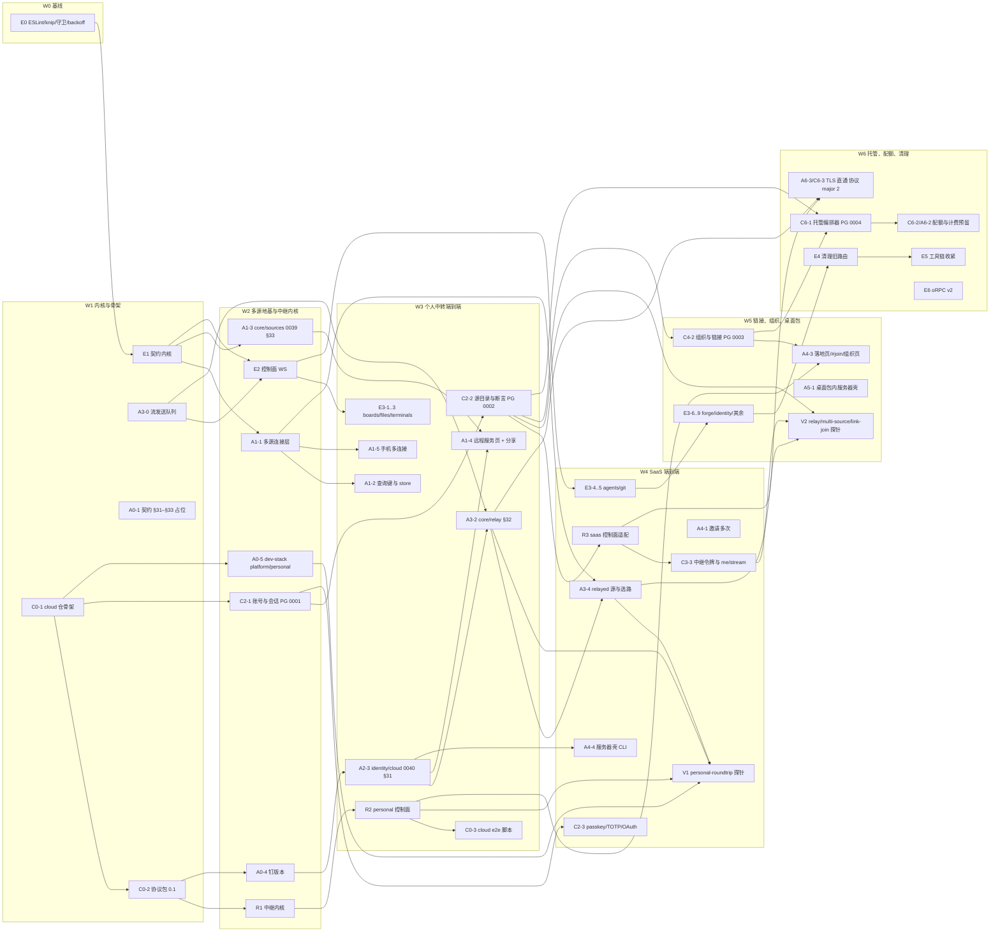

# 正规化平台落地总计划

> 状态：目标计划（2026-10-06）。把[工程规范化](engineering-standardization.md)的 E0–E6 与[平台设计](platform-saas-architecture.md)的阶段 0–6（含 §17 个人中转与桌面零配置）合成一张有依赖关系的波次图，每个工作包写明仓库、目录、预分配编号、交付物、验收命令、推荐模型与规模；逐包的实现规格在 `docs/design/platform/` 下（§11）。E0 已派出、正在实现，列为第 0 波。现状以源码为准；本文不改代码。
> 用户已定：按推荐全部执行；接口层 oRPC 1.15.4 精确锁；中继首版终止 TLS 零日志；SaaS 后端在独立私有仓库 `Owlbay/armadra-cloud`（MIT）；本地 PostgreSQL / Redis 只用 Docker；两种模式（SaaS 多租户 / 单人中转）；桌面端零配置可用；个人中转先于 SaaS 控制面交付。
> 不出现任何第三方参考项目的名字；不建云资源、不发布包、不改用户系统配置。

## §0 结论

> 2026-10-06 优先级调整：个人中转优先，SaaS 服务端预留接口，见 §12。

1. **七个波次（W0–W6），三条并行线**：Armadra 工程规范化线（E）、Armadra 平台线（A）、cloud 仓线（C 控制面 / R 中继）。第一个对外可用的能力是**个人中转端到端**（W3 末）：只依赖协议包、中继内核与 core 的隧道客户端 / 断言登录，不等 PostgreSQL、Redis 与云账号。SaaS 端到端在 W4 末，链接加入与组织在 W5，托管源、配额、TLS 直通与清理在 W6。
2. **cloud 仓的工作不依赖 E0**，可以与 E0 同时开始；Armadra 侧凡是新接口都按 E1 的契约写，所以 Armadra 平台包（A1-x 起）排在 E1 之后。
3. **个人中转是 `apps/relay` 的运行模式**，不是第二套代码：中继内核（R1）先做、personal 控制面（R2）紧随，saas 适配（R3）在 cloud 账号与源目录（C2-1 / C2-2）之后。core 与客户端对两种模式零分支。
4. **编号**：core 迁移 0039 = `client_sources` + `remote_services`（W2），0040 = `cloud_identity`（W3）；契约 §31 云登录（A2-3）、§32 隧道（A3-2）、§33 源表（A1-3）、§34–§43 工程规范化各域（[工程包](platform/engineering-packages.md) §0）；cloud 仓 PostgreSQL 迁移 0001 账号、0002 源、0003 组织与链接、0004 计费与托管。
5. **模型**：复杂、跨模块、安全相关的包用 Opus（E1、E2、A1-1、A1-3、A2-3、A3-0、A3-2、R1、R2、R3、C0-1、C0-2、C2-1、C2-2、C4-2、E3-4、E3-5、E3-7、C6-x）；机械、范围清楚的用 Sonnet（其余）。每包一个 worktree、一个 PR、CI 绿后合并；跨仓改形状先改协议包。
6. 需要用户拍板的点集中在 §9，每条给了默认值，实现按默认值先走。

## §1 输入与范围

- 工程规范化 E0–E6（F1–F17 已定：oRPC、门面隔离、控制面 WS 合一、ESLint + knip、覆盖率门槛等）。
- 平台设计 D1–D27、§13 的 31 个工作包、§16 拆仓、§17 个人中转。
- 本计划把平台设计 §13.3 的 `P0-x…P6-x` 重新编号为 A（Armadra）/ C（cloud）/ R（relay）三组，并新增 R2 个人中转、A1-4 合并「源」与「源与云」两页为「远程服务」页、A0-5 的 `personal` profile、V 组验证包。§13.3 原编号在 §4 的表里对照列出。

## §2 命名、规则与估算口径

- **包编号**：`E<阶段>-<序>` 工程规范化；`A<阶段>-<序>` Armadra 平台；`C<阶段>-<序>` cloud 控制面 / 协议包 / 仓库；`R<序>` 中继；`V<序>` 验证体系。阶段号沿用平台设计（0 建仓与协议、1 多源、2 云账号、3 中继、4 链接与组织、5 桌面包、6 托管与加固）。
- **规模**：S ≤ 1 天 / ≤ 400 行；M 2–3 天 / ≤ 1500 行；L 4–6 天 / ≤ 4000 行；XL > 1 周。含测试。
- **每包交付**：代码 + 同 PR 测试 + 契约 / 文档同步 + `docs/status/completion-progress.md` 一节；验收命令写在表里，CI 全绿才合并。
- **跨仓顺序**：协议包先（minor+1 并发包或本地 link）→ cloud 仓实现 → Armadra 升级钉住版本。
- **worktree**：Armadra 按 `_shared/common.md`；cloud 仓同样一包一 worktree，分支 `feat/<包>`。

## §3 波次图

| 波  | 并行                                                  | 串行约束                                                                                         | 里程碑                                                       |
| --- | ----------------------------------------------------- | ------------------------------------------------------------------------------------------------ | ------------------------------------------------------------ |
| W0  | E0（进行中）                                          | —                                                                                                | lint 基线、守卫、`lib/backoff.ts`                            |
| W1  | E1、A3-0、A0-1、C0-1 → C0-2                           | C0-2 在 C0-1 之后（同一 worktree 可连做）；E1 在 E0 合入后                                       | 契约内核；协议包 0.1.0 可 pack                               |
| W2  | E2、A1-1、A1-3、A0-5、A0-4、R1、C2-1                  | E2 需 E1 + A3-0；A1-x 需 E1；R1 需 C0-2；C2-1 需 C0-1 / C0-2；A0-4 需协议包可被钉（发布或 link） | 控制面 WS；`Source` 抽象；中继内核能转发假 core              |
| W3  | R2、A2-3、A3-2、A1-2、A1-4、A1-5、C2-2、C0-3、E3-1..3 | A3-2 需 A2-3 + A3-0；A1-4 的「分享本机」需 A2-3；C0-3 需 R2                                      | **个人中转端到端**（桌面分享本机 → 手机 / 第二台经中继挂载） |
| W4  | A3-4、R3、C3-3、A4-1、A4-4、C2-3、V1、E3-4..5         | R3 需 R1 + C2-2；C3-3 需 R3；A3-4 需 A3-2（与 R2 联调）；V1 需 A0-5 + R2 + A3-2 + A3-4           | **SaaS 端到端**（云账号 → 登记 → 经中继挂载）                |
| W5  | C4-2、A4-3、A5-1、V2、E3-6..9                         | A4-3 需 C4-2 + R2 + A1-4                                                                         | 链接加入（两种模式）、组织、桌面包 `serve`                   |
| W6  | E4、E5、C6-1、C6-2 / A6-2、A6-3 / C6-3、E6（触发后）  | E4 在 E3 全部合入且一个 minor 版本后；A6-3 需协议包 major 2                                      | 托管源、配额、TLS 直通、旧路由退场                           |

## §4 工作包总表

列：仓库 / 改哪里 / 预分配编号 / 交付物 / 验收命令 / 模型 / 规模 / 依赖 / 规格文档。验收命令省略了前缀 `cd <worktree> &&`；Armadra 的完整验证按 `_shared/common.md`（`pnpm libs:build && pnpm -r --if-present test`、`pnpm check`），cloud 仓是 `pnpm check && pnpm test`（集成另起）。

### 4.1 W0

| 包  | 仓库    | 改哪里                                                                                                                     | 编号 | 交付物                                                                    | 验收                                                  | 模型   | 规模 | 依赖 |
| --- | ------- | -------------------------------------------------------------------------------------------------------------------------- | ---- | ------------------------------------------------------------------------- | ----------------------------------------------------- | ------ | ---- | ---- |
| E0  | Armadra | 根 `eslint.config.js`、`knip.json`、`repo.rules.json`（oRPC 规则）、`apps/web/src/{panels,nodes,canvas,session,agent,lib}` | —    | ESLint 全 warn 基线、knip 入口、新守卫、§4.1 小尾巴清零、`lib/backoff.ts` | `pnpm check`（含 lint）；守卫测试各一条「真的扫到了」 | 已派出 | L    | —    |

### 4.2 W1

| 包   | 仓库    | 改哪里                                                                                                                                         | 编号               | 交付物                                                                                                                                                                   | 验收                                                                                                                                                            | 模型   | 规模 | 依赖 | 规格                                                                  |
| ---- | ------- | ---------------------------------------------------------------------------------------------------------------------------------------------- | ------------------ | ------------------------------------------------------------------------------------------------------------------------------------------------------------------------ | --------------------------------------------------------------------------------------------------------------------------------------------------------------- | ------ | ---- | ---- | --------------------------------------------------------------------- |
| E1   | Armadra | `packages/shared/src/contract/`、`apps/desktop/src/core/http/rpc.ts`、`apps/web/src/api/client.ts`、`tools/contract/`、`routes.ts` 一行        | 契约 §34           | 契约内核（`@orpc/*` 1.15.4 精确）、`Source` + `createClient`、错误 envelope、`system.hello/ping`、`workspaces` / `settings` 试点、`generate.mjs --check` 进 `pnpm check` | `pnpm check`（含 `contract:check`）；`pnpm --filter @armadra/desktop test -- core/http core/contract`；`pnpm --filter @armadra/web test -- api/`；A 档 e2e 不变 | Opus   | L    | E0   | [工程包](platform/engineering-packages.md) §1                         |
| A3-0 | Armadra | `core/http/stream-queue.ts`、`core/events/stream.ts`、`core/terminal/`、`core/realtime/`、`core/language/`、`core/browser/`                    | —                  | 统一 `SendQueue`（drop-oldest / coalesce / pause）、终端 `bufferedAmount` 暂停读 PTY、`ws maxPayload`                                                                    | `pnpm --filter @armadra/desktop test -- core/http core/events core/terminal core/realtime`；`node tools/probes/server-perf.mjs` 基线不退化                      | Opus   | M    | —    | [core 包](platform/core-packages.md) §3                               |
| A0-1 | Armadra | `docs/contracts/core-json-api.md` §31–§33、`docs/README.md`                                                                                    | §31–§33            | 三节占位 + 形状（JSON 表，schema 引自协议包）、错误码；README 链接 cloud 仓的 `cloud-api.md`                                                                             | `pnpm repo:check`；`pnpm exec prettier --check docs/`                                                                                                           | Sonnet | S    | —    | 平台设计 §13.2；[core 包](platform/core-packages.md) §1.3、§2.3、§4.5 |
| C0-1 | cloud   | 整仓骨架（§2 目录）、`AGENTS.md`、`repo.rules.json`、`migrations.lock`、三条工作流、两份 Dockerfile、`deploy/{dev,personal}/compose.yml`、脚本 | PG 迁移目录（空）  | `pnpm check / test` 过的空仓；`pnpm dev:up && pnpm db:migrate && pnpm dev` 起得来；`pnpm images:build` 成功                                                              | `pnpm check && pnpm test && pnpm repo:test`；`pnpm dev:up && pnpm dev`（`curl :8100/health`、`:8101/health` 200）；`pnpm images:build`；PR 上 `ci.yml` 绿       | Opus   | L    | —    | [仓库骨架](platform/cloud-repo-skeleton.md)                           |
| C0-2 | cloud   | `packages/platform-protocol/`                                                                                                                  | 协议 1.0；包 0.1.0 | `tunnel / assertion / cloud-api / core-api / errors / identity-vectors / fixtures` 七个子路径；黄金 fixtures；OpenAPI 快照                                               | `pnpm --filter @armadra/platform-protocol test && build && pack`（tarball 含 `fixtures/`）；`pnpm contract:check`                                               | Opus   | L    | C0-1 | [协议包](platform/protocol-package.md)                                |

### 4.3 W2

| 包   | 仓库    | 改哪里                                                                                                                                      | 编号                                                                                  | 交付物                                                                                                                                                                                    | 验收                                                                                                                                                  | 模型                                      | 规模   | 依赖       | 规格                                                            |
| ---- | ------- | ------------------------------------------------------------------------------------------------------------------------------------------- | ------------------------------------------------------------------------------------- | ----------------------------------------------------------------------------------------------------------------------------------------------------------------------------------------- | ----------------------------------------------------------------------------------------------------------------------------------------------------- | ----------------------------------------- | ------ | ---------- | --------------------------------------------------------------- | --------------------------------------------------- |
| E2   | Armadra | `core/http/ws-control.ts`、`server.ts` 升级层、`core/events/`、`apps/web/src/api/{client,ws,events}.ts`、`i18n/connection.ts`               | §35                                                                                   | `/api/ws` 控制面、子协议与关闭码、心跳、事件流作为第一个 iterator、`TicketedWebSocket` + `lib/backoff`、前后台                                                                            | `pnpm --filter @armadra/desktop test -- core/http core/events`；`pnpm --filter @armadra/web test -- api/`；新 A 档 `ws-mux-e2e`；`server-perf` 不退化 | Opus                                      | L      | E1、A3-0   | [工程包](platform/engineering-packages.md) §2                   |
| A1-1 | Armadra | `apps/web/src/sources/`、`api/{request,sockets,identity,shell-transport}.ts`                                                                | —                                                                                     | `SourceRegistry` / `SourceConnection` / `ManagedSocket` / `CredentialProvider` / `routing`；`RUNTIME_URL` 与全局补丁退役                                                                  | `pnpm --filter @armadra/web test -- sources/ api/`；`pnpm --filter @armadra/web typecheck`；A 档不变                                                  | Opus                                      | L      | E1         | [客户端包](platform/client-packages.md) §1                      |
| A1-3 | Armadra | `core/sources/`、迁移 `0039_client_sources.sql`、`migrations.lock`、`shared/contract/sources.ts`、`route-scopes.ts`                         | 0039、§33                                                                             | `client_sources` + `remote_services`、`sources.*` procedure（含 `remoteAdd` / `mount` / `session` 选路）、SecretStore 读写、远程服务客户端                                                | `pnpm --filter @armadra/desktop test -- core/sources core/db`；凭据不出现在响应（测试）；`pnpm check`（lock）                                         | Opus                                      | L      | E1         | [core 包](platform/core-packages.md) §1                         |
| A0-5 | Armadra | `tools/dev-stack/{docker-compose.yml,services.mjs,dev-stack.mjs}`、根 `package.json`（`platform:*`）、`tools/ci/e2e.d/`                     | —                                                                                     | `platform` / `personal` profile（postgres、redis、cloud、relay、relay-personal、armadra-server-nat）；`ARMADRA_DEV_STACK_CLOUD_SRC` 本地构建；`pnpm platform:up/down/health/personal/e2e` | `pnpm release:test`（`stack.test.mjs`）；`pnpm platform:up`（本地构建）全部健康；`pnpm platform:personal` 健康                                        | Sonnet                                    | M      | C0-1       | [验证](platform/dev-stack-and-verification.md) §1               |
| A0-4 | Armadra | `packages/shared/package.json`、`apps/desktop                                                                                               | web/package.json`、`tools/release/{compatibility.json,version.mjs}`、`pnpm-lock.yaml` | —                                                                                                                                                                                         | 钉 `@armadra/platform-protocol` 精确版本；`platform` 项；`release:check` 校验                                                                         | `pnpm release:check`；`pnpm release:test` | Sonnet | S          | C0-2 发布或 link                                                | [验证](platform/dev-stack-and-verification.md) §1.3 |
| R1   | cloud   | `apps/relay/src/{tunnel,edge,auth,control/types,control/memory,http,metrics,log}`、`test/fake-core.ts`                                      | —                                                                                     | 隧道终端、边缘、流控、心跳、GOAWAY、令牌校验、`ControlPlane` 接口与内存实现、`/health`、`/metrics`                                                                                        | `pnpm --filter @armadra/relay test`（含集成 `roundtrip.test.ts` 对假 core）                                                                           | Opus                                      | XL     | C0-2       | [中继](platform/relay.md) §1–§4                                 |
| C2-1 | cloud   | `apps/cloud/src/{db/migrations/0001_accounts.sql,auth,accounts,devices,signing,http,audit,mail}`、`packages/cloud-shared/src/db/migrate.ts` | PG 0001                                                                               | 迁移运行器 + 0001；口令 / 会话 / JWT / JWKS / 设备码流 / 邮件验证与重置；`platform.*`、`auth.*`（password、device）、`me.*` 实现                                                          | `pnpm --filter @armadra/cloud test`；`pnpm test:integration`（migrate、accounts）；`pnpm contract:check`                                              | Opus                                      | XL     | C0-1、C0-2 | [控制面](platform/cloud-control-plane.md) §3.1、§3.5、§5.1–§5.2 |

### 4.4 W3

| 包      | 仓库    | 改哪里                                                                                                                                          | 编号      | 交付物                                                                                                                                                                                 | 验收                                                                                                                                                                   | 模型   | 规模 | 依赖                       | 规格                                                 |
| ------- | ------- | ----------------------------------------------------------------------------------------------------------------------------------------------- | --------- | -------------------------------------------------------------------------------------------------------------------------------------------------------------------------------------- | ---------------------------------------------------------------------------------------------------------------------------------------------------------------------- | ------ | ---- | -------------------------- | ---------------------------------------------------- |
| R2      | cloud   | `apps/relay/src/personal/`、`cli.ts`、`deploy/personal/compose.yml`、npm `bin`                                                                  | —         | `personal init/serve/status/passwd/rotate-key/links`；状态文件；账号与锁定；四种令牌签发；源注册与隧道令牌；分享链接与访客；自签 CA / ACME / 文件证书；托管页面；`pnpm relay:personal` | `pnpm --filter @armadra/relay test`（`personal-e2e.test.ts`）；`pnpm relay:personal` 起得来并打印指纹；`docker run … personal --help`                                  | Opus   | L    | R1                         | [中继](platform/relay.md) §6                         |
| A2-3    | Armadra | `core/identity/cloud/`、迁移 `0040_cloud_identity.sql`、`shared/contract/cloud.ts`、`net/outbound.ts`、`identity/service.ts`（`LoginMethod`）   | 0040、§31 | `cloud/login`（匿名 legacy）、`register / revoke / status / bind / trustedOrigins`、JWKS 缓存与离线验签、源密钥、审计                                                                  | `pnpm --filter @armadra/desktop test -- core/identity core/net core/db`；fixtures 全过；`pnpm check`                                                                   | Opus   | L    | C0-2（A0-4 或 link）、A1-3 | [core 包](platform/core-packages.md) §2              |
| A3-2    | Armadra | `core/relay/`、`core/main.ts`、`core/http/server.ts`（`createListener` 的 `gate`）、`core/settings`                                             | §32       | 隧道客户端、`TunnelDuplex` → `createListener({admitted:true})`、准入、节点选择与退避、状态事件 `cloud.tunnel`、**旁路保证测试**                                                        | `pnpm --filter @armadra/desktop test -- core/relay core/main`；集成（dev-stack `personal`）：经中继开终端 / 实时板 / 事件流、4401 换票、撤销即断；启动不等隧道（测试） | Opus   | XL   | A2-3、A3-0、C0-2           | [core 包](platform/core-packages.md) §4              |
| A1-2    | Armadra | `app/workspaces-query.ts`、`store/canvas/*`、`agent/*-store.ts`、`acp/store.ts`、`realtime/session.ts`、`api/events.ts`、`preferences-store.ts` | —         | 查询键与 store 键加源；偏好迁移；`hello.hostId` → `sourceId`                                                                                                                           | `pnpm --filter @armadra/web test`；迁移测试；两源各一条事件连接（测试）                                                                                                | Sonnet | M    | A1-1                       | [客户端包](platform/client-packages.md) §2           |
| A1-4    | Armadra | `panels/settings/pages/RemoteServicesPage.tsx`、`ShareDialog.tsx`、`nav.ts`、`shell/Sidebar`、`i18n/remote.ts`、`shell-core/csp.ts`             | —         | 「远程服务」页（个人中转 / SaaS / 自托管直连）、分享本机（登记 + 邀请链接 / 二维码 + 停用）、侧栏按源分组、CSP `connect-src` 动态                                                      | `pnpm --filter @armadra/web test -- panels/settings shell/`；`typecheck`；i18n 守卫；桌面：本机 + `direct`（dev-stack `armadra-server`）两组侧栏，终端两边都能开       | Sonnet | L    | A1-1、A1-3、A2-3           | [客户端包](platform/client-packages.md) §3           |
| A1-5    | Armadra | `apps/mobile`（iOS `SecretStore`、Android `SecureStore`）、`apps/web/src/mobile/{bridge,connect}.ts`、`ConnectScreen.tsx`                       | —         | 多会话钥匙串、「添加连接」三选一、同源合并                                                                                                                                             | `pnpm --filter @armadra/web test -- mobile/`；模拟器：扫两个码挂两源、杀 App 重开仍在（B 档 `mobile-shell-e2e`）                                                       | Sonnet | M    | A1-1                       | [客户端包](platform/client-packages.md) §4           |
| C2-2    | cloud   | `apps/cloud/src/{db/migrations/0002_sources.sql,sources}`                                                                                       | PG 0002   | 注册令牌、`sources.register`、源 JWS 认证、隧道令牌、断言 + 中继令牌、`source_access`、撤销 kick                                                                                       | `pnpm --filter @armadra/cloud test`；`test:integration`（sources）；断言样例与 fixtures 一致                                                                           | Opus   | L    | C2-1                       | [控制面](platform/cloud-control-plane.md) §3.2、§5.3 |
| C0-3    | cloud   | `scripts/e2e.mjs`、`deploy/e2e/compose.yml`、`nightly.yml`                                                                                      | —         | 跨仓端到端（personal 先；saas 随 C2-2 / R3 补全）                                                                                                                                      | `pnpm e2e --mode personal`（本地 Docker）                                                                                                                              | Sonnet | M    | R2、A3-2（镜像里有）       | [验证](platform/dev-stack-and-verification.md) §3    |
| E3-1..3 | Armadra | 各域 `core/<域>/`、`web/src/api/<域>.ts`、`shared/contract/<域>.ts`                                                                             | §36–§38   | boards / files / terminals 契约化                                                                                                                                                      | 对偶测试、域内用例、`contract:check`、A 档                                                                                                                             | Sonnet | M×3  | E2                         | [工程包](platform/engineering-packages.md) §3        |

### 4.5 W4

| 包      | 仓库    | 改哪里                                                                          | 编号     | 交付物                                                                                        | 验收                                                                                        | 模型   | 规模 | 依赖                 | 规格                                              |
| ------- | ------- | ------------------------------------------------------------------------------- | -------- | --------------------------------------------------------------------------------------------- | ------------------------------------------------------------------------------------------- | ------ | ---- | -------------------- | ------------------------------------------------- |
| A3-4    | Armadra | `apps/web/src/sources/{connection,remote-stream}.ts`、`i18n/remote.ts`          | —        | `relayed` 源：中继令牌头 / 子协议、`relayBaseUrl`、4404 等待 + `me.stream` 唤醒；手机同一份   | `pnpm --filter @armadra/web test -- sources/`；手机经中继连 dev-stack 的 NAT 后源（模拟器） | Sonnet | M    | A1-1、A3-2、R2       | [客户端包](platform/client-packages.md) §5        |
| R3      | cloud   | `apps/relay/src/{control/redis.ts,edge/internode.ts}`                           | —        | Redis 路由 / 限流 / 撤销、`relay:ctl`、cloud JWKS 缓存、节点间转发、`relay:nodes`             | `pnpm --filter @armadra/relay test`（`control/redis`、`two-nodes` 需 Redis）                | Opus   | L    | R1、C2-2             | [中继](platform/relay.md) §5                      |
| C3-3    | cloud   | `apps/cloud/src/{sources/relay-nodes.ts,stream}`                                | —        | `sources.heartbeatHint` 节点列表、`me.stream`（`relay:ctl` → 账号过滤）、撤销写 `revoked:jti` | `test:integration`（me-stream：事件 2 秒内到）                                              | Sonnet | M    | C2-2、R3             | [控制面](platform/cloud-control-plane.md) §5.5    |
| A4-1    | Armadra | `identity/accounts.ts`、`accounts-http.ts`、契约 §10 追加                       | §10 追加 | 邀请 `maxUses` / `uses` / `identity_invitation_uses` 消费逻辑（列在 0040 里）                 | `pnpm --filter @armadra/desktop test -- core/identity`（并发 20 对 5 恰好 5；同人幂等）     | Sonnet | S    | A2-3（0040）         | [core 包](platform/core-packages.md) §5           |
| A4-4    | Armadra | `apps/server/src/{cli,serve}.ts`、`docker/entrypoint.sh`                        | —        | `cloud register/revoke/status/login`、`invite --cloud-link`、容器自动登记                     | `pnpm --filter @armadra/server test`（`cli.test.ts`）                                       | Sonnet | M    | A2-3、A1-3           | [core 包](platform/core-packages.md) §6           |
| C2-3    | cloud   | `apps/cloud/src/auth/{passkey,totp,oauth}`                                      | —        | passkey、TOTP + 恢复码、OAuth / OIDC 绑定与建号                                               | `pnpm --filter @armadra/cloud test`；集成：dev-stack 的 dex 做 OIDC                         | Sonnet | L    | C2-1                 | [控制面](platform/cloud-control-plane.md) §5      |
| V1      | Armadra | `tools/probes/personal-roundtrip.mjs`、`tools/ci/e2e.d/personal-roundtrip.json` | —        | A 档探针：个人中转全流程                                                                      | `node tools/ci/e2e.mjs --only personal-roundtrip`                                           | Sonnet | M    | A0-5、R2、A3-2、A3-4 | [验证](platform/dev-stack-and-verification.md) §4 |
| E3-4..5 | Armadra | agents、git（两次）                                                             | §39–§40  | 契约化                                                                                        | 对偶、域内、A 档                                                                            | Opus   | L+XL | E2                   | [工程包](platform/engineering-packages.md) §3     |

### 4.6 W5

| 包      | 仓库    | 改哪里                                                                                                                                      | 编号     | 交付物                                                                  | 验收                                                                  | 模型    | 规模 | 依赖             | 规格                                                 |
| ------- | ------- | ------------------------------------------------------------------------------------------------------------------------------------------- | -------- | ----------------------------------------------------------------------- | --------------------------------------------------------------------- | ------- | ---- | ---------------- | ---------------------------------------------------- |
| C4-2    | cloud   | `apps/cloud/src/{db/migrations/0003_orgs_links.sql,orgs,links}`                                                                             | PG 0003  | 组织、成员角色、`links.*`（source_invite / org_join）、`/j/` 落地页托管 | `test:integration`（links 并发、orgs）；`pnpm e2e --mode saas` 含链接 | Opus    | L    | C2-2             | [控制面](platform/cloud-control-plane.md) §3.3、§5.4 |
| A4-3    | Armadra | `shell/JoinPage.tsx`、`app/use-link-fragments.ts`、`panels/settings/pages/OrganizationsPage.tsx`、`i18n/{links,orgs}.ts`、§33 `mountByLink` | §33 追加 | 落地页、`#join` / `armadra://join`、桌面粘贴链接挂载、组织页            | `pnpm --filter @armadra/web test`；探针 `link-join`（≤ 3 步）         | Sonnet  | L    | C4-2、R2、A1-4   | [客户端包](platform/client-packages.md) §6           |
| A5-1    | Armadra | `apps/desktop/scripts/after-pack.mjs`、`main/index.ts`、`electron-builder.yml`、`tools/release/`                                            | —        | `resources/server/`、`Armadra serve` 透传、发布物清单                   | `pnpm release:test`；B 档 `packaged-smoke` 加 `serve` 步              | Sonnet  | M    | —                | [core 包](platform/core-packages.md) §7              |
| V2      | Armadra | `tools/probes/{relay-roundtrip,multi-source,link-join,nat-core-offline}.mjs` + 清单                                                         | —        | A 档三条 + B 档一条                                                     | `pnpm platform:e2e`                                                   | Sonnet  | L    | A3-4、C3-3、A4-3 | [验证](platform/dev-stack-and-verification.md) §4    |
| E3-6..9 | Armadra | forge / github、identity / security / accounts、其余八域、语言会话评估                                                                      | §41–§43  | 契约化；错误码 snake_case；§31–§33 登记进 §42                           | 对偶、域内、A 档；E3-6 另加两种拼法映射用例                           | S/O/S/O | L×4  | E3-4..5          | [工程包](platform/engineering-packages.md) §3        |

### 4.7 W6

| 包          | 仓库            | 改哪里                                                                                               | 编号     | 交付物                                                                      | 验收                                          | 模型   | 规模 | 依赖              | 规格                                           |
| ----------- | --------------- | ---------------------------------------------------------------------------------------------------- | -------- | --------------------------------------------------------------------------- | --------------------------------------------- | ------ | ---- | ----------------- | ---------------------------------------------- |
| E4          | Armadra         | `routes.ts`、`route-scopes.ts`、各域测试、契约各 §                                                   | —        | 旧路径退场、`createRouterClient` 直调、knip 归零                            | `pnpm check`；grep 无旧路径引用（测试）       | Sonnet | L    | E3 全部 + 1 minor | [工程包](platform/engineering-packages.md) §4  |
| E5          | Armadra         | 配置文件                                                                                             | —        | ESLint error、覆盖率门槛、knip 阻断、audit 进 PR、视觉回归评估（每步一 PR） | 每步 CI 绿；时长记录                          | Sonnet | M    | E4                | [工程包](platform/engineering-packages.md) §5  |
| C6-1        | cloud           | `apps/cloud/src/{hosted,db/migrations/0004_billing.sql}`                                             | PG 0004  | 容器 API 抽象 + 本地 Docker 实现、自动登记、每租户卷与备份                  | 集成：起一个托管源 → 自动在目录 → 客户端挂载  | Opus   | XL   | C4-2、A4-4        | [控制面](platform/cloud-control-plane.md) §3.4 |
| C6-2 / A6-2 | 两仓            | cloud `billing/`；relay 字节计数；core `limits.*`                                                    | —        | `usage_counters`、`billing_*`、429 `limit_reached`                          | 超配额 429；计数对账（集成）                  | Sonnet | M    | C6-1              | [core 包](platform/core-packages.md) §8        |
| A6-3 / C6-3 | 两仓            | 协议包 major 2（`OPEN kind=tls`）；core Gateway TLS 监听接隧道；App 钉 CA；relay 透传；cloud 私有 CA | 协议 2.0 | TLS 直通（桌面壳与 App）                                                    | 抓包中继看不到明文；浏览器路径不变            | Opus   | XL   | A3-2、R3          | 平台设计 §11.1                                 |
| E6          | Armadra + cloud | 三处门面、`repo.rules.json`、cloud 门面                                                              | —        | oRPC v2（触发条件满足后）                                                   | 业务代码零改动；对偶与 A 档全过；两端同一版本 | Opus   | L    | 上游稳定          | [工程包](platform/engineering-packages.md) §6  |

### 4.8 与平台设计 §13.3 的编号对照

P0-1→A0-1；P0-2→C0-1；P0-3→C0-2；P0-4→A0-4；P0-5→A0-5 + C0-3；P1-1→A1-1；P1-2→A1-2；P1-3→A1-3；P1-4 + P2-4→A1-4；P1-5→A1-5；P2-1→C2-1 + C2-3；P2-2→C2-2；P2-3→A2-3；P3-0→A3-0；P3-1→R1 + R3；P3-2→A3-2；P3-3→C3-3；P3-4→A3-4；P4-1→A4-1；P4-2→C4-2；P4-3→A4-3；P4-4→A4-4；P5-1→A5-1；P6-1→C6-1；P6-2→C6-2 / A6-2；P6-3→A6-3 / C6-3；新增：R2（personal）、V1 / V2。

## §5 第 1 波可立即派发的包

| 包   | 仓库    | 模型   | 前置条件                                                         | 备注                                                                |
| ---- | ------- | ------ | ---------------------------------------------------------------- | ------------------------------------------------------------------- |
| C0-1 | cloud   | Opus   | 无（仓库已有 LICENSE）；`pnpm`、Docker                           | 可与 E0 同时开始；完成后同一 worktree 连做 C0-2                     |
| C0-2 | cloud   | Opus   | C0-1 的骨架（同一 agent 顺序做）                                 | 产出 tarball 供 Armadra link                                        |
| A3-0 | Armadra | Opus   | 无                                                               | 与 E0 并行；不碰 E0 的文件                                          |
| A0-1 | Armadra | Sonnet | 无（只写 `docs/contracts/core-json-api.md` 与 `docs/README.md`） | 形状以 [core 包](platform/core-packages.md) §1.3 / §2.3 / §4.5 为准 |
| E1   | Armadra | Opus   | **E0 合入**（ESLint 白名单、repo-check 的 oRPC 规则）            | 之后 A1-1、A1-3、E2 才能开始                                        |

W2 里一旦 E1 合入即可派：A1-1、A1-3、E2（需 A3-0）、A0-5（需 C0-1）、R1（需 C0-2）、C2-1（需 C0-1 / C0-2）。

## §6 测试与验收体系

跨仓契约测试与 fixtures、探针清单、每波验收命令见[验证](platform/dev-stack-and-verification.md) §4–§6；要点：

- 协议包的 `fixtures/` 是唯一黄金字节，两仓各自的帧 / 断言 / 契约测试都读它；改形状先改包。
- 两仓各一条 `errors.scan.test.ts`，错误码只能来自注册表。
- 探针全部在本机 Docker 跑通：`pnpm platform:personal` + `personal-roundtrip`（W4）；`pnpm platform:up` + `relay-roundtrip` / `multi-source` / `link-join`（W5）；cloud 仓 `pnpm e2e --mode both`（nightly 对 `armadra-server` 两个版本）。
- 每波末跑全量：Armadra `pnpm check && pnpm libs:build && pnpm -r --if-present test && pnpm release:test` + A 档；cloud `pnpm check && pnpm test && pnpm test:integration`。

## §7 风险与回滚

| 波   | 风险                                                                                                        | 对策                                                                                                 | 回滚                                                                  |
| ---- | ----------------------------------------------------------------------------------------------------------- | ---------------------------------------------------------------------------------------------------- | --------------------------------------------------------------------- |
| W1   | E1 的 `Source` 替换全局 `fetch` 补丁时漏掉 `assets.ts`、``、编辑器下载等绕开 `request()` 的点          | E1 只给本机 `Source` 装凭据、补丁保留到 A1-1；逐点清单在工程包 §1.4                                  | E1 是加法（新路径 `/api/rpc`、旧路由不动）：revert 一个 PR 即回到现状 |
| W1   | 协议包未发布，Armadra 侧只能 link                                                                           | fixtures 随 tarball；A0-4 延到发布后；W3 的 A2-3 / A3-2 用 link 开发、PR 等 A0-4 合入后再合          | 无线上影响                                                            |
| W2   | E2 与现有五条流的 4401 / 4403 复核、Gateway 空闲超时、中继心跳要一起调；oRPC 内建重连与换票二选一（选后者） | `ws-mux-e2e` 探针；心跳常量集中在 `identity/protocol.ts`                                             | 旧 `/events` 路由保留；`api/events.ts` 的对外函数不变，可切回旧实现   |
| W2   | A3-0 的 `pause` 策略误伤终端吞吐                                                                            | `server-perf` 基线门槛；终端策略先只在 `bufferedAmount > 4 MiB` 触发                                 | 每条流独立接入，可单独 revert                                         |
| W2   | R1 的流控实现与 core 侧（A3-2）不对称导致死锁                                                               | 同一份协议包常量；fixtures `sequence-http-roundtrip`；集成测试「窗口耗尽 → WINDOW 后继续」两边各一条 | 中继是新组件，无回滚面                                                |
| W3   | A2-3 的匿名 `cloud/login` 被滥用（重放、暴力）                                                              | `jti` 重放缓存、IP 桶、`sub` 限流、断言 5 分钟、`aud = hostId`                                       | 删 `cloud_registrations` 行即撤信；迁移 0040 只加列加表               |
| W3   | A3-2 隧道影响本地关键路径                                                                                   | 旁路保证测试（启动不 await、中继不可达 API 正常）；`cloud.relay.enabled` 总开关                      | 设置关开关或撤销登记；无登记行时代码不运行                            |
| W3   | 个人中继自签 CA 让浏览器体验差                                                                              | 桌面 / 手机钉指纹；浏览器一次性信任 CA（与 Gateway 本地 CA 相同）；有域名就 `--tls acme`             | —                                                                     |
| W3   | 0039 / 0040 合入顺序与别的包抢号                                                                            | `_shared/renumber.sh`；合入前核 main 最大号                                                          | 迁移只加列加表，不改已发布                                            |
| W4   | saas 多节点转发的证书 / 互认                                                                                | 首版 HMAC 共享密钥 + 内网；单节点部署也按多节点代码写                                                | 单节点时 `internode` 不启用                                           |
| W4   | 云签名私钥泄露                                                                                              | 断言 5 分钟、`kid` 轮换、core 单方面撤信                                                             | `keys rotate` + 撤旧 `kid`                                            |
| W5   | 链接 `uses` 与 core 邀请 `uses` 不一致                                                                      | core 是真相，云端只是提前拦截；不一致时以 core 拒绝为准                                              | 撤邀请即刻生效                                                        |
| W5   | E3 大域（git）迁移撞车功能 PR                                                                               | 对偶测试 + 旧路径保留一个 minor；按子域分两次                                                        | 每域一包可单独 revert（`OpenAPIHandler` 保证旧路径仍在）              |
| W6   | E4 删路径破坏探针 / hook 面 / `armadra.sh`                                                                  | grep 测试 + 一个 minor 的保留期                                                                      | revert E4-1                                                           |
| W6   | 协议 major 2（TLS 直通）与在野 core 不兼容                                                                  | D19 双 major 12 个月；cloud / relay 同时支持 1 与 2                                                  | 客户端不升即走 major 1                                                |
| 全程 | 两仓协议漂移                                                                                                | 协议包唯一真相 + fixtures + nightly 跨仓 e2e + 显式钉版本 PR                                         | 钉住旧版本                                                            |

## §8 用户需要动手的对外操作（本计划不执行）

1. `Owlbay/armadra-cloud` 已建（私有、MIT）；设 branch protection、secret scanning。
2. npm：为 `@armadra/platform-protocol` 与 `@armadra/relay` 配 trusted publishing（与 `@armadra/agent` 同一做法）；首个 `v0.1.0` 标签由用户打。
3. GHCR：允许新仓工作流推 `armadra-cloud` / `armadra-relay` 镜像；或先只用本地构建（dev-stack 缺省）。
4. SaaS 上线前（W4 后）：签名密钥文件、托管 PostgreSQL / Redis、`api.` / `app.` 域名、`*.src.<域>` 通配证书、SMTP。
5. 个人中转：用户自己的 VPS / NAS 的公网 IP 或域名；口令。

## §9 需要拍板的点（默认值可先走）

| #   | 点                                           | 默认值（实现先按它走）                                                                                        | 影响                            |
| --- | -------------------------------------------- | ------------------------------------------------------------------------------------------------------------- | ------------------------------- |
| Q1  | 协议包 0.1.0 何时发 npm                      | C0-2 合入并 `pnpm e2e --mode personal` 前 3 步绿后，用户打 `v0.1.0`；之前 Armadra 用 `pnpm link`（不提交）    | A0-4 与 W3 Armadra 包的合入时机 |
| Q2  | `armadra-cloud` 公开 / 私有                  | 按用户：**私有**；npm 包与 GHCR 镜像仍可公开发布；D18 的「可自托管」靠镜像与 npm 包兑现，源码公开另议         | 无代码影响                      |
| Q3  | 个人中转默认 TLS                             | 自签 CA + 指纹（D22）                                                                                         | R2、A1-4、A1-5 的指纹确认 UI    |
| Q4  | 个人中转是否允许访客（分享链接）             | 允许（`allowGuests: true`）                                                                                   | R2 链接、A4-3                   |
| Q5  | SaaS 注册是否必须验证邮箱才能登记源 / 签链接 | 开发关、参考部署开（`ARMADRA_CLOUD_REQUIRE_EMAIL_VERIFIED`）                                                  | C2-1                            |
| Q6  | 令牌寿命                                     | 访问 15 分钟、刷新 30 天、断言 5 分钟、中继令牌 1 小时、隧道令牌 1 小时、注册令牌 10 分钟（identity-vectors） | 协议包常量                      |
| Q7  | 组织成员对组织内源的默认可达 / 默认角色      | 都关（`org.sourceDefaultAccess = false`、`cloud.orgDefaultRole = null`）                                      | C2-2、A2-3                      |
| Q8  | 中继节点间认证                               | HMAC 共享密钥 + 内网；mTLS 后置                                                                               | R3                              |
| Q9  | SaaS 域名                                    | 占位 `api.armadra.app`、`app.armadra.app`、`*.src.relay.armadra.app`（只进配置样例）                          | 配置与文档                      |
| Q10 | 迁移编号对调（0039 源表、0040 云登录）       | 按本计划（合入顺序）                                                                                          | 已改平台设计 §4.3               |
| Q11 | `@armadra/relay` 是否发 npm                  | 发（`npx @armadra/relay personal`）                                                                           | release.yml                     |
| Q12 | cloud / relay 镜像里的页面来源               | 构建时从 `ghcr.io/owlbay/armadra-server:<compat>` 复制同版本 `/app/web`                                       | Dockerfile                      |
| Q13 | E3 的并行度                                  | 同时最多 2 个域在飞（避免 `route-scopes.ts` 与契约文档冲突）                                                  | 派发节奏                        |
| Q14 | 页面刷新令牌在浏览器（云页面）是否持久化     | 内存（D15）                                                                                                   | A3-4 浏览器路径                 |

## §10 文档同步

- 本文登记进 `docs/README.md`；`docs/design/platform/` 下八份规格各登记一行。
- 平台设计已加 P11、D20–D27、§17、§4.3 编号更正；工程规范化不改（E 包细化在[工程包](platform/engineering-packages.md)）。
- 架构变化（`core/sources/`、`core/identity/cloud/`、`core/relay/`、`http/stream-queue.ts`、`http/rpc.ts`、`/api/ws`、`armadra-cloud` 仓）由各包合入时同步 `docs/guides/architecture.md`。

## §11 规格文档索引

| 文档                                                       | 覆盖的包                                       |
| ---------------------------------------------------------- | ---------------------------------------------- |
| [协议包](platform/protocol-package.md)                     | C0-2                                           |
| [仓库骨架](platform/cloud-repo-skeleton.md)                | C0-1                                           |
| [中继](platform/relay.md)                                  | R1、R2、R3                                     |
| [控制面](platform/cloud-control-plane.md)                  | C2-1、C2-2、C2-3、C3-3、C4-2、C6-1、C6-2       |
| [core 侧](platform/core-packages.md)                       | A1-3、A2-3、A3-0、A3-2、A4-1、A4-4、A5-1、A6-2 |
| [页面与手机侧](platform/client-packages.md)                | A1-1、A1-2、A1-4、A1-5、A3-4、A4-3             |
| [工程规范化包](platform/engineering-packages.md)           | E1–E6，契约 §34–§43 预分配                     |
| [dev-stack 与验收](platform/dev-stack-and-verification.md) | A0-4、A0-5、C0-3、V1、V2、每波验收             |

## §12 优先级调整：个人中转优先，SaaS 服务端预留（2026-10-06）

用户决定：SaaS 服务端先只预留接口、保留能力，以后再实现；**优先交付个人中转**。个人中转同样要能在 **Web 端**操作（浏览器经中继打开托管页面并挂载源），也要能**用手机扫分享链接或二维码**直接挂载。

### 12.1 照常做（个人中转路径）

| 波  | 包                                                                                                 | 说明                                                                                                                                                                                       |
| --- | -------------------------------------------------------------------------------------------------- | ------------------------------------------------------------------------------------------------------------------------------------------------------------------------------------------ |
| W1  | E1、A3-0、A0-1（已合）、C0-1、C0-2                                                                 | 不变；C0-1 里 `apps/cloud` 只做骨架与预留路由（统一 501 `not_implemented`），`deploy/personal/compose.yml` 与 `pnpm relay:personal` 不依赖 PostgreSQL / Redis                              |
| W2  | E2、A1-1、A1-3、A0-4、R1                                                                           | 不变                                                                                                                                                                                       |
| W2  | A0-5                                                                                               | 先做 `personal` profile（relay-personal、armadra-server-nat）；`platform` profile 里的 postgres、redis、cloud 只保留占位                                                                   |
| W3  | R2、A2-3、A3-2、A1-2、A1-4、A1-5、C0-3                                                             | A2-3 只实现个人中转签发方（中继自己的 JWKS / 断言），云端签发方留接口；A1-4 远程服务页只开放「个人中转」与「自托管直连」，SaaS 入口显示为「即将提供」且不可用；C0-3 只做 `--mode personal` |
| W4  | A3-4、A4-1、A4-4、V1                                                                               | A4-4 只做个人中转的登记与 `invite`；其余不变                                                                                                                                               |
| W4  | **A4-3p**（新，从 A4-3 拆出）                                                                      | 个人中转的链接加入：`#join` / `armadra://join` 落地处理、桌面粘贴链接挂载、**分享二维码**（A1-4 的分享对话框给出）与**手机扫码挂载**（A1-5 的「添加连接」里扫码即挂）；不含组织页          |
| W5  | A5-1、V2（只含 `relay-roundtrip`、`multi-source`、`link-join` 的个人中转版本、`nat-core-offline`） | 不变                                                                                                                                                                                       |
| —   | E3 各域、E4、E5、E6                                                                                | 工程规范化照原计划推进                                                                                                                                                                     |

### 12.2 预留，以后实现（SaaS 服务端）

C2-1、C2-2、C2-3、C3-3、R3、C4-2、A4-3 的组织部分、C6-1、C6-2 / A6-2、A6-3 / C6-3。预留的含义：

- 协议包里的 `cloud-api` schema、契约 §31 的云端部分、`ControlPlane` 接口都保留并编译通过；
- `apps/cloud` 的业务路由在路由表里，统一返回 501 `not_implemented`，有测试守住；
- 中继只实现 `ControlPlane` 的内存实现（personal），Redis 实现留接口；
- 客户端与 core 侧凡涉及 SaaS 的分支（`saas` 源类型、云登录），类型与开关保留，界面不可用并有明确提示。

### 12.3 新的里程碑

- **M1 个人中转端到端（原 W3 末）**：桌面 core 经个人中转被浏览器与手机挂载；Web 端在中继托管的页面里能登录（地址 + 账号 + 口令）并操作；手机扫分享二维码直接挂载。验收：`node tools/ci/e2e.mjs --only personal-roundtrip`、`pnpm e2e --mode personal`（cloud 仓）、`link-join` 个人版探针。
- **M2 工程规范化收尾**：E3–E5 完成。
- SaaS 端到端里程碑推迟，届时按 §12.2 的预留恢复原 W4–W6。
