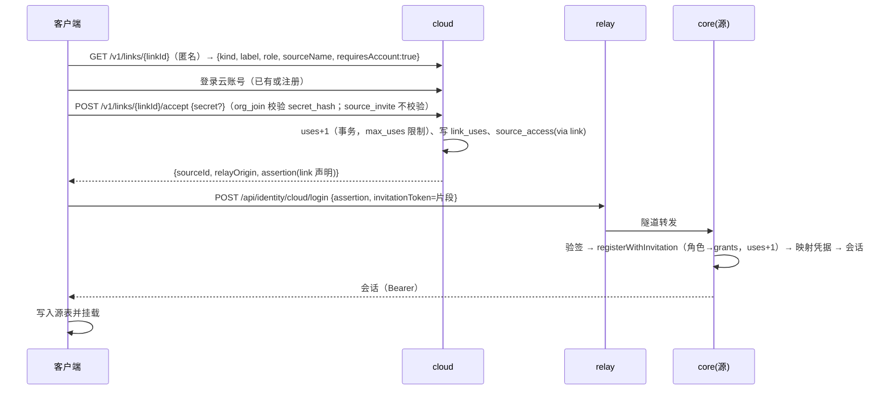

# 正规化平台：中转、SaaS 控制面与多源挂载

> 状态：目标设计（2026-10-06）。尚未实施；本文只定边界、数据、协议形状与分阶段计划。现状以源码为准，核对结果写在 §1.3。
> 前置：[架构](../guides/architecture.md)、[服务器账号、中转与共享](server-accounts-and-sharing.md)、[补全架构](completion-architecture.md) §7–§8、[TypeScript Core](typescript-core.md)、[外部服务与依赖](external-services.md)、[远端画布注入](remote-canvas-injection.md)、[core 的 JSON 面](../contracts/core-json-api.md) §3.2 / §10 / §16–§19 / §23–§24、[用户待办清单](../status/user-action-checklist.md)。
> 并行文档：「工程规范化」（API 是否改 RPC、通用组件审计、测试与检查工具）。本文在接口处只写「传输层见工程规范化文档」，并在 §12 列出本设计对传输层的硬性要求。
> 不出现任何第三方参考项目的名字；通用技术名词（OIDC、JWT、ACME、Yjs、PostgreSQL、Redis）照用。

## §0 结论

| #   | 决定                                                                                                                                                                                                                    | 理由                                                                                                                                                                                                                                                             |
| --- | ----------------------------------------------------------------------------------------------------------------------------------------------------------------------------------------------------------------------- | ---------------------------------------------------------------------------------------------------------------------------------------------------------------------------------------------------------------------------------------------------------------- |
| P1  | **「中转」= SaaS 运营的中继（reverse tunnel），不是 SaaS 托管 core**。core 仍是唯一的状态持有者与执行者，跑在用户电脑、公司服务器或（后期）SaaS 自己的容器里；SaaS 提供账号、组织、源目录、链接加入与中继数据面         | 现有架构 S1「服务器就是中转站」只有一个状态源（core）；Agent 的 CLI 登录、本地仓库、tmux 都在用户机器上，搬上云成本高且触碰各 CLI 的使用条款；中继不解析业务协议就能让 NAT 后的 core 被各端访问，一次解决「域名 / 证书 / 公网 IP」这组用户待办                   |
| P2  | **一个 core 实例 = 一个「源」（source）**，`sourceId` 就是 core 的 `hostId`（`store_meta.host_id`）。客户端可同时挂载多个源；每块画布、每个会话都带 `sourceId`                                                          | 多源挂载的最小单位是 core；`hostId` 已经稳定、已在 hello 与票据里；不与执行主机的 `executionHostId` 混用                                                                                                                                                         |
| P3  | **core 本地仍是 SQLite，不加 PostgreSQL 存储后端**。PostgreSQL 与 Redis 只在 SaaS 控制面与中继层                                                                                                                        | 83 个非测试文件直接持 `node:sqlite` 句柄、487 处 `prepare`、触发器 / JSON1 / `AUTOINCREMENT` / `VACUUM INTO`，没有数据访问层可以换底；服务器壳的多 principal 已在一库里实测（30 终端、6 事件流、2000 对象实时板）；多租户隔离靠「每团队一个 core」而不是一库多租 |
| P4  | **认证联合、授权不联合**：SaaS 账号只负责「你是谁」与「你能连到哪个源」，签发面向单个源的短寿命断言；core 验签后换成自己的会话，`scope` 仍是唯一判定点，邀请 / 组 / 授予仍在 core                                       | AGENTS.md 要求协作上下文按连线授权、不跨工作空间读取；授权真相若搬到云上，core 离线或自托管时就失去自治；现有 `identity_credentials(kind='oauth')` 正好能承载「云账号 ↔ 本地 principal」的映射                                                                  |
| P5  | **链接加入复用 core 的 `identity_invitations`**：云端链接只是「路由封装 + 需要登录」，邀请令牌留在 URL 片段里不经云端存储；邀请表加 `max_uses / uses` 支持多次链接                                                      | 邀请签发、角色、过期、一次性消费都已实现并有审计；云端只需知道「这条链接通向哪个源的哪条邀请」                                                                                                                                                                   |
| P6  | **WebSocket 原样保留**：中继对客户端呈现的就是一个 Gateway（HTTPS + WSS，五条流路径不变）；core 主动外连中继、一条隧道多路复用，隧道里的每条流是一个虚拟 socket 交给 `CoreServer.createListener({admitted:true})`       | Gateway 已经把「准入 → `runAs` → 交给未绑定的 `http.Server`」写成一条可复用的交接；隧道只是换了底层 socket；页面的 `api/*` 层按源换基址即可，不改五条流的帧格式                                                                                                  |
| P7  | **多人协同的基础设施 = 组织（云）→ 源（core owner）→ 工作空间（grants）→ 连线（上下文）四层**；节点级 ACL 仍不做，跨源连线不支持                                                                                        | S4 / S5 不变；云端只加「组织」这一层做目录与批量加入，画布内的权限矩阵不变                                                                                                                                                                                       |
| P8  | **「拆离出来的一部分」= 服务器壳产物随桌面包一起发**：桌面包内含 `resources/server/`（服务器壳入口 + 页面），桌面二进制加 `serve` 透传子命令；三种发布物（桌面包、服务器 tar、容器镜像）装的是同一份 core 与页面        | 两种壳、一份 core 的边界不变；用户在任意一台装了桌面版的机器上就能把它变成一个源                                                                                                                                                                                 |
| P9  | **中继首版终止 TLS、零持久化、零正文日志；端到端加密作为后期可选（仅原生 App 与桌面壳，TLS 直通）**                                                                                                                     | 浏览器里做不了内层 TLS；先把「中继看不看得见」写成明确的运营承诺与自托管选项，再用直通补齐 App 侧                                                                                                                                                                |
| P10 | **新增两个 app：`apps/cloud`（控制面）与 `apps/relay`（数据面）**，协议类型放 `packages/shared/src/platform/`；core 新增 `core/relay/`（隧道客户端）、`core/identity/cloud/`（断言登录）、`core/sources/`（客户端源表） | 控制面有库、要事务；数据面无状态、要横向扩；分开进程与镜像，但共享一份协议类型                                                                                                                                                                                   |

## §1 范围、术语与现状核对

### 1.1 范围

- 做：中继数据面、SaaS 控制面（账号、组织、源、设备、链接、计费预留）、各端多源挂载与登录、链接加入、core 的隧道客户端与云登录、桌面包内含服务器壳。
- 不做：core 改 PostgreSQL；节点级 ACL；跨源画布连线；支付接入（只留表与配额计数）；匿名加入。

### 1.2 术语

| 词                | 含义                                                                                                                                    |
| ----------------- | --------------------------------------------------------------------------------------------------------------------------------------- |
| 源（source）      | 一个 core 实例。`sourceId` = core 的 `hostId`（32 位十六进制，`store_meta.host_id`）。不要与执行主机 `executionHostId` 混用             |
| 源的种类          | `local`（桌面壳自带）、`direct`（自托管 core 的 Gateway，直连 URL）、`relayed`（经中继可达）、`hosted`（SaaS 容器里跑的服务器壳，后期） |
| 云账号（account） | SaaS 控制面的身份；与 core 的 principal 是两套，靠断言映射                                                                              |
| 组织（org）       | 云端的一批账号；是目录与批量加入的单位，不是授权单位                                                                                    |
| 源访问断言        | 云端签发、面向单个源的短寿命 JWT；core 用它换本地会话                                                                                   |
| 中继令牌          | 云端签发、面向中继的短寿命 JWT；中继据此放行到某个源                                                                                    |
| 隧道              | core → 中继的一条出站 WebSocket，多路复用承载客户端到该源的 HTTP 与 WebSocket 流                                                        |
| 挂载              | 客户端把某个源加入本地源表并登录；之后该源的工作空间、会话出现在侧栏                                                                    |

### 1.3 现状核对（按源码）

| 项             | 现状                                                                                                                                                                                                                                                                                     | 对本设计的意义                                                                |
| -------------- | ---------------------------------------------------------------------------------------------------------------------------------------------------------------------------------------------------------------------------------------------------------------------------------------- | ----------------------------------------------------------------------------- | ------ | ---------------------- |
| core 与壳      | core 在 `apps/desktop/src/core/`，`no-electron.test.ts` 守边界；桌面壳 `fork` 它（`ELECTRON_RUN_AS_NODE`）；服务器壳 esbuild 把 core 内联进 `apps/server/out/main.js`，`banner` 置 `__armadraShellEntry="server"`                                                                        | 第三种装配（容器 / 桌面包内的 `serve`）仍是同一份源码                         |
| 页面基址       | `apps/web/src/api/request.ts` 的 `RUNTIME_URL` 在导入期算一次；`sockets.ts` 一个 `socketBase`；凭据是 `identity.ts` 的模块级变量；`events.ts` 一个 `current` 连接；`QueryClient` 的键不带源                                                                                              | 多源挂载的主要改动在页面连接层，不在 core                                     |
| 准入与票据     | 回环：Bearer + 30 秒一次性 WS 票（`Sec-WebSocket-Protocol: armadra-ticket.<t>`）；Gateway：`__Host-` Cookie + CSRF + Origin 白名单，原生来源（`capacitor://localhost`、`https://localhost`）走 Bearer 模式；访问令牌 15 分钟、会话 30 天；长连接在授权变化时 4403、过期未续 4401         | 隧道进来的请求按 Bearer 模式处理，与原生 App 同一条路                         |
| Gateway 交接   | `openGateway` 是同进程 HTTPS 服务器，准入后 `runAs` 并 `delegate.emit("upgrade"/"request")` 给 `CoreServer.createListener({admitted:true})` 得到的未绑定 `http.Server`                                                                                                                   | 隧道客户端沿用这条交接，不写第二套准入                                        |
| 身份域         | `identity_principals(kind owner/member/service)`、凭据 `password/passkey/oauth`（`provider`+`subject` 唯一）、邀请（`token_hash`、`role`、`consumed_by` 一次性、7 天默认 30 天上限）、组、授予、审计；OIDC 只做客户端（PKCE、JWKS、RS256/ES256）                                         | 云账号映射走 `oauth` 凭据行；断言验签复用 JWKS 代码；邀请加多次使用列即可     |
| 角色           | `viewer ⊂ editor ⊂ operator ⊂ driver`，owner 是 principal 种类不是角色；组内 `admin` 不编译成 scope                                                                                                                                                                                      | 链接的角色字段取这四个                                                        |
| 五条流         | `/events`、`/terminals/{id}/ws`、`/boards/{id}/sync`（y-protocols 二进制）、`/language/sessions/{id}/stream`、`/browser/{node}/stream`；`ws` 单实例 `noServer`、`perMessageDeflate:false`、没设 `maxPayload`、**没有心跳**；事件流有 256 帧丢旧队列，终端 / 实时 / 语言 / 画面**无背压** | 隧道必须带信用窗口与心跳；core 侧的无背压流是已知债务，列入依赖               |
| 出站           | `core/net/outbound.ts` 登记表，扫描测试强制；没有任何反向长连接                                                                                                                                                                                                                          | 隧道地址要登记（用途、频率、关闭开关）                                        |
| 数据库         | `node:sqlite`，`_sqlx_migrations` 账本（SHA-384），9 种拒绝条件；0001–0038；`ARMADRA_DATABASE_URL` 只在文档里，无代码读                                                                                                                                                                  | 下一个迁移号 0039；文档里的 `ARMADRA_DATABASE_URL` 应删掉或实现，本文不依赖它 |
| 契约           | 最高 §30；没有预留 §31 以上                                                                                                                                                                                                                                                              | 本文预分配 §31–§33                                                            |
| 手机           | 一个 `Account.session`、一个 `armadra.runtimeOrigin`，只能存一个源；钥匙串 / Keystore；指纹钉扎 `/ca.crt`；深链 `armadra://pair                                                                                                                                                          | w                                                                             | oauth` | 改成按 `sourceId` 多条 |
| 推送中继       | `apps/push-relay` 无状态，X25519-HKDF-A256GCM 信封，relayToken 是平台 token 的密封                                                                                                                                                                                                       | 作为控制面的一个组件部署，协议不改                                            |
| 服务器壳       | `serve / install / uninstall / status / logs / upgrade / secrets / version`；首张配对票的兑换者成为 owner；邀请链接 `#invite=`；容器镜像 `ghcr.io/owlbay/armadra-server`                                                                                                                 | 托管源 = 同一镜像 + 自动注册隧道                                              |
| 终端输出持久化 | `terminal_logs` 表存在但无代码读写；回放只在内存（128 块 + 2000 行）                                                                                                                                                                                                                     | 中继与控制面同样不得落盘终端正文                                              |

## §2 「中转」的定义与形态取舍

### 2.1 定义

本文的「中转」指**让一个 core 在没有公网入站端口、没有自有域名与证书的情况下，被任何客户端经一个固定的公网地址访问**，并在这个地址上提供统一的登录。它不改变「状态只在 core」这条原则：中转不持有画布、终端、Agent 状态，只持有「谁能连到哪个源、源现在在哪个中继节点」这类路由与身份信息。

### 2.2 四种形态

```text
形态 0  只自托管（现状）           客户端 ──TLS──▶ core@Gateway        需要域名/证书/公网口，每台各自登录
形态 1  SaaS 中继 + 控制面         客户端 ──TLS──▶ relay ◀──隧道── core  core 不开入站口；账号在云，状态在 core
形态 2  SaaS 托管 core             客户端 ──TLS──▶ SaaS 内的 core 容器   状态与执行都在云；CLI 登录、仓库要上云
形态 3  形态 1 为底 + 可选托管源   同形态 1；托管容器只是「跑在 SaaS 机房里的 relayed 源」
```

| 维度                    | 形态 0                    | 形态 1（中继）                           | 形态 2（托管）                                           | 形态 3（推荐）                 |
| ----------------------- | ------------------------- | ---------------------------------------- | -------------------------------------------------------- | ------------------------------ |
| 用户要提供的东西        | 域名、证书或 ACME、公网口 | 无（装桌面版或起容器即可）               | 无，但要把各 CLI 的登录与仓库交给云                      | 同形态 1；托管可选             |
| 数据与执行位置          | 用户机器                  | 用户机器                                 | 云                                                       | 用户机器；托管源在云           |
| 离线 / 自托管           | 天然                      | 天然（中继断了退回直连或本机）           | 不可                                                     | 天然                           |
| 各 CLI 的使用条款       | 无影响                    | 无影响                                   | 订阅类登录在共享基础设施上运行，有条款风险               | 托管源由用户自带凭据，风险写明 |
| SaaS 看到什么           | 无                        | TLS 终止则看到明文（可零日志；后期直通） | 全部                                                     | 同形态 1                       |
| 多人协同                | 同一 core 内              | 同一 core 内，云端做目录与加入           | 同一容器内                                               | 同形态 1                       |
| 横向扩展                | 无                        | 中继无状态，按源路由                     | 按租户起容器                                             | 两者                           |
| PostgreSQL / Redis 落点 | 无                        | 控制面 + 中继                            | 控制面 + 中继 + 若一库多租则 core 也要                   | 控制面 + 中继                  |
| 对现有代码的改动        | 无                        | 页面连接层、core 加隧道客户端与断言登录  | core 加 PG 后端（83 文件、487 处 SQL）、多租户隔离、配额 | 同形态 1 + 调度容器            |

### 2.3 推荐：形态 3，以形态 1 为底

理由按权重：

1. **保住 core 的自治**。离线、自托管、单机三种用法今天都成立；中继只加一条可断的出站连接，断了就退回直连或本机。
2. **不动数据层**。core 继续 SQLite；PostgreSQL 与 Redis 承担的是云端自己的事（账号、组织、路由、限流），这正是它们擅长的，也符合「中间层数据库用 PG 与 Redis」的要求。
3. **一次解决最大的用户待办**。用户待办清单 §3 里「稳定域名与公网主机」「真机上的配对」都卡在「core 要可达」；中继把它变成「装了就可达」。
4. **托管源不是另一种架构**。SaaS 机房里起一个 `armadra-server` 容器、让它像桌面版一样主动连中继，就是托管；没有第二套鉴权、第二套页面。

不选形态 2 作底的硬理由：各 CLI 的登录凭据属于用户订阅，运行在共享基础设施上会触碰条款；并且 core 的 SQLite 耦合深度（§1.3）让「一库多租」在可预见的几个波次里不可能稳定交付。

## §3 部署拓扑与能力划分

### 3.1 拓扑

```text
                     ┌───────────────────── SaaS（运营方） ─────────────────────┐
                     │  apps/cloud 控制面                 apps/relay 数据面 ×N   │
                     │  ┌─────────────────────┐          ┌─────────────────────┐ │
   浏览器 / 桌面壳 / │  │ 账号·组织·源目录·    │  Redis   │ 隧道终端(core 侧)    │ │
   手机 App ─────────┼─▶│ 链接·设备·审计·计费  │◀────────▶│ 边缘(客户端侧)       │◀┼── 隧道(出站 WSS) ──┐
     │               │  │ JWKS·断言·中继令牌   │ 路由/在线 │ 路由·限流·心跳       │ │                     │
     │               │  └──────────┬──────────┘          └─────────────────────┘ │                     │
     │               │        PostgreSQL        ┌──────────────┐                 │                     │
     │               │                          │ push-relay   │（现有，E2E 信封）│                     │
     │               └──────────────────────────┴──────────────┴─────────────────┘                     │
     │                                                                                                  │
     │  direct：TLS 直连 Gateway（现状）                                                                  ▼
     └──────────────────────────────────────────────────▶ ┌──────────────────────────────────────────────┐
                                                          │ core（源）= 桌面壳内 / 服务器壳 / 托管容器      │
                                                          │ SQLite · 终端 · Agent · Yjs · 身份 · Gateway    │
                                                          │ + core/relay 隧道客户端 + identity/cloud 断言登录 │
                                                          └──────────────────────────────────────────────┘
```

客户端到源有三条路，页面的连接层对三者一视同仁（都是「基址 + Bearer + 一次性 WS 票」）：

- `local`：桌面壳内的 core，回环 + preload 票（现状）。
- `direct`：自托管 core 的 Gateway，TLS + 配对票 → Bearer（现状，原生 App 的路径；浏览器直开 Gateway 页面仍走 Cookie）。
- `relayed`：`https://<sourceId>.src.<relay 域>`，中继令牌 + Bearer；core 侧以 Bearer 模式准入。

### 3.2 每一块持有什么、对谁负责

| 块                | 持有的数据                                                                                                           | 对谁负责                                 | 信任边界                                                                                                                                                 |
| ----------------- | -------------------------------------------------------------------------------------------------------------------- | ---------------------------------------- | -------------------------------------------------------------------------------------------------------------------------------------------------------- |
| core（任何壳）    | 全部业务状态（SQLite）、本地 principal / 会话 / 授予、云账号映射、源密钥对、客户端源表（桌面壳）                     | 源的 owner                               | 只信任：自己签的会话；已登记云端的 JWKS 签出的断言；隧道里由中继转来的请求按 Bearer 模式准入，Origin 必须在源的白名单                                    |
| 桌面壳            | 窗口、托盘、CSP、`serve` 透传；不持业务数据                                                                          | 本机用户                                 | 页面能让壳做的仍只有 `shared/ipc.ts` 那张表；CSP `connect-src` 由源表动态生成                                                                            |
| 页面（apps/web）  | 内存里的多源连接、按源命名空间的查询缓存；localStorage 只放不含凭据的偏好                                            | 使用者                                   | 凭据只在内存，持久化交给壳 / core / 钥匙串                                                                                                               |
| 手机 App          | 钥匙串里按 `sourceId` 的会话、钉扎指纹、云账号刷新令牌                                                               | 使用者                                   | 原生只补钥匙串、钉扎、扫码、推送解密、深链                                                                                                               |
| apps/cloud 控制面 | 账号与凭据、组织与成员、源目录（`sourceId`、公钥、所有者、名称、最近在线）、设备、链接、云端审计、计费预留、签名私钥 | 运营方；对账号负责「认证正确、目录正确」 | 不持有任何画布 / 终端 / Agent 数据；签出的断言只对一个源、只有几分钟；可被 core 单方面撤信（删掉登记）                                                   |
| apps/relay 数据面 | 内存中的隧道与流；Redis 里的路由表、在线、限流；指标                                                                 | 运营方；对连通性负责                     | 看得到 TLS 终止后的字节（首版），但**不得持久化、不得记录正文**；只能把流转给中继令牌 `src` 指向的源；core 不信任中继转来的任何「身份声明」，只认 Bearer |
| push-relay        | 无状态（现状）                                                                                                       | 运营方                                   | 只见密文信封                                                                                                                                             |

### 3.3 能力划分（谁做什么）

| 能力                  | 控制面                     | 中继               | core                                          | 客户端                              |
| --------------------- | -------------------------- | ------------------ | --------------------------------------------- | ----------------------------------- |
| 账号注册 / 登录 / MFA | ✔                         |                    | 本地 principal 的登录（现状，直连场景继续用） | 界面                                |
| 组织与成员            | ✔                         |                    |                                               | 界面                                |
| 源注册 / 目录 / 在线  | ✔（目录）                 | ✔（在线、路由）   | ✔（注册、心跳）                              | 列表                                |
| 链接签发 / 消费       | ✔（路由封装、次数、过期） |                    | ✔（邀请真相、角色、授予）                    | 打开链接 → 登录云 → 挂载 → 接受邀请 |
| 工作空间共享与角色    |                            |                    | ✔（grants）                                  | 现有「账号与共享」页                |
| 隧道                  | 分配中继节点、签源凭据     | ✔                 | ✔（出站客户端）                              |                                     |
| 五条 WebSocket 流     |                            | 透传               | ✔                                            | ✔                                  |
| 实时协同（Yjs）       |                            | 透传               | ✔（每块板一个 `Y.Doc`，SQLite 是真相）       | ✔                                  |
| 推送                  | 托管 push-relay            |                    | ✔（信封在 core 密封）                        | 解密                                |
| 审计                  | 云端动作                   | 连接元数据（短期） | 源内动作（现状 `audit_log`）                  |                                     |
| 计费 / 配额           | ✔（预留）                 | 计数上报           | 本地配额（终端数）                            |                                     |

## §4 数据层

### 4.1 PostgreSQL（控制面唯一的持久库）

迁移目录 `apps/cloud/src/db/migrations/`（`0001_…sql` 起，自己的账本表 `cloud_migrations`，校验和写进根 `migrations.lock` 的第二个键；见 §13.3 对 `repo.rules.json` 的改动）。

| 表                                                            | 列（要点）                                                                                                                                                                                                                        | 说明                                                                           |
| ------------------------------------------------------------- | --------------------------------------------------------------------------------------------------------------------------------------------------------------------------------------------------------------------------------- | ------------------------------------------------------------------------------ |
| `accounts`                                                    | `account_id` uuid PK、`email` citext 唯一、`email_verified_at`、`display_name`、`disabled_at`、`created_at`                                                                                                                       | 云账号                                                                         |
| `account_credentials`                                         | `kind password/passkey/oauth`、`secret_hash` + scrypt 参数列、`public_key`、`provider`、`subject`、`sign_count`、`aaguid`、`label`、`revoked_at`                                                                                  | 与 core 的 `identity_credentials` 同形，算法同一份（§5.1）                     |
| `account_mfa` / `account_recovery_codes` / `account_lockouts` | 同 core 的 0032                                                                                                                                                                                                                   | TOTP 密钥用控制面自己的密钥后端（KMS 或文件主密钥）封装                        |
| `account_sessions`                                            | `session_id`、`account_id`、`refresh_hash`、`rotation`、`expires_at`、`revoked_at`、`device_id`、`remote_ip`、`user_agent`、`last_seen_at`                                                                                        | 云端自己的会话；访问令牌是无状态 JWT（§5.2），刷新是这张表                     |
| `devices`                                                     | `device_id`、`account_id`、`platform`、`name`、`push_transport`、`push_public_key`、`last_seen_at`、`revoked_at`                                                                                                                  | 客户端设备（手机 / 桌面 / 浏览器）；推送登记仍在各源（契约 §19），这里只做目录 |
| `organizations`                                               | `org_id`、`slug` 唯一、`name`、`owner_account_id`、`plan`、`created_at`、`deleted_at`                                                                                                                                             |                                                                                |
| `org_members`                                                 | PK(`org_id`,`account_id`)、`role owner/admin/member`、`joined_at`                                                                                                                                                                 | 组织角色只管组织本身与链接签发权，不编译成任何源内 scope                       |
| `sources`                                                     | `source_id` char(32) PK（= core `hostId`）、`owner_account_id`、`org_id` 可空、`name`、`kind desktop/server/hosted`、`public_key`（Ed25519）、`core_version`、`capabilities_json`、`registered_at`、`last_seen_at`、`revoked_at`  | 源目录；公钥用于隧道握手                                                       |
| `source_access`                                               | PK(`source_id`,`account_id`)、`via link/owner/org`、`link_id` 可空、`granted_at`、`revoked_at`                                                                                                                                    | 「这个账号可以请求这个源的断言」——只是可达性，不是源内角色                     |
| `links`                                                       | `link_id`、`kind source_invite/org_join`、`org_id` 可空、`source_id` 可空、`invitation_id` 可空、`secret_hash` 可空（只有 `org_join` 存）、`label`、`role`（展示用）、`max_uses`、`uses`、`expires_at`、`revoked_at`、`issued_by` | §6                                                                             |
| `link_uses`                                                   | `link_id`、`account_id`、`used_at`、`result`                                                                                                                                                                                      | 审计与次数                                                                     |
| `audit_log`                                                   | 同 core 形状 + `org_id`                                                                                                                                                                                                           | 云端动作                                                                       |
| `signing_keys`                                                | `kid`、`alg EdDSA`、`public_jwk`、`private_ref`、`active_from`、`retired_at`                                                                                                                                                      | JWKS 轮换；私钥在密钥后端                                                      |
| `billing_plans` / `billing_subscriptions` / `usage_counters`  | 计划、订阅状态、按 `org_id`+`period` 的计数（源数、在线分钟、隧道字节）                                                                                                                                                           | **预留**：有表、有计数、无支付                                                 |

不进 PostgreSQL 的：画布、节点、终端、Agent 状态、Yjs 更新、评论、推送正文——这些都在各源的 SQLite 里。

### 4.2 Redis（控制面与中继共用，全部可丢）

| 键 / 通道                   | 值                                           | TTL / 说明                                                                       |
| --------------------------- | -------------------------------------------- | -------------------------------------------------------------------------------- |
| `route:src:<sourceId>`      | `{node, tunnelId, since, coreVersion}`       | 45 秒，隧道心跳每 20 秒刷新；没有就是离线                                        |
| `presence:acct:<accountId>` | set 设备 id                                  | 90 秒，由控制面的 `/v1/me/stream` 心跳刷新                                       |
| `rl:<kind>:<key>`           | 滑动窗口计数                                 | 登录 / 断言签发 / 中继连接数 / 链接尝试，按 IP、账号、源三档                     |
| `revoked:jti:<jti>`         | 1                                            | 到断言 / 中继令牌的 `exp` 为止；撤销可达性时写入                                 |
| `wsticket:<hash>`           | `{accountId, sourceId}`                      | 30 秒一次性：控制面自己的 `/v1/me/stream` 用；源的 WS 票仍由 core 签，不经 Redis |
| 通道 `relay:ctl`            | `{type: sourceOnline/sourceOffline/kick, …}` | 中继节点间与控制面之间的信令；控制面转成客户端的源状态事件                       |
| 通道 `relay:node:<node>`    | 节点级指令（关闭某条隧道、限流调整）         |                                                                                  |

明确不放进 Redis 的：Yjs 更新分发与 awareness。真相在 core，中继只透传二进制帧；把 Yjs 放进中间层意味着中间层要理解文档、要持久化、要解决两套真相——违反 P1。

### 4.3 core 本地仍是 SQLite：新增迁移（追加、不改已发布）

下一个编号是 **0039**（0001–0038 已锁）。预分配：

| 迁移                      | 内容                                                                                                                                                                                                                                                                                                                                                      | 域                     |
| ------------------------- | --------------------------------------------------------------------------------------------------------------------------------------------------------------------------------------------------------------------------------------------------------------------------------------------------------------------------------------------------------- | ---------------------- |
| `0039_cloud_identity.sql` | `identity_invitations` 加 `max_uses INTEGER`（NULL = 一次性，沿用 `consumed_by`）与 `uses INTEGER NOT NULL DEFAULT 0`；新表 `cloud_registrations(issuer TEXT PK, source_key_ref TEXT, jwks_json TEXT, jwks_fetched_at_ms, registered_by TEXT, registered_at_ms, revoked_at_ms)`；新表 `identity_invitation_uses(invitation_id, principal_id, used_at_ms)` | `core/identity/cloud/` |
| `0040_client_sources.sql` | `client_sources(source_id TEXT PK, kind TEXT CHECK(local/direct/relayed/hosted), label TEXT, base_url TEXT, relay_origin TEXT, fingerprint TEXT, cloud_issuer TEXT, principal_hint TEXT, added_at_ms, last_ok_at_ms, order_index INTEGER)`；凭据不在表里（`armadra-source-<sourceId>` 在 SecretStore）                                                    | `core/sources/`        |

规则照 AGENTS.md：编号连续、字节记进 `migrations.lock`、每个迁移同 PR 带域测试；0015 之前的库与损坏库照旧拒绝启动，无自动清库。多次邀请的消费逻辑：`max_uses IS NULL` 时走现有的条件 UPDATE（一次性）；否则 `UPDATE … SET uses = uses + 1 WHERE uses < max_uses AND expires_at_ms > ? AND consumed_by IS NULL`，并写一行 `identity_invitation_uses`，同一 principal 重复接受视为幂等成功（不增计数）。

### 4.4 评估：core 要不要可选的 PostgreSQL 后端

结论：**不做**。依据与代价：

- 没有数据访问层可以换底：`CoreContext.db.database` 是裸 `DatabaseSync`，83 个文件直接 `prepare`；`BEGIN IMMEDIATE` 手写 23 处；`sqlite_schema` / `PRAGMA table_info` / `VACUUM INTO` / `ATTACH` / `typeof()` 在身份、数据、吸收旧库三处是功能性依赖。
- 迁移文件本身是 SQLite 方言（触发器 `RAISE(ABORT)`、`AUTOINCREMENT`、`WITHOUT ROWID`、JSON1、`GLOB`），而且已发布迁移不得修改——PG 后端需要**第二套完整迁移序列**，等于永久维护两份 schema。
- 它要解决的问题（服务器多人）已经被「一个 core 一个团队、多 principal 共用一库」覆盖；团队之间的隔离按容器分 core 更干净（§10）。
- 真要做，正确顺序是先在工程规范化里引入一层查询接口并把 487 处调用迁过去，再谈第二后端；那是另一份设计，且不在本轮的收益范围内。

替代：托管源每租户一个数据卷（`/data` 卷 + `VACUUM INTO` 热备，现有 `docker/backup.mjs` 与 `POST /api/data/backup`），控制面按租户编排备份。

## §5 登录与身份

### 5.1 云账号

- 控制面自建账号：口令（scrypt、与 core 同参数、同策略与泄露检查）、passkey、TOTP + 恢复码、OAuth / OIDC 绑定与 SSO 建号。算法与策略代码从 `core/identity/{passwords,policy,throttle,tokens}.ts`、`core/identity/mfa/`、`core/identity/passkey.ts` 中**抽成无存储依赖的纯函数**（移到 `packages/shared/src/identity/` 或留在 core 内由 cloud 以源码引用），PG 存储层由 cloud 自己写；行为与 core 一致，测试复用夹具。
- 云访问令牌：JWT（EdDSA，`kid` 轮换），15 分钟；刷新令牌是 `account_sessions` 一行（30 天，旋转防重放，与 core 同语义）。
- 云账号是否可选：**是**。`local` 与 `direct` 源不需要云账号（现状不变）；只有 `relayed` / `hosted` 源与链接加入需要。

### 5.2 源访问断言（云 → core）

```text
POST https://<cloud>/v1/sources/{sourceId}/assertion      需要云会话
→ { assertion, expiresAtMs, relayToken, relayOrigin }
```

断言是 JWT：

| 声明                                      | 值                                              |
| ----------------------------------------- | ----------------------------------------------- |
| `iss`                                     | 云端 issuer URL                                 |
| `sub`                                     | `account_id`                                    |
| `aud`                                     | `sourceId`                                      |
| `exp` / `iat`                             | 5 分钟                                          |
| `jti`                                     | 一次性（core 记最近 10 分钟的 `jti`，内存）     |
| `name`、`email`（可选）、`email_verified` | 建号与显示用                                    |
| `org`                                     | `{orgId, role}` 可空                            |
| `link`                                    | `{linkId, invitationId}` 可空：本次是经链接加入 |
| `device`                                  | `{deviceId, platform, name}`                    |

core 侧新登录方法 `cloud`（`LoginMethod` 加一项）：

```text
POST /api/identity/cloud/login   { assertion, invitationToken? }     匿名路径（与 /api/identity/* 同列）
→ 与 POST /api/identity/pair 同形：会话（Bearer 模式答 native.accessToken/refreshToken，Cookie 模式设 Cookie）
```

验签与映射：

1. 取 `iss` 对应的 `cloud_registrations` 行；没有或已撤 → 401 `cloud_not_registered`。JWKS 从缓存读；`kid` 未知时刷新一次（登记在 `net/outbound.ts`），刷新失败仍用缓存——**离线时已缓存的公钥照常验签**。
2. `aud` 必须等于本 core 的 `hostId`；`exp` / `jti` 校验。
3. 映射到 principal：`identity_credentials(kind='oauth', provider='cloud:' || sha256(iss) 前 16 位, subject=sub)`。有则登录；没有则：
   - 带 `invitationToken` 且邀请有效 → 走 `registerWithInvitation`（建 member、授予、消费），并写这条映射凭据；
   - 否则 → 401 `cloud_account_unlinked`（源不自动给任何人开门，哪怕是组织成员）。
4. owner 把自己的云账号绑定到本地 owner：设置页「源与云」里的「绑定云账号」= 在已登录 owner 会话上提交断言，写映射凭据（与 OAuth 绑定同一条路径 `oauth/bindings`）。
5. 之后 15 分钟 / 30 天的会话与刷新完全是 core 自己的（契约 §3）；客户端只在刷新失败或被撤时才回云端再要断言。

**为什么不用现有 §18.5 的 OIDC 重定向流**：每个源要一次浏览器往返、要为每个源登记 OIDC 客户端与回调地址、建号条件要求 `allowedDomains` 非空；断言流对三端一致、无 per-source 密钥、不要求 core 有公网回调地址。但验签代码（JWKS 拉取与缓存、签名算法）复用 `identity/oauth/` 已有实现，加 EdDSA。

### 5.3 源向云登记（owner 动作）

```text
桌面壳 / 服务器壳 设置页「源与云」→「把这个 core 登记到云」
  1. core 生成 Ed25519 源密钥对，私钥存 SecretStore `armadra-cloud-source-key`（服务器壳 file-encrypted，桌面钥匙串 / safeStorage）
  2. 页面用 owner 的云会话向 cloud: POST /v1/sources { sourceId, publicKey, name, kind, coreVersion, capabilities }
     → cloud 答 { issuer, jwksUrl, relayOrigins[], registrationToken }
  3. 页面把答案交给 core: POST /api/identity/cloud/register { issuer, jwksUrl, registrationToken }（owner，settings:write）
     core 拉 JWKS、写 cloud_registrations、启动隧道（§8）
  4. 撤销：DELETE /api/identity/cloud/register（core 侧单方面撤信并断隧道）；cloud 侧 DELETE /v1/sources/{id}
```

服务器壳无界面时用 `armadra-server cloud register --token <registrationToken>`（令牌在 cloud 控制台生成，一次性，10 分钟）。托管源由 cloud 编排器在起容器时注入同样的令牌，自动完成第 3 步。

### 5.4 桌面端「配置源端」

设置新增一节「源」（`panels/settings/pages/SourcesPage.tsx`，`serverOnly: false`）。`nav.ts` 现有的 `host` 节（「后端服务」）保留为本机源的详情页。

| 动作         | 交互                                                                                                                                                                                | 协议                                                                                                              |
| ------------ | ----------------------------------------------------------------------------------------------------------------------------------------------------------------------------------- | ----------------------------------------------------------------------------------------------------------------- | --------------------------------- |
| 本机         | 自动存在，不可删；显示 `hostId`、版本、Gateway 状态                                                                                                                                 | 现状                                                                                                              |
| 添加自托管   | 粘贴配对链接 / 扫码（桌面用摄像头或粘贴）/ 输入 origin + 8 位码（私网档）→ 显示指纹让用户确认 → 配对                                                                                | `POST <origin>/api/identity/pair`（现状，Bearer 模式）；来源 `direct`                                             |
| 登录云       | 「登录云账号」→ 系统浏览器开 `https://<cloud>/login?device=…` → 深链 `armadra://cloud?code=` 回到壳 → 换云会话；或页面内口令 / passkey（页面来源是回环时 passkey 不可用，走浏览器） | cloud `POST /v1/auth/device/start                                                                                 | poll`（设备码流，桌面与手机通用） |
| 添加云上的源 | 登录云后列出「我能访问的源」（`GET /v1/me/sources`，含在线状态）→ 勾选挂载                                                                                                          | 对每个：向 cloud 要断言 → `POST https://<sourceId>.src.<relay>/api/identity/cloud/login` → 存会话；来源 `relayed` |
| 切换 / 并存  | 侧栏按源分组；每个源可「断开」（保留配置）与「移除」（删行 + 删 SecretStore）                                                                                                       | `GET/PUT/DELETE /api/sources`（§13.2 契约 §33）由本机 core 维护 `client_sources`                                  |

源的凭据存放：桌面壳 → 本机 core 的 SecretStore `armadra-source-<sourceId>`（内容 `{refreshToken, origin}`；访问令牌不存）；云会话的刷新令牌 → `armadra-cloud-session`。不写用户的其它配置文件。页面启动时经 `GET /api/sources` 取源表（不含凭据），再经 `POST /api/sources/{id}/session` 让本机 core 用刷新令牌换一张访问令牌交给页面（页面只在内存持有）。

### 5.5 手机与浏览器

- **手机 App**：钥匙串由单条 `session` 改为 `sessions[]`（按 `sourceId`），`setSession({sourceId, origin, accessToken, refreshToken})`；`armadra.runtimeOrigin` 改为 `armadra.sources`（无凭据）。云会话刷新令牌单独一条。扫码配对（`direct`）与云登录（设备码流或系统浏览器 + `armadra://cloud`）并存。钉扎：`direct` 源继续钉 `fp`；`relayed` 源走系统信任的中继证书，不钉。
- **浏览器**：两种页面来源。
  - 从某个源的 Gateway 打开：现状（Cookie + CSRF），只挂该源（跨源需要 Bearer 模式，浏览器 Cookie 无法跨 origin）。
  - 从云端页面 `https://app.<cloud>` 打开：云会话是 `__Host-` Cookie；对各源用 Bearer（内存），刷新令牌不落 localStorage——标签页关闭即丢，重开时用云会话再要断言。这是浏览器里挂多源的唯一方式，也是可接受的代价。
- 页面来源白名单：core 对隧道来的请求要求 Origin ∈ {`https://app.<cloud>`、`capacitor://localhost`、`https://localhost`、`http://127.0.0.1:*` / `http://localhost:*`（桌面页面）}。该表在 `cloud_registrations` 登记时由 cloud 下发（`trustedOrigins`），owner 可在设置里增删。

## §6 链接加入

### 6.1 两种链接

| 种类                       | 谁签                                | 落到哪                                                                                       | 云端存什么                                                                               | 秘密在哪                                            |
| -------------------------- | ----------------------------------- | -------------------------------------------------------------------------------------------- | ---------------------------------------------------------------------------------------- | --------------------------------------------------- |
| 源邀请链接 `source_invite` | 源的 owner / 组 admin（在 core 上） | 一个源的一条 `identity_invitations`（角色、目标工作空间或组、过期、`max_uses`）              | `links{kind, sourceId, invitationId, label, role(展示), expires_at, max_uses}`；不存令牌 | URL 片段里的 core 邀请令牌（`invitationId.secret`） |
| 组织加入链接 `org_join`    | 组织 owner / admin（在 cloud 上）   | `org_members` 一行（`member`）；可附带「加入后自动可达的源」列表（`source_access via link`） | `secret_hash`（sha256）、`max_uses`、`expires_at`、附带源列表                            | URL 片段里的随机 256 位秘密                         |

格式（片段不进日志与 Referer，与现有 `#pair=` / `#invite=` 一致）：

```text
https://<cloud>/j/<linkId>#<secret>            浏览器与桌面壳
armadra://join?link=<linkId>&s=<secret>        手机深链
```

不用签名：秘密是随机值、云端只存哈希（`org_join`）或根本不存（`source_invite`），撤销就是改一行；签名能做的（防伪造、过期）这里都能做，且可撤销。

### 6.2 消费流程



要点：

- 源邀请的「真相」在 core：次数、过期、角色都由 core 最终裁决，云端的 `max_uses` 只是提前拦截；两边不一致时以 core 的拒绝为准（答 401 `invitation_invalid`，页面提示「链接已失效」）。
- 必须登录云账号（匿名加入不做，见 §14）。`direct` 源的邀请链接 `#invite=` 现状保留，不经云。
- 签发入口：core 的「账号与共享」页现有「创建邀请」对话框加「生成云端链接」（需要本源已登记到云）：core 先 `POST /api/identity/invitations`（带 `maxUses`），再由页面用 owner 的云会话 `POST /v1/links {kind: source_invite, sourceId, invitationId, label, role, expiresAt, maxUses}`，拼出 URL 时把 core 返回的一次性明文令牌放进片段。服务器壳无界面时 `armadra-server invite --cloud-link`。
- 撤销：core 侧 `DELETE invitations/{id}`（现有）即刻生效；云侧 `DELETE /v1/links/{id}` 只是不再展示。

### 6.3 角色

链接的 `role` 取 `viewer / editor / operator / driver`（契约 §10、§23 的阶梯）；`org_join` 没有源内角色，附带的源列表只给「可达」（`source_access`），进源后仍要该源的邀请或 owner 手动授予。组织 `admin` 能签 `org_join` 与查看成员；组织 `owner` 还能删组织、改计划。

## §7 多源挂载与多路对话

### 7.1 页面连接层改造（`apps/web/src/sources/`）

```text
SourceRegistry                       // 源表（来自本机 core /api/sources，或手机钥匙串，或云会话）
 └─ SourceConnection ×N              // 每个源一份：{sourceId, kind, httpBase, wsBase, auth, hello, capabilities, status}
     ├─ request(path, init)          // 带 Bearer；401 → 续期一次重放（现有 bearerFetch 逻辑按源实例化）
     ├─ socket(path)                 // 取 30 秒票 → WS；4401 → 续期换票重连；4403 → 标记失权；4404 → 等源上线
     ├─ renew()                      // 刷新令牌 → 新访问令牌；失败且 kind=relayed → 回云端要断言再 cloud/login
     └─ streams: Map<path, ManagedSocket>   // 退避 1s→10s（事件流现值），抖动 ±20%
```

- `RUNTIME_URL` 常量退役：`api/*` 的自由函数改为接受 `SourceConnection`（或从 React context 取「当前源」）；`installShellTransport` 的全局 `fetch` / `WebSocket` 补丁改为按源的基址集合匹配（它今天只匹配一个 origin），直到 `api/*` 迁完再移除补丁——这是传输层的议题，边界见 §12。
- 查询键全部加源前缀：`["src", sourceId, "workspaces"]` 等；`QueryClient` 不变。
- `canvas-store` 仍一次只有一块活动板，但 `workspace` 加 `sourceId`；`realtime/session.ts` 的 `live` 单例按 `(sourceId, boardId)` 识别；`events.ts` 的 `current` 单例改为 `Map<sourceId:workspaceId, Connection>`——同时打开的工作空间各一条事件流（侧栏要跨源显示状态徽标）。
- 偏好键加源：`armadra.openWorkspaces` 等从 `workspaceId[]` 变成 `{sourceId, workspaceId}[]`，旧值按 `local` 源迁移一次。

### 7.2 多路对话

「多路对话」在本产品里 = 同时挂着多个源的多个 Agent / 终端会话。会话侧栏按源 → 工作空间 → 会话分组；状态徽标来自各源自己的事件流；点开某个会话时画布切到该源的板。不同源之间**没有**上下文连线（§9.4）。

### 7.3 WebSocket 连接管理

- 每个源一条**逻辑**连接（`SourceConnection`），内部仍是按流一条 WS（五条流路径与帧格式不变）。中继侧 core↔relay 是一条隧道多路复用（§8），所以「每源一条物理连接」在源侧成立；客户端侧是否也合成一条由工程规范化决定（§12 的多路复用要求）。
- 换票重连：访问令牌 15 分钟，`accessExpiresAt` 前 2 分钟续期（现有 `SHELL_REFRESH_LEAD_MS`）；服务端 4401 时续期 + 新票重连，不重放用户输入（终端的 `inputId` 账本保证不重复）。
- 断线：退避重连；`relayed` 源收到中继的 `4404 source_offline` 时进入「等待源上线」，由云端 `/v1/me/stream` 的 `sourceOnline` 事件唤醒立即重连。
- 离线：`local` 源永远可用；其余源离线时侧栏灰显，已打开的板转只读并显示来源与状态。

### 7.4 前端状态隔离

- 所有以 id 为键的 store（`agent/status-store`、`drive-store`、`acp/store`、`dependency-store` 等）键改为 `${sourceId}:${id}`；`hydrate(sessions, workspaceId)` 带 `sourceId`。
- 节点 id、工作空间 id 在各源内是 uuid，跨源碰撞概率可忽略，但**不依赖它**：所有跨 store 的引用都带源。
- `hostId` 命名：页面里把 `hello.hostId` 一律改叫 `sourceId`；`executionHostId` 保持。

## §8 中继与 WebSocket 隧道

### 8.1 中继对客户端的面

`https://<sourceId>.src.<relay 域>`（通配证书，ACME DNS-01 由运营方办；决策 D7 给出路径前缀备选）。路径与源的 Gateway 完全相同：`/api/**`、五条 WS 流、`/health`。中继**不**托管页面（页面来自云端 `app.<cloud>` 或各壳）。

客户端每个请求 / 升级带两样：

- `Authorization: Bearer <源的访问令牌>`（core 签，中继不解析）；
- 中继令牌：HTTP 用 `Armadra-Relay-Token: <jwt>`；WS 用第二个子协议 `armadra-relay.<jwt>`（与 `armadra-ticket.<t>` 并列）。中继校验 `aud=relay`、`src=sourceId`、`exp`（1 小时）、`jti` 未撤销，然后**剥掉**这两样里属于自己的部分再转发。没有中继令牌 → 401；`src` 不符 → 403；源离线 → 503 `source_offline`（WS 为 4404）。

### 8.2 core 侧：`core/relay/`（出站隧道客户端）

```text
wss://<relay 节点>/t/v1          core → relay，出站，登记进 net/outbound.ts（用途 relayTunnel，设置 cloud.relay.enabled）
握手：
  core → { type:"hello", sourceId, coreVersion, capabilities, nonce }
  relay → { type:"challenge", nonce2 }
  core → { type:"auth", sig: Ed25519(sourceKey, nonce|nonce2|relayNode) }
  relay → { type:"ready", tunnelId, limits:{ maxStreams, streamWindow, tunnelWindow }, heartbeatMs:20000 }
```

隧道帧（二进制，`packages/shared/src/platform/tunnel-frames.ts`）：

| 类型            | 载荷                     | 说明                                                    |
| --------------- | ------------------------ | ------------------------------------------------------- | ----------------------------------- |
| `OPEN`          | `streamId u32, kind http | ws, method, path, headers, clientOrigin, remoteIp`      | 中继为每个客户端请求 / 升级开一条流 |
| `DATA`          | `streamId, bytes`        | 双向                                                    |
| `END`           | `streamId`               | 半关                                                    |
| `RST`           | `streamId, code`         | 任一侧异常                                              |
| `WINDOW`        | `streamId                | 0, credit`                                              | 信用窗口；0 表示隧道级              |
| `PING` / `PONG` | `ts`                     | 20 秒；两次未答 → 重连                                  |
| `GOAWAY`        | `reason`                 | 中继滚动升级前通知；core 立即重连另一节点，旧流自然结束 |

core 侧实现：每条 `OPEN` 变成一个 `Duplex`（`stream.Duplex`，`highWaterMark` = 流窗口），**喂给 `CoreServer.createListener({admitted:true})` 得到的 `http.Server`**（`emit("connection", duplex)`），由 Node 自己解析 HTTP 与升级；准入在 `core/relay/admission.ts` 做，逻辑等同 Gateway 的 Bearer 模式：Origin ∈ 源的白名单 → `Authorization: Bearer` → `IdentityService.authenticate` → `runAs`；升级要 WS 票（`armadra-ticket.<t>`），票由 `POST /api/identity/ws-ticket` 经同一隧道签发。隧道面不暴露 `/hook/`、`/control/`、`/context-link/`、`/browser/`、`/verify`（与 Gateway 的 `loopbackOnlyPath` 同表）。

背压：`Duplex` 的读写水位 ↔ `WINDOW` 信用；core 的终端 / 实时 / 语言 / 画面流今天直接 `ws.send` 不看 `bufferedAmount`，隧道里这会把隧道级窗口吃满、拖慢同隧道的其它流——**依赖**：在工程规范化里给五条流统一的发送队列（事件流已有的丢旧 / 等回调模式推广到其它四条），本设计把它列为阶段 3 的前置。

重连：退避 1s → 60s（抖动），中继节点列表来自 cloud（`GET /v1/sources/me/relay`，带延迟探测），一次失败换下一个节点；隧道断开时**不**结束本地终端与 Agent（它们不依赖隧道），只是客户端流断。

### 8.3 中继内部

- 节点无状态；路由在 Redis `route:src:*`；客户端连到任一节点，该节点若不持有隧道，按路由表经节点间连接（`wss://<node>/x/v1`，节点间互认证书）转发；负载均衡按主机名（`<sourceId>.src.…`）做一致性哈希可把绝大多数请求直接落到持有隧道的节点，节点间转发只是兜底。
- 限制：每源 `maxStreams`（默认 256）、每隧道窗口 8 MiB、每流窗口 256 KiB、每账号并发连接 64、新连接速率按 IP / 账号 / 源三档（Redis）。
- 心跳：隧道 20 秒 `PING`；对客户端 WS 每 30 秒 `ping` 帧（浏览器自动 `pong`），60 秒无响应即断。
- 日志：只记元数据（时间、源、账号、流数、字节数、关闭码）；不记路径以外的头、不记正文；指标以文本格式暴露在内网端点 `/metrics`。

### 8.4 中继失效时

`relayed` 源同时也可能是 `direct` 可达（同一台公司服务器在内网）：源表允许一条记录两种到达方式（`base_url` 与 `relay_origin` 都填），客户端先直连后中继，`hello.hostId` 相同即视为同源、共用会话（会话 origin 不同则各存一份）。

## §9 多人协同的基础设施

### 9.1 四层权限模型

```text
组织（cloud）         ── 目录、批量加入、计费；不编译成任何 scope
  └ 源（core owner）  ── 谁能到达（source_access）；进门后 core 的 principal
      └ 工作空间      ── identity_grants：viewer/editor/operator/driver（现状）
          └ 连线      ── 上下文读取按 link 边与 role 判定（现状，不变）
```

- 一个源内的授权判定点仍是 `permits(grants, required)` 与 `route-access.ts`；云账号只会以 member principal 出现，owner 仍是本地的。
- 组织成员身份不自动等于任何源内权限（§6.3）；「组织内所有源对组织成员默认 viewer」这类策略如需要，由源 owner 在设置里打开 `cloud.orgDefaultRole`，core 在 `cloud/login` 时据 `org` 声明创建 principal 并对**所有工作空间**写 viewer 授予（仍是 grants 行，可逐条撤）。默认关。

### 9.2 在线状态

- 源级：云端 `/v1/me/stream`（WS，Cookie 或 Bearer + 30 秒票）推 `sourceOnline / sourceOffline / sourceRevoked / linkUsed`；来源是 Redis `relay:ctl`。
- 源内：现状——板级 awareness（Yjs）与 `canvas.presence`（HTTP 心跳 + 事件流），不动。

### 9.3 审批

`approval:answer` 与 `terminal:drive` 的语义不变（契约 §23）：经云账号进来的 member 与本地 member 一样按 `creator_principal_id` 判「自己的 / 别人的」。推送：`push_devices` 仍挂在各源的 `identity_devices` 上，`relayed` 源的推送经 push-relay（E2E）或直连，不经控制面。

### 9.4 与连线授权约定的关系

- 上下文读取（`/context-link/*`、`GET /api/nodes/{id}/context-reads`）只在一个 core 内判定，中继与多源挂载不新增任何读取路径；页面不得把 A 源节点的转录喂给 B 源的 Agent（没有跨源 link 边，`canvas-store` 在不同源之间不共享文档）。
- 跨工作空间读取仍不允许；云端没有任何接口能读工作空间内容。
- 「向 Agent 终端投递可能替人答权限提示」的门（契约 §22 / §25）在隧道路径上原样生效，因为请求到了 core 之后与 Gateway 来的请求没有区别。

## §10 Core 单独部署

### 10.1 服务器上多人运行 Agent 与终端

现状：一个 core 一个系统用户，所有终端以它运行（已知约束，架构 §7）。方案：

| 层级     | 隔离手段                                                                                                                                                    | 说明                                                          |
| -------- | ----------------------------------------------------------------------------------------------------------------------------------------------------------- | ------------------------------------------------------------- |
| 团队之间 | **一个团队一个 core**：容器（现有镜像）或独立系统用户 + `install --run-as`；各自数据卷、各自源 id                                                           | 多人协同（Yjs、grants）只在同一 core 内成立，这正是团队的边界 |
| 团队之内 | 现状的 principal / scope / 终端创建者 / 节点凭据（`credential:use`）                                                                                        | 成员共享该 core 的系统用户，文档写明                          |
| 资源     | 容器 cgroup（CPU / 内存 / pids）；core 内新增 `limits.terminalsPerPrincipal`（默认 16）与 `limits.agentsPerWorkspace`（默认 8），超出答 429 `limit_reached` | 配额计数进 `usage_counters`（托管源由编排器上报）             |

### 10.2 托管源（`hosted`，后期）

cloud 编排器用现有 `apps/server/docker/` 镜像起容器：`ARMADRA_DATA_DIR=/data`（每租户卷）、`ARMADRA_CLOUD_REGISTRATION_TOKEN`、不开 Gateway 入站口、只开隧道；首个 owner = 发起托管的云账号（容器启动后由编排器用注册令牌兑换首张配对票）。CLI 登录凭据由用户自己在终端里登录（与桌面一致），或用节点凭据机制注入；条款风险写进使用说明（决策 D12）。

### 10.3 页面由 core 直接提供 & 「拆离出来的一部分」

```text
发布物                      内容                                                  装配
桌面包（dmg/nsis/AppImage）  Electron 壳 + out/core/main.js + out/renderer + resources/server/{main.js, web/}   壳 fork core；`Armadra serve …` 透传给 resources/server/main.js（ELECTRON_RUN_AS_NODE）
服务器 tar                   apps/server/out/main.js + web/ + migrations/ + agent/  `armadra-server serve`
容器镜像                     同上                                                  `serve`
```

- 三者里的 core 与页面来自同一次构建（`pnpm build` 的同一份 `apps/web/dist` 与同一份 core 源码），版本号一致；`/health.version` 与 `hello.capabilities` 相同。
- 桌面壳的 `serve` 透传：主进程在 `app.ready` 前检查 `process.argv[1] === "serve"`，直接以 `ELECTRON_RUN_AS_NODE=1` 起 `resources/server/main.js` 并退出壳。这样「把一台装了桌面版的机器变成源」不需要第二个安装包。服务器壳的 `install` 已能生成服务定义，桌面壳复用。
- 页面在三种装配里都由 core 提供（桌面：回环静态服务；服务器 / 托管：Gateway web-root；云端 `app.<cloud>` 另托管一份同版本页面供浏览器多源用）。

## §11 安全

### 11.1 端到端加密

| 阶段 | 中继看到什么                               | 适用端           | 做法                                                                                                                                                                                                            |
| ---- | ------------------------------------------ | ---------------- | --------------------------------------------------------------------------------------------------------------------------------------------------------------------------------------------------------------- |
| 3    | TLS 终止，看得到明文；零持久化、零正文日志 | 全部             | 运营承诺 + 可自托管中继（`apps/relay` 镜像）+ 直连优先（§8.4）                                                                                                                                                  |
| 6    | 看不到（TLS 直通）                         | 桌面壳、手机 App | 客户端与 core 之间再建一层 TLS：core 的 Gateway TLS 监听接到隧道 `OPEN kind=tls` 的原始字节；证书由 cloud 的私有 CA 按 `sourceId` 签给 core（私钥在 core），App 钉 cloud CA；中继只按 `OPEN` 元数据做路由与限流 |

浏览器无法在页面脚本里做内层 TLS，所以浏览器始终是阶段 3 的模式；这是产品层面要写明的差别。

### 11.2 不得进入持久化、日志或 API 响应的东西

- 终端原始输出、文件正文、凭据：core 现状已守（`terminal_logs` 无写入、推送载荷只有标题 / 短正文 / 深链）；中继**不缓存流正文**（窗口内的字节只在内存、流结束即丢），控制面没有任何接口接触这些；`usage_counters` 只记字节数。
- 断言与中继令牌不进 URL；邀请秘密只在片段。
- 中继的连接日志保留 7 天，只含元数据。

### 11.3 多租户与审计

- 控制面所有表带 `org_id` / `account_id`，查询层强制按会话主体过滤；源目录的读权限 = `source_access` 或组织成员。
- 源密钥只在 core；cloud 只有公钥——cloud 泄露不能冒充任何源；cloud 签名私钥泄露能签断言，core 侧的对策是撤销登记（§5.3）+ JWKS 轮换（`kid`），断言只 5 分钟。
- 审计三处：cloud（账号、组织、链接、源登记）、relay（连接元数据）、core（现有 `audit_log`，新增动作 `cloud.login`、`cloud.register`、`cloud.revoke`、`invitation.accept.link`）。

### 11.4 已知约束

- 成员进了一个源就能以该 core 的系统用户开 shell（现状）；托管源与团队 core 必须跑在容器或专用用户下。
- 中继令牌与源访问断言都要求客户端时钟大致正确（±5 分钟）。

## §12 对传输层的要求（接口处：传输层见工程规范化文档）

本设计不规定 API 是 REST 还是 RPC，只要求传输层满足：

1. **双向**：服务端推送（事件、Yjs、终端输出、画面）与客户端输入在同一连接上；关闭码 4401（过期）/ 4403（失权）/ 4404（源离线）的语义保留并对所有流统一。
2. **流式**：帧级别发送，不缓冲整条响应；终端 16 ms / 64 KiB 的合并策略保留；二进制帧（Yjs、画面 JPEG）与文本帧（JSON）都要能走。
3. **多路复用**：core↔中继一条隧道承载多流是硬要求（§8.2 的帧表就是最低集合）；客户端↔源是否合成一条由工程规范化决定，但 `SourceConnection` 的抽象（§7.1）必须对两种实现都成立。
4. **换票重连**：每条流 30 秒一次性票、15 分钟访问令牌续期、重连不重放输入（终端 `inputId` 账本、事件流 `cursor` 续传）；多路复用后票应按连接而非按流取一次。
5. **背压与心跳**：每流信用窗口、隧道级窗口、20 秒心跳；core 五条流的发送路径要有统一队列（事件流的实现是范本）。
6. **准入点不变**：无论传输怎么改，`CoreServer.admission` → `runAs` → 路由门这条链是唯一的身份入口；隧道只是另一种 socket。

## §13 分阶段落地计划

### 13.1 总览

```text
阶段 0  契约与骨架          2 周   §31–§33、cloud-api 契约、apps/cloud + apps/relay 目录、dev-stack 加 PG/Redis、repo 规则
阶段 1  多源挂载（本机+直连） 3 周   页面连接层按源、桌面「源」页、core/sources + 0040、手机多会话、CSP
阶段 2  云账号与断言登录     4 周   apps/cloud 账号域 + PG、core/identity/cloud + 0039、源登记、设备码流
阶段 3  中继                4 周   apps/relay、core/relay 隧道、Bearer 准入、五条流发送队列（前置）、云端源状态流
阶段 4  链接加入与组织       3 周   邀请多次使用、links、org、侧栏与设置页、服务器壳 CLI
阶段 5  桌面包内服务器壳     1 周   resources/server、`serve` 透传、发布脚本
阶段 6  托管源与加固（可选） 4 周+  编排器、配额计数、TLS 直通、多中继节点、计费预留
```

依赖：1 → 2 → 3 → 4；5 独立（可与 2 并行）；6 依赖 3、4。阶段 3 的「五条流发送队列」是与工程规范化共享的前置项，先做。

### 13.2 契约与编号预分配

core（`docs/contracts/core-json-api.md`，只追加）：

| §   | 内容                                                                                                                                                                                                                                                                                                   | 阶段 |
| --- | ------------------------------------------------------------------------------------------------------------------------------------------------------------------------------------------------------------------------------------------------------------------------------------------------------ | ---- |
| §31 | 云登录与登记：`POST /api/identity/cloud/login`、`POST/DELETE /api/identity/cloud/register`、`GET /api/identity/cloud`（登记状态、JWKS 时间、隧道状态）；错误码 `cloud_not_registered`、`cloud_account_unlinked`、`cloud_assertion_invalid`、`cloud_assertion_replayed`、`invitation_invalid`；审计动作 | 2    |
| §32 | 隧道面：core 作为隧道客户端的握手、帧表、限制、准入规则（Bearer 模式、Origin 白名单、`loopbackOnlyPath`）、关闭码 4404；设置 `cloud.relay.*`；`net/outbound.ts` 登记项 `relayTunnel` / `cloudJwks` / `cloudApi`                                                                                        | 3    |
| §33 | 客户端源表：`GET/PUT/DELETE /api/sources`、`POST /api/sources/{id}/session`（本机 core 用 SecretStore 里的刷新令牌换访问令牌交给页面）、`POST /api/sources/{id}/forget`；owner only；错误码 `source_unreachable`、`source_unauthorized`                                                                | 1    |

新契约文档 `docs/contracts/platform-cloud-api.md`（自 §1 起，登记进 `docs/README.md`）：§1 编码规则（camelCase、`{code,message}`、错误码 snake_case）、§2 账号与会话（`/v1/auth/*`、设备码流）、§3 组织、§4 源目录与断言（`/v1/sources/*`、`/v1/me/sources`）、§5 链接（`/v1/links/*`）、§6 `/v1/me/stream`、§7 中继客户端面（`Armadra-Relay-Token`、子协议、状态码）、§8 隧道协议版本 `t/v1`、§9 计费预留。

迁移：core 0039、0040（§4.3）；cloud 从 0001 起、独立账本。

### 13.3 工作包

| 包   | 阶段 | 改哪里                                                                                                                                                                                                                     | 验收                                                                                                    | 风险                                                                              |
| ---- | ---- | -------------------------------------------------------------------------------------------------------------------------------------------------------------------------------------------------------------------------- | ------------------------------------------------------------------------------------------------------- | --------------------------------------------------------------------------------- | ------------------ | --- |
| P0-1 | 0    | `docs/contracts/core-json-api.md` §31–§33 占位与形状；`docs/contracts/platform-cloud-api.md`；`docs/README.md`                                                                                                             | `pnpm repo:check` 过；§N 不与现有冲突                                                                   | 与工程规范化的 RPC 决定冲突——形状先写 JSON，传输留白                              |
| P0-2 | 0    | `apps/cloud/`、`apps/relay/`（`package.json` `@armadra/cloud` / `@armadra/relay`、README、`test` / `typecheck`、`src/main.ts` 骨架、`docker/`）；`pnpm-workspace.yaml`                                                     | `pnpm check` 过；两 app 的空测试跑通                                                                    | 规则 §3.1 要求 README；`apps/mobile` 现在就缺，顺手补                             |
| P0-3 | 0    | `packages/shared/src/platform/{tunnel-frames,assertion,sources}.ts`（帧编解码、断言声明类型、源表类型 + 测试）                                                                                                             | 帧编解码往返测试；16 MiB 上限与 `maxFrameBytes` 对齐                                                    |                                                                                   |
| P0-4 | 0    | `repo.rules.json` `migrations.sources` 加 `apps/cloud/src/db/migrations`；`tools/repo-check.mjs` 支持第二个来源；`migrations.lock` 第二个键；AGENTS.md「只有一个目录」改成「core 只有一个目录；cloud 另有自己的」          | `pnpm repo:check` 对两目录都校验                                                                        | 需用户同意改 AGENTS.md（决策 D13）                                                |
| P0-5 | 0    | `tools/dev-stack/`：加 `postgres`、`redis`、`cloud`、`relay` 服务与 `services.mjs` 条目                                                                                                                                    | `pnpm dev-stack` 起得来；cloud `/health` 答 200                                                         |                                                                                   |
| P1-1 | 1    | `apps/web/src/sources/`（`SourceRegistry`、`SourceConnection`、`ManagedSocket`）；`api/request.ts`、`sockets.ts`、`identity.ts`、`shell-transport.ts` 按源实例化；`api/*` 自由函数加 `source` 参数                         | 单元：两源并存、401 续期一次、4401 换票重连、4403 失权；现有 `api/*.test.ts` 全过                       | 改动面大，与工程规范化的 RPC 改造撞车——先做 `SourceConnection` 抽象，内部实现可换 |
| P1-2 | 1    | 查询键与 store 加源前缀：`app/workspaces-query.ts`、`store/canvas/*`、`agent/*-store.ts`、`acp/store.ts`、`realtime/session.ts`、`api/events.ts`（多连接）、`app/preferences-store.ts`（迁移旧键）                         | 旧 localStorage 键迁移测试；两源各开一个工作空间时事件流各一条                                          |                                                                                   |
| P1-3 | 1    | core `core/sources/`（`client_sources` + `/api/sources`、SecretStore `armadra-source-*`）；迁移 `0040_client_sources.sql`；`http/route-scopes.ts` 加 `settings:*`                                                          | 域测试：增删改、凭据不出现在响应、member 403                                                            |                                                                                   |
| P1-4 | 1    | 桌面：`panels/settings/pages/SourcesPage.tsx` + `nav.ts` + `i18n/sources.ts`（中英同步）；`shell-core/csp.ts` 的 `connect-src` 由源表生成（经 `app:gateway-refresh` 同类通道刷新）；侧栏按源分组                           | 桌面同时挂本机 + 一台 `direct` 服务器（dev-stack 的 `armadra-server`），侧栏两组，终端在两边都能开      | CSP 动态化：壳重载 CSP 需要新开窗口或 `session.webRequest` 改头，验证             |
| P1-5 | 1    | 手机：`bridge.ts` `sessions[]`、iOS `SecretStore` / Android `SecureStore` 多条、`mobile/connect.ts` 与 `ConnectScreen.tsx` 列表化、`armadra.sources`                                                                       | 模拟器：扫两个码挂两源，杀 App 重开仍在                                                                 | 真机只在用户账号下验                                                              |
| P2-1 | 2    | `apps/cloud/src/{db,accounts,sessions,http}`：PG 迁移 0001（§4.1 账号部分）、口令 / passkey / TOTP（纯函数从 core 抽到 `packages/shared/src/identity/`）、JWT 签发、JWKS、设备码流                                         | 集成测试对 dev-stack PG；与 core 的策略测试共用夹具                                                     | 抽纯函数会动 core 的身份文件——只搬不改，`no-electron` 与现有测试守                |
| P2-2 | 2    | `apps/cloud/src/sources/`：源登记、`source_access`、断言签发、`/v1/me/sources`                                                                                                                                             | 断言的 `aud`、`exp`、`jti` 测试                                                                         |                                                                                   |
| P2-3 | 2    | core `core/identity/cloud/`：`cloud/login`、`cloud/register`、JWKS 缓存（复用 `identity/oauth/` 的 JWKS 代码 + EdDSA）、映射凭据、`LoginMethod` 加 `cloud`、审计；迁移 `0039_cloud_identity.sql`；`net/outbound.ts`        | 域测试：离线用缓存公钥验签通过、重放拒绝、未绑定 401、带邀请建号并授予                                  |                                                                                   |
| P2-4 | 2    | 设置页「源与云」：登录云（浏览器 + `armadra://cloud` 深链；壳的 `shell:open-external` 已有）、绑定云账号、登记本 core、列云上的源并挂载；`i18n/cloud.ts`                                                                   | 桌面登录云 → 登记本机 → 在第二台桌面上挂载它（阶段 3 前用 `direct` 地址）                               |                                                                                   |
| P3-0 | 3    | **前置**：core 五条流统一发送队列（`http/stream-queue.ts`，事件流的实现抽出来），终端 / 实时 / 语言 / 画面接上；`ws` 设 `maxPayload`                                                                                       | 慢消费者不让 `bufferedAmount` 无限涨；现有流测试全过                                                    | 与工程规范化共享，先做                                                            |
| P3-1 | 3    | `apps/relay/src/{tunnel,edge,route,auth,metrics}`：隧道终端、客户端边缘、Redis 路由、中继令牌校验、节点间转发、指标、docker                                                                                                | 本地两节点 + 一个 core：客户端连到不持隧道的节点也能通；源下线 503/4404；窗口耗尽时 `DATA` 停发         | 节点间转发的证书与互认证                                                          |
| P3-2 | 3    | core `core/relay/`：隧道客户端、`Duplex` → `createListener({admitted:true})`、`admission.ts`（Bearer 模式、Origin 白名单、`loopbackOnlyPath`）、重连与节点选择、设置 `cloud.relay.*`、`GET /api/identity/cloud` 的隧道状态 | 集成：NAT 后（dev-stack 网络无入站）的 core 经中继开终端、实时板、事件流；4401 换票；撤销设备即断       | 隧道里的 WS 票签发走同一隧道，确认无循环依赖                                      |
| P3-3 | 3    | cloud：`/v1/sources/me/relay`、`/v1/me/stream`（Redis `relay:ctl` → 客户端）、中继令牌签发、撤销写 `revoked:jti`                                                                                                           | 源上线事件 2 秒内到客户端                                                                               |                                                                                   |
| P3-4 | 3    | 页面：`relayed` 源的 `SourceConnection`（中继令牌头 / 子协议、4404 等待、云事件唤醒）；手机走同一份                                                                                                                        | 手机经中继连家里的桌面版（dev-stack 模拟）                                                              |                                                                                   |
| P4-1 | 4    | core：邀请 `maxUses`（`accounts.ts` 消费逻辑、`accounts-http.ts` 参数、§10 契约追加）、`identity_invitation_uses`                                                                                                          | 多次邀请并发接受计数正确、同人幂等                                                                      |                                                                                   |
| P4-2 | 4    | cloud：`organizations`、`org_members`、`links`、`link_uses`、`/v1/links/*`、`/v1/orgs/*`、`/j/<linkId>` 落地页                                                                                                             | §6.2 全流程集成测试                                                                                     |                                                                                   |
| P4-3 | 4    | 页面：「账号与共享」页的「生成云端链接」；`/j/` 落地页与 `#join` / `armadra://join` 处理（`app/use-link-fragments.ts`）；组织页；`i18n/links.ts`、`i18n/orgs.ts`                                                           | 从链接到画布可见 ≤ 3 步                                                                                 |                                                                                   |
| P4-4 | 4    | 服务器壳：`armadra-server cloud register                                                                                                                                                                                   | revoke                                                                                                  | status`、`invite --cloud-link`                                                    | `cli.test.ts` 覆盖 |     |
| P5-1 | 5    | 桌面：`scripts/after-pack.mjs` 复制 `apps/server/out/main.js` + `web/` 到 `resources/server/`；`main/index.ts` 的 `serve` 透传；`electron-builder.yml`；`tools/release/` 的发布物清单与校验                                | `Armadra serve --listen … --public-origin …` 起得来、`/health.version` 与壳一致；`pnpm release:test` 过 | 包体积 +（页面已在包里，只多一个 bundle）                                         |
| P6-1 | 6    | cloud 编排器（容器 API 抽象 + 一个实现）、`ARMADRA_CLOUD_REGISTRATION_TOKEN` 自动登记、每租户卷与备份                                                                                                                      | 起一个托管源 → 自动出现在源目录 → 客户端挂载                                                            | 运行环境由运营方定                                                                |
| P6-2 | 6    | 配额：core `limits.*`（429 `limit_reached`）、relay 字节计数 → cloud `usage_counters`、`billing_*` 表                                                                                                                      | 超配额答 429，计数对账                                                                                  |                                                                                   |
| P6-3 | 6    | TLS 直通：`OPEN kind=tls`、core Gateway TLS 监听接隧道字节、cloud 私有 CA 签源证书、App 钉 CA                                                                                                                              | 抓包中继节点看不到明文                                                                                  | 浏览器不适用                                                                      |

### 13.4 验证命令

- 页面：`pnpm --filter @armadra/web test` / `typecheck`；core 与桌面：`pnpm libs:build && pnpm --filter @armadra/desktop test`；服务器壳：`pnpm --filter @armadra/server test`；新 app：`pnpm --filter @armadra/cloud test`、`pnpm --filter @armadra/relay test`；仓库：`pnpm check`；发布：`pnpm release:test`。
- 端到端探针：`tools/probes/` 新增 `relay-roundtrip.mjs`（NAT 后 core 经中继开终端）与 `multi-source.mjs`（桌面挂两源）。

## §14 需要拍板的决策

> 2026-10-06 用户已定：D1（形态 3，以中继为底、托管后置）、D3（首版终止 TLS + 零日志）、D13（允许第二个迁移目录，同一把 lock）。其余按推荐执行，用户另有意见时再改。

| #   | 决策                                             | 选项                                                               | 推荐                                                                | 影响                     |
| --- | ------------------------------------------------ | ------------------------------------------------------------------ | ------------------------------------------------------------------- | ------------------------ |
| D1  | 中转形态                                         | 形态 1 / 2 / 3（§2.2）                                             | **已定**：形态 3，以形态 1 为底；托管源后置到阶段 6                 | 全文                     |
| D2  | core 是否加 PostgreSQL 后端                      | 加 / 不加                                                          | **不加**（§4.4）；托管源每租户一卷                                  | 阶段 6                   |
| D3  | 中继是否可见明文                                 | 首版终止 TLS 零日志 / 首版就做直通                                 | **已定**：首版终止 + 零日志 + 可自托管；阶段 6 给 App 做直通        | 阶段 3、6                |
| D4  | 云账号                                           | 自建（移植 core 的口令 / passkey / TOTP）/ 只接外部 IdP            | **自建**，OIDC 作为绑定与 SSO（与 core 一致）                       | 阶段 2                   |
| D5  | 授权真相                                         | 在 core（云只认证 + 目录）/ 云端管成员并下发                       | **在 core**（P4）；`cloud.orgDefaultRole` 作为 owner 可选的便利开关 | §5、§9                   |
| D6  | 链接是否必须登录云账号                           | 必须 / 允许匿名                                                    | **必须**；`direct` 源的 `#invite=` 现状保留                         | §6                       |
| D7  | 中继对外地址形式                                 | `<sourceId>.src.<域>`（通配证书）/ `<域>/s/<sourceId>`（路径前缀） | **子域**；运营方办通配证书                                          | 阶段 3、页面 origin 处理 |
| D8  | 新 app 的目录                                    | `apps/cloud` + `apps/relay` / 一个 `apps/cloud` 两入口             | **两个 app**                                                        | 阶段 0                   |
| D9  | 计费预留范围                                     | 只建表与计数 / 接支付                                              | **只建表与计数**                                                    | 阶段 6                   |
| D10 | 桌面包内含服务器壳入口                           | 含（`serve` 透传）/ 不含（另发 tar）                               | **含**                                                              | 阶段 5                   |
| D11 | 多中继节点扩展                                   | 按主机名一致性哈希 + 节点间转发兜底 / 只单节点                     | **哈希 + 兜底**；首版可只部署一个节点，代码按多节点写               | 阶段 3                   |
| D12 | 托管源里的 CLI 登录                              | 用户自带（终端里登录或节点凭据）/ 运营方代持                       | **用户自带**；条款风险写进使用说明                                  | 阶段 6                   |
| D13 | `repo.rules.json` / AGENTS.md 允许第二个迁移目录 | 允许（cloud 的 PG 迁移进同一把 lock）/ cloud 自管                  | **已定**：允许，同一纪律（编号连续、不改已发布、损坏库拒绝启动）    | 阶段 0                   |
| D14 | 跨源画布连线                                     | 不支持 / 支持                                                      | **不支持**（P7）                                                    | §9.4                     |
| D15 | 浏览器多源时源凭据只在内存                       | 内存 / 持久化到 localStorage                                       | **内存**（关标签即失效，用云会话重取）                              | §5.5                     |

## §15 不做的事与风险

- 不做：节点级 ACL、跨源连线、匿名加入、core 的 PG 后端、支付、OTA 页面更新、把 Yjs 放进中间层。
- 风险与对策：
  - 页面连接层改造与工程规范化的 RPC 改造撞车 → 先落 `SourceConnection` 抽象（P1-1），内部实现随传输层换。
  - core 五条流无背压在隧道里放大 → P3-0 前置。
  - 中继是单点 → 直连优先 + 自托管中继 + 多节点。
  - 云签名私钥泄露 → 断言 5 分钟 + `kid` 轮换 + core 单方面撤信。
  - 文档漂移 → 架构变化时同步 `docs/guides/architecture.md`（新增 `core/relay/`、`core/identity/cloud/`、`core/sources/`、`apps/cloud`、`apps/relay`），`ARMADRA_DATABASE_URL` 这条无代码对应的文档项顺手删除。
